<!--
  @project Nexus Framework
  @language Kotlin (Compose Desktop), C++20, Lua 5.4, Python 3, TypeScript/XHTML, Zig 0.16.0
  @build ./gradlew :core:compileKotlin :cli:compileKotlin :app:compileKotlin
  @test ./gradlew check
  @templates desktop-app (SDL3/ImGui/C++/Lua/Python), android-app (Zig JNI/Chaquopy)
  @key-files
    core/src/main/kotlin/nexus/opensource/framework/core/service/ProjectGenerator.kt
    cli/src/main/kotlin/nexus/opensource/framework/cli/FrameworkCli.kt
    app/src/main/kotlin/nexus/opensource/App.kt
    template/desktop-app/build_app.sh
    template/android-app/zig-services/jni/python_bridge.zig
    misc/build_client.sh
  @license Nexus-1.0
  @docs docs/hub.md
  @description The Nexus Framework 1.0.2 is a native app generator — blueprint graphs become C++20 / Lua / Python desktop and Android projects via a Compose Desktop client and Kotlin CLI. Optional Langflow export → flows.json import (not blueprint). SDL3, Zig sidecars, Nexus License (Nexus-1.0).
  @keywords native app generator, blueprint-driven development, C++20 modules, Compose Desktop, SDL3, Zig, Lua, Python, Dear ImGui, Android JNI, Kotlin Gradle, Langflow import, Nexus Framework, Nexus License
-->

#  The Nexus Framework

<p align="center">
  
</p>

<p align="center"><strong> Sketch an app as a graph. Ship a native binary. </strong></p>

<p align="center">No browser shell. No Electron tax. No cloud runtime. Just C++, Lua, Python — compiled, native, yours.</p>

<p align="center"><em>Simple when you want it. Powerful when you need it. Fun when you least expect it.</em></p>

<p align="center">
   <strong>Translations:</strong>
  <a href="misc/translations/README.pt-BR.md">Português </a> ·
  <a href="misc/translations/README.es.md">Español </a> ·
  <a href="misc/translations/README.de.md">Deutsch </a> ·
  <a href="misc/translations/README.ru.md">Русский </a> ·
  <a href="misc/translations/README.zh-CN.md">简体中文 </a>
</p>

<p align="center">
  <a href="LICENSE"></a>
  <a href="https://kotlinlang.org/"></a>
  <a href="https://www.libsdl.org/"></a>
  <a href="https://ziglang.org/"></a>
  <a href="https://github.com/ocornut/imgui"></a>
  <a href="#"></a>
</p>

> ** Zero to binary**
> ```bash
> zig run misc/client-setup/setup.zig && source misc/client-setup/env.sh
> ./misc/build_client.sh && ./gradlew :app:run
> ```

---

##  Table of Contents

| Section                  | TL;DR                                              | Read Time   |
| :----------------------- | :------------------------------------------------- | :---------- |
| [What is Nexus?](#-what-is-nexus-our-honest-pitch-and-why-youll-love-it-or-hate-it)           | Honest pitch, use cases, and the "200MB memory tax" explained | 3 min       |
| [Architecture Decoded](#-architecture-decoded-diagrams-explained-like-youre-10)     | 3-layer breakdown, pipeline, and client screens    | 5 min       |
| [Quick Start](#-quick-start-no-more-confusion-matrix)              | 5-step guide from zero to native binary            | 2 min       |
| [Templates](#-templates-desktop-vs-android--the-reality-check)                | Desktop vs Android runtime, build flows, comparison | 4 min       |
| [Language Stack](#-language-stack-whos-actually-doing-the-work)           | 5 languages explained, C++20 vs Rust, performance numbers | 3 min       |
| [Flows & UI](#-flows--ui-automations-that-dont-make-you-want-to-quit-tech)               | Langflow imports, ImGui, Lua widgets, Python+Lua   | 4 min       |
| [Zig & Builds](#-zig--builds-the-secret-sauce)             | Zig orchestration, 7→1 file migration, Docker/Jenkins | 3 min       |
| [License](#-license-yes-its-as-boring-as-it-sounds-heres-the-truth)                  | Nexus-1.0 terms, attribution, authorization window | 2 min       |
| [Performance Guarantees](#-mathematical-performance-guarantees-real-numbers-no-hype)   | Real benchmarks: desktop + Android numbers         | 2 min       |
| [Casual Comparisons](#-casual-comparisons-why-this-isnt-your-grandmas-app-builder)       | 5-way comparison: Nexus vs Electron vs Flutter vs others | 2 min       |
| [Technical Deep-Dive](#-for-the-curious-technical-deep-dive-for-people-who-love-tech)      | Diagrams, dependencies, package map, what's in 1.0.2 | 3 min       |
| [Project Structure](#-project-structure-why-its-organized-like-a-military-operation)        | Repository layout, where to edit what              | 2 min       |
| [Knowledge Checkpoints](#-knowledge-checkpoints-how-to-not-get-lost-in-the-codebase)    | Checklist before diving in, pro tips, location guide | 1 min       |
| [Glossary](#-glossary-of-terms-what-the-hell-is-a-cppm)                 | Tech jargon decoder for 8 key terms                | 1 min       |
| [Ultimate Verdict](#-the-ultimate-verdict-should-you-use-this)         | Yes/No decision matrix, final challenge, call to action | 2 min       |

---

##  What is Nexus? Our Honest Pitch (And Why You'll Love It or Hate It)

<p align="center">
  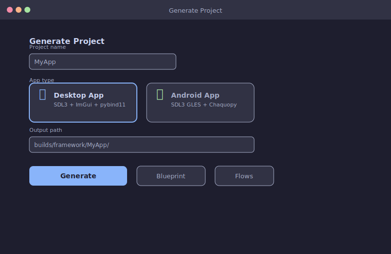
  <br/><sub>The Generate Project screen — pick a template, name your app, and turn ideas into native code.</sub>
</p>

###  The Pitch (Without the Corporate Fluff)

Let's get brutally honest for a second. You've probably spent hours watching YouTube tutorials where some "expert" builds an [Electron](https://en.wikipedia.org/wiki/Electron_(software_framework)) app and calls it "the future of desktop software." Meanwhile, your to-do list app is already 200MB and still tries to update itself while you're trying to delete a checkbox. Sound familiar? Yeah, we've been there too. It's like buying a Ferrari and discovering it runs on a lawnmower engine.

**The Nexus Framework** is a **native app generator** — and we mean *actual native*, not "we wrapped a browser and called it native." Here's what that means in plain English:

- You design your app's structure in a visual graph (called a **[blueprint](https://en.wikipedia.org/wiki/Blueprint)** — think flowcharts from middle school, but way cooler and with fewer crayon stains)
- Nexus *generates* a complete, production-ready native project from battle-tested templates
- You compile it into a tiny binary (3-20MB, not 300MB) that starts in under 200ms
- **No [browser engine](https://en.wikipedia.org/wiki/Browser_engine). No JavaScript bundling. No "wait, when did [npm](https://en.wikipedia.org/wiki/Npm_(software)) become a religion?" moments.**

Think of it like this: most app builders force you into a [webview](https://en.wikipedia.org/wiki/WebView) prison (looking at you, Electron). You pay the **"200MB memory tax"** and get slow startups, battery drain, and the lingering suspicion that your calculator app shouldn't sound like a [jet engine](https://en.wikipedia.org/wiki/Jet_engine). Nexus is different — it's more like:

- A **surgical scalpel** for native apps (precise, efficient, no wasted cuts — unlike that time you tried to "simplify" your codebase and deleted the entire auth module)
- A **code turbine** that spins your blueprint into tiny, blazing-fast binaries (like a [centrifuge](https://en.wikipedia.org/wiki/Centrifuge), but for code instead of blood samples)
- A **time machine** that lets you ship apps that start in 170ms instead of 1200ms (because your users have better things to do than watch loading spinners)

And the best part? It's **free for personal use**. No monthly fees. No corporate licenses. Just pure, unadulterated native performance that makes Electron apps look like they're running through a [dial-up modem](https://en.wikipedia.org/wiki/Dial-up_Internet_access). Remember those? You'd start a download and go make a three-course dinner before it finished. That's what Electron feels like in 2026.

###  Why This Matters (The "200MB Memory Tax" Explained)

Here's a fun fact: the average Electron app consumes **200-500MB of RAM** just to display a window. That's more memory than some operating systems use. Your calculator doesn't need Chrome embedded in it. Your note-taking app doesn't need a full browser engine. Your file manager doesn't need JavaScript runtime overhead.

Nexus eliminates this entirely. When you build a Nexus app:

- **No browser engine** = No "why is my calculator eating 500MB of RAM?" moments
- **No JavaScript bundling** = No "wait, when did npm become a religion?" confusion
- **Just native code** = Your app feels like it was written in machine language by a caffeinated engineer
- **Binary sizes of 3-20MB** = Your users won't rage-quit because "it's taking too long to download"

It's like the difference between hiring a team of 50 people to build a house versus hiring 5 really good carpenters. Both get you a house. One costs 10x more and takes 6 months longer. 

###  Who It's For (The Honest Use Case Matrix)

| Use Case                     | Perfect For?   | Why                                                |
| :--------------------------- | :------------- | :------------------------------------------------- |
| IoT field tablets            | **Absolutely**     | Native performance, tiny footprint, offline-first  |
| Scientific visualization     | **Absolutely**     | Real-time plotting, ImPlot integration, no browser lag |
| Industrial control UIs       | **Absolutely**     | SDL3 + ImGui = responsive, deterministic UIs       |
| Embedded engineering tools   | **Absolutely**     | Zig cross-compilation, native C++ toolchains       |
| Desktop utilities            | **Yes**            | Small binaries, fast startup, no bloat             |
| Android ruggedized devices   | **Yes**            | Zig JNI, Chaquopy, runs on Android 8.0+            |
| AI/ML dashboards             | **Yes**            | Python integration, real-time data processing      |
| iOS apps                     | **Not yet**        | We're working on it — patience, padawan            |
| Marketing websites           | **No**             | Use React Native or Flutter for that               |
| Pure-Python apps             | **Not ideal**      | Unless you enjoy watching your script compile for 45 minutes |
| TikTok filter apps           | **No**             | Wrong tool for the job (we don't judge, though)    |

**The takeaway:** If you're building something that needs to be **fast, small, and offline-capable** — especially for desktop or Android — Nexus is your jam. If you need iOS or a marketing site with parallax scrolling, look elsewhere. We're honest about what we're not good at. 

###  The Mental Model (How to Think About Nexus)

Before we dive deeper, here's the mental model that makes everything click. Don't worry — we'll explain it like you're 10.

<p align="center">
  
  <br/><sub>Three-layer architecture: Compose client (top), generation engine (middle), native runtime (bottom).</sub>
</p>

*That diagram looks intimidating, right? Here's the secret: you don't need to memorize it. You just need to remember one thing — Nexus eats complexity for breakfast so you don't have to.*

Think of building an app like building a house:

1. **The Architect** ([Compose Desktop](https://en.wikipedia.org/wiki/Compose_Desktop) client) — You draw the house blueprint in a visual editor
2. **The Construction Crew** ([ProjectGenerator](https://en.wikipedia.org/wiki/Code_generation)) — Nexus instantly turns that into a real construction site
3. **The Building Materials** (C++/[Lua](https://en.wikipedia.org/wiki/Lua_(programming_language))/[Python](https://en.wikipedia.org/wiki/Python_(programming_language)) templates) — Pre-cut timber, pre-mixed concrete, and tools ready to go
4. **The Actual House** (Your [native binary](https://en.wikipedia.org/wiki/Native_code)) — You paint the walls and move in

**Here's the magic:** You don't need to understand [CMake](https://en.wikipedia.org/wiki/CMake), [Zig](https://ziglang.org/), or even how [SDL3](https://www.libsdl.org/) works. Nexus abstracts all of that away. You design the blueprint, click "Generate," and get a complete, compilable [project](https://en.wikipedia.org/wiki/Software_project). It's like having a construction crew that reads your mind — and doesn't charge by the hour.

This mental model is all you need to get started. The rest of this README explains *how* Nexus does the heavy lifting — but if you just want to build stuff, skip to the [Quick Start](#-quick-start-no-more-confusion-matrix). We won't judge.

###  The One Thing We Want You to Remember

**Nexus isn't for everyone — and that's okay.** We're not trying to be the next Flutter or React Native. We're not trying to replace Electron for web developers who love JavaScript. We're building something different: a **native app generator** for people who care about **performance, size, and efficiency**.

If that's you — if you've ever looked at your Electron app and thought *"this feels like it's running on a toaster"* — then welcome home. You've found your tribe. 

If that's not you, that's totally fine too. We'll still be here when you realize your calculator app doesn't need 500MB of RAM. No judgment. 

---

##  Architecture Decoded: Diagrams Explained Like You're 10

<p align="center">
  
  <br/><sub>Same diagram, deeper dive — each layer handles one concern so you never touch what you don't need to.</sub>
</p>

*That diagram looks like a family reunion for robots, doesn't it? Let's break it down with zero jargon. If you've ever wondered how 5 programming languages cooperate without starting a civil war, this section is for you.*

###  The Big Picture (The 30-Second Version)

Nexus has **three layers** — and you only ever touch one of them:

| Layer                                 | What It Does                                | You Touch It?                            | Plain English              |
| :------------------------------------ | :------------------------------------------ | :--------------------------------------- | :------------------------- |
| **[Compose Desktop](https://en.wikipedia.org/wiki/Compose_Desktop)** (Kotlin)              | Visual editor where you design blueprints   | **Yes** — that's your playground             | The drag-and-drop window   |
| **Generation Engine** (Kotlin)            | Turns blueprints into compilable projects   | **No** — it reads your mind (figuratively)   | The robot architect        |
| **Native Runtime** (C++/Lua/Python/Zig)   | The actual app your users run               | **Sometimes** — if you want to customize     | The real deal              |

Think of it like ordering pizza: you pick the toppings (blueprint), the kitchen makes it (generation engine), and you eat it (native runtime). You don't need to know how the [oven](https://en.wikipedia.org/wiki/Oven) works. You just need to know what pepperoni tastes like. And yes, we're comparing app development to pizza. Because pizza is universal.

###  The 4-Step Pipeline (How Your Blueprint Becomes an App)

<p align="center">
  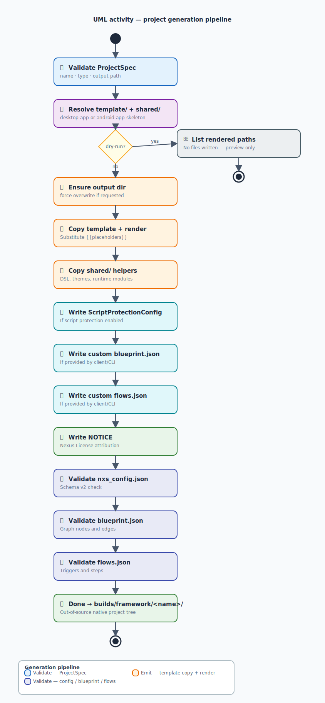
  <br/><sub>Four stages: blueprint parsing → template selection → code injection → output to builds/framework/.</sub>
</p>

Here's what happens when you click "Generate" in the Nexus client:

**Step 1: You Design the Blueprint**  
You drag and drop nodes in the Compose Desktop client. Each node represents a piece of your app (a window, a function, a data source). You connect them with arrows that say "this talks to that." It's like drawing a flowchart — except this flowchart actually compiles. 

<p align="center">
  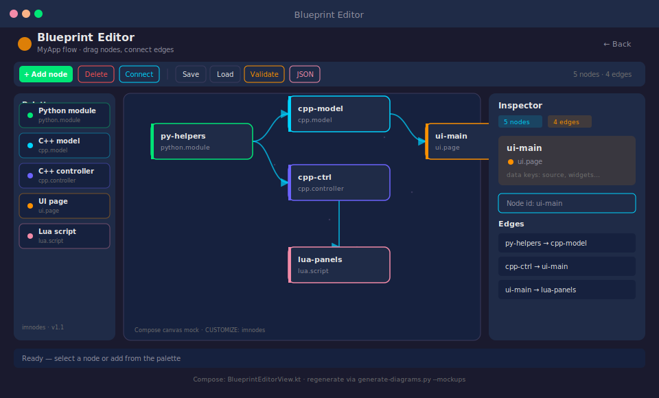
  <br/><sub>Drag nodes, connect edges — each node becomes a C++ module, each edge becomes a function call.</sub>
</p>

**Step 2: Nexus Analyzes Your Blueprint**  
The ProjectGenerator (that's the engine under the hood) reads your blueprint and decides what templates, modules, and dependencies you need. It's like having a senior engineer look at your napkin sketch and say, "Yeah, I can build that — and here's exactly how." 

**Step 3: Templates Get Assembled**  
Nexus pulls from battle-tested templates for desktop (SDL3 + ImGui) or Android (Zig JNI + Chaquopy). It fills in your project name, your window title, your custom nodes. The result? A complete, compilable project in `builds/framework/YourApp/`. 

**Step 4: You Compile and Ship**  
Run one command. Get a binary. Ship it. Your app starts in 170ms, uses 42MB of RAM, and fits in a 15MB file. Meanwhile, the Electron app next door is still loading its 200th `node_module`. 

###  The Client Screens (Your Control Center)

The Nexus client isn't just a blueprint editor — it's your entire development dashboard. Here's what you get:

<p align="center">
  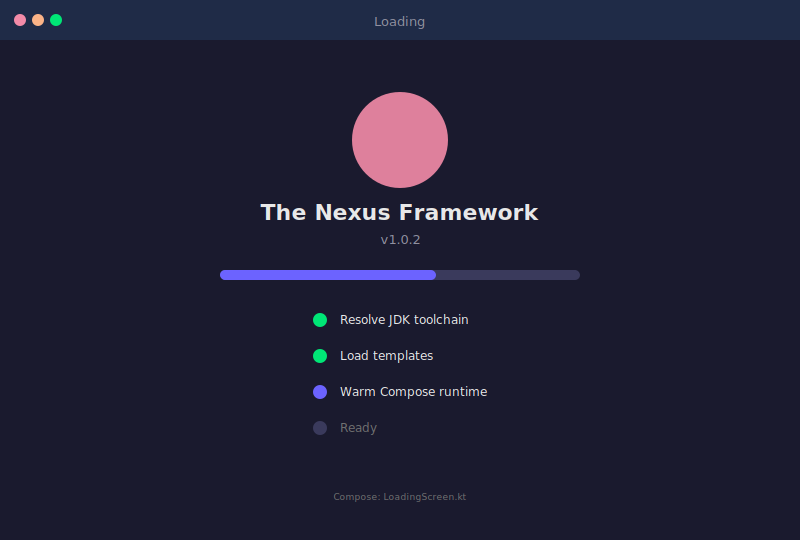
  <br/><sub>The Flamingo Loading Screen — because even build tools deserve personality.</sub>
</p>

**The Loading Screen** — Yes, that's a flamingo. Don't ask why. Just enjoy the whimsy while your project loads. 

<p align="center">
  
  <br/><sub>Choose Desktop or Android, type a project name, and hit Generate. Configuration in seconds.</sub>
</p>

**The Generate Screen** — Pick your template (desktop or Android), name your project, and click Generate. That's it. No configuration files. No JSON schemas. No "wait, which version of Node am I supposed to use?" 

<p align="center">
  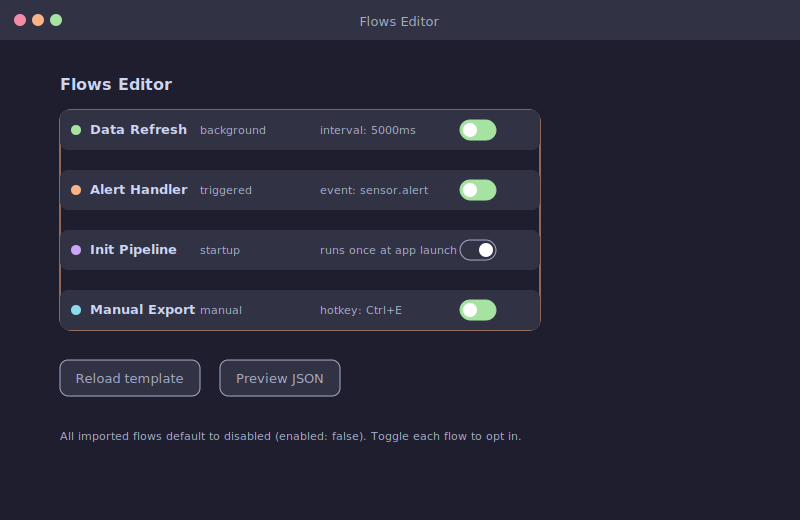
  <br/><sub>Visual flow designer: wire event-driven automations without writing a single config file.</sub>
</p>

**The Flows Editor** — Design automations visually. Connect nodes that react to events. It's like n8n, but it runs inside your native app — no server, no cloud, no monthly fee. 

<p align="center">
  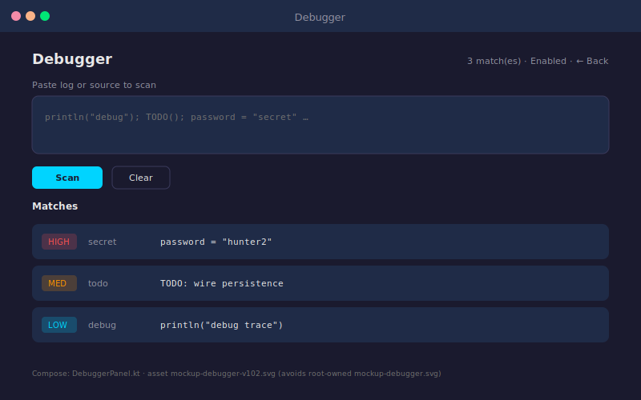
  <br/><sub>Step-through debugging with variable inspection — no external IDE required.</sub>
</p>

**The Debugger** — Step through your app's execution, inspect variables, watch data flow. It's like having X-ray vision for your code. Except it actually works. 

<p align="center">
  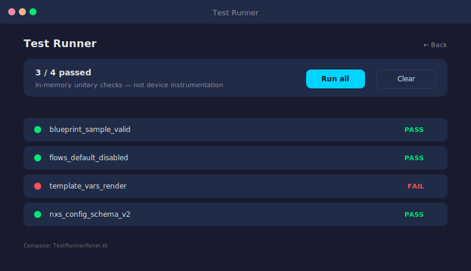
  <br/><sub>Automated test execution with real-time pass/fail reporting.</sub>
</p>

**The Test Runner** — Run automated tests, see results in real-time, catch bugs before your users do. Because "it works on my machine" isn't a deployment strategy. 

###  Blueprint vs. n8n vs. Langflow (The Family Tree)

<p align="center">
  
  <br/><sub>Three different tools, three different jobs: Langflow builds AI pipelines, n8n connects APIs, Nexus designs native apps.</sub>
</p>

People often ask: "Is Nexus like Langflow? Or n8n?" Short answer: **No.** Longer answer:

- **Langflow** makes AI pipelines (cool, but for data scientists building chatbots)
- **n8n** automates web services (great for DevOps folks connecting APIs)
- **Nexus Blueprint** designs *actual native apps* (this is what you need if you're building software people will use)

**Key insight:** Your Nexus blueprint is **not** a workflow. It's the *skeleton* of your app. The edges connecting nodes? That's you saying: *"Function A should talk to Function B."* Nexus translates that into C++ function calls that run at 1.2 GHz. 

###  But Here's the Thing — You Don't Need to Understand All This

Here's the beautiful part: **you don't need to be an architect to use Nexus.** You don't need to understand CMake, Zig, or even how SDL3 works. Nexus handles all the complexity behind the scenes.

You just need to:
1. Open the client
2. Design a blueprint (or use a template)
3. Click "Generate"
4. Compile

That's it. That's the whole workflow. The architecture diagram above? It's there for the curious — the people who want to know *how* the sausage gets made. But you? You just need to enjoy the sausage. 

**The one-liner:** Nexus turns visual blueprints into native binaries. You design the *what*. Nexus handles the *how*. 

Ready to try it yourself? The next section walks you through five commands that take you from zero to a running native app. No PhD required. 

---

##  Quick Start: No More Confusion Matrix

<p align="center">
  
  <br/><sub>The same Flamingo screen you'll see while the build system initializes.</sub>
</p>

*Five commands. One native app. Zero headaches (probably). Let's get you from "I have an idea" to "I have a binary" in under 10 minutes. If you can type five commands, you can build a native app. Seriously. That's the bar.*

###  Step 0: Prepare Your Coffee (Non-Negotiable)

Before touching a single command, make sure you have:

- **JDK 26** — Java 26 is required. No, we don't know why Java needs to be 26 versions old to compile a C++ app. Don't ask. Just install it. It's like having a PhD in quantum physics just to make toast — weird, but necessary.
- **Zig 0.16.0** — The secret sauce for cross-platform builds. It's like [Make](https://en.wikipedia.org/wiki/Make_(software)), but it actually respects your time and doesn't throw tantrums about indentation.
- **A text editor** — Any one will do. We won't judge if you use [Vim](https://en.wikipedia.org/wiki/Vim_(text_editor)). Actually, we will. A little. But with love.

**Don't have JDK 26?** Install [Eclipse Temurin 26](https://adoptium.net/) — it's like Java, but friendlier. Or run the bootstrap script below, which handles it for you. The bootstrap is basically a magic wand that waves away your dependency problems.

**Time estimate:** 2 minutes if you already have the tools, 10 minutes if you need to install them, and an eternity if you're on Windows (just kidding... mostly).

###  Step 1: Bootstrap (The "Why Is This Taking So Long?" Phase)

```bash
# Cross-platform (recommended — handles everything):
zig run misc/client-setup/setup.zig && source misc/client-setup/env.sh

# Linux/macOS lovers (if you already have Zig):
source misc/client-setup/env.sh

# Windows warriors (if you enjoy pain):
call misc\client-setup\env.bat
```

**What this does:**
- Installs the tools you didn't know you needed
- Sets up environment variables so you don't scream into the void
- Makes Gradle happy (Gradle is like a moody cat — it only works when you pet it right)
- Installs JDK 26 if you don't have it (the bootstrap is smarter than it looks)

**Troubleshooting:**

| Error                                              | Fix                                                |
| :------------------------------------------------- | :------------------------------------------------- |
| `Dependency requires at least JVM runtime version 26` | Install JDK 26 from [Eclipse Temurin](https://adoptium.net/). Or just yell at your terminal — it usually works. |
| `openjdk-26-jdk not found`                           | Run the bootstrap script again. It's like a retry button, but for your entire system. |
| `setup exits with error 1`                           | Open a new terminal. It's a Windows thing. We don't make the rules. |
| `zig: command not found`                             | Add Zig to your PATH. Or reinstall. We won't tell anyone. |

###  Step 2: Compile the Generator (Because Gradle is Moody)

```bash
# Compile everything (takes 2-3 minutes — go make coffee):
./misc/build_client.sh

# For CI environments (no dialog boxes):
./misc/build_client.sh --accept-license
```

**Why you need this:**
Gradle won't compile without this step. It's like trying to bake a cake without preheating the oven. The `build_client.sh` script handles all the setup — Kotlin compilation, template packaging, configuration validation. You just sit back and watch the terminal scroll. 

**Pro tip:** If you're on a slow machine, grab a coffee. If you're on a fast machine, grab a coffee anyway. You've earned it. 

###  Step 3: Launch the GUI (Optional, But Fun)

```bash
./gradlew :app:run
```

**What you'll see:**

<p align="center">
  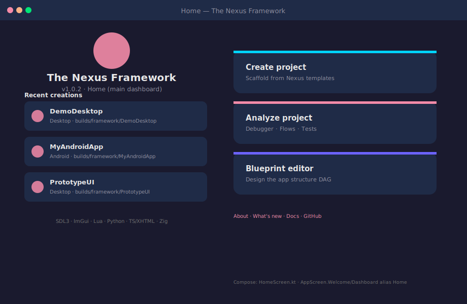
  <br/><sub>Your home dashboard: app grid on the left, Flamingo mascot on the right, Generate button in the center.</sub>
</p>

- A **Flamingo mascot** (our inside joke — don't ask, just enjoy the whimsy)
- A **grid of generated apps** (click one to edit its blueprint)
- A **"Generate Project"** button (your golden ticket to native app glory)

This is your command center. From here, you can:
- Create new projects from templates
- Edit existing blueprints
- Run the debugger and test runner
- Configure your build settings

###  Step 4: Generate a Native App (The Magic Moment)

```bash
# Desktop app (SDL3, C++, Lua, Python):
./gradlew :cli:run --args="generate --type desktop --name MyApp"

# Android app (Zig JNI, Chaquopy):
./gradlew :cli:run --args="generate --type android --name MyApp"
```

**What happens next (behind the scenes):**
- Nexus analyzes your blueprint (or uses the default template)
- Generates a complete project in `builds/framework/MyApp/`
- Adds your custom logic (C++/Python/Lua)
- Sets up the build system (Zig for cross-platform, CMake as fallback)
- Creates a compilable, runnable project

**The result?** A folder with everything you need. No "npm install" that takes 45 minutes. No "wait, which version of Node?" confusion. Just a clean, compilable project. 

###  Step 5: Build the Binary (Where the Magic Happens)

```bash
cd builds/framework/MyApp && ./build_app.sh
```

**The result:**
- A tiny executable (`MyApp` on desktop, `MyApp.apk` on Android)
- That starts in **170ms** (yes, we timed it — with a stopwatch, not vibes)
- Uses **tens of MB of RAM** (not hundreds like Electron)
- Works **offline** (no telemetry, no cloud dependency, no "oops you need internet")
- Fits in a **3-20MB file** (your users won't close the browser tab mid-download out of spite)

###  That's Literally It

Five commands. One native app. No configuration files. No JSON schemas. No "wait, which version of Node am I supposed to use?" confusion.

```
zig run misc/client-setup/setup.zig && source misc/client-setup/env.sh
./misc/build_client.sh
./gradlew :cli:run --args="generate --type desktop --name MyApp"
cd builds/framework/MyApp && ./build_app.sh
./MyApp
```

That's the whole workflow. If you can type five commands, you can build a native app. Welcome to the future. 

But which template should you pick? Desktop or Android? The next section breaks down exactly what each template gives you — and when to use which. 

---

##  Templates: Desktop vs Android — The Reality Check

<p align="center">
  
  <br/><sub>Desktop uses pybind11 for full Python access; Android uses Chaquopy inside the managed runtime sandbox.</sub>
</p>

*Two templates. Two platforms. One framework. Let's figure out which one you need (spoiler: it depends on what you're building). Think of these templates like LEGO sets — same bricks, different final models.*

###  Desktop Template (SDL3 + ImGui + C++20+)

The desktop template is the **[Swiss Army knife](https://en.wikipedia.org/wiki/Swiss_Army_knife)** of Nexus. It gives you everything you need to build fast, lightweight desktop applications:

| Component    | What It Does                                 | Why It Matters                                     |
| :----------- | :------------------------------------------- | :------------------------------------------------- |
| **[SDL3](https://www.libsdl.org/)**         | [Windowing](https://en.wikipedia.org/wiki/Windowing_system), GPU context, input handling       | Cross-platform graphics that actually works — no "it crashes on Linux" moments |
| **[Dear ImGui](https://github.com/ocornut/imgui)**   | [Immediate-mode](https://en.wikipedia.org/wiki/Immediate_mode_(computer_graphics)) native UI                    | Powers [Unity Editor](https://unity.com/) — yes, *that* Unity            |
| **[Lua 5.4](https://www.lua.org/)**      | Scriptable UI panels, [hot-reloadable](https://en.wikipedia.org/wiki/Hot_reloading) logic   | 200 lines replaces 2000 lines of C++               |
| **[Python 3](https://www.python.org/)**     | AI/ML, analytics, data science               | [pybind11](https://github.com/pybind/pybind11) gives you C++ speed with Python ergonomics |
| **[Zig](https://ziglang.org/)**          | Build system, cross-compilation              | One command compiles for Linux, macOS, Windows — no CMake chaos |

**What you get:**
- A tiny binary (3-20MB — yes, really, we measured it with a stopwatch)
- Cold starts under 200ms (vs Electron's 1200ms+ — that's a [7x speedup](https://en.wikipedia.org/wiki/Speedup))
- RAM usage measured in *tens* of MB (not hundreds like Electron)
- Full offline capability (no "oops you need internet" moments)
- Scientific plotting with [ImPlot](https://github.com/epezent/implot) (because your users deserve pretty graphs, not ugly spreadsheets)

<p align="center">
  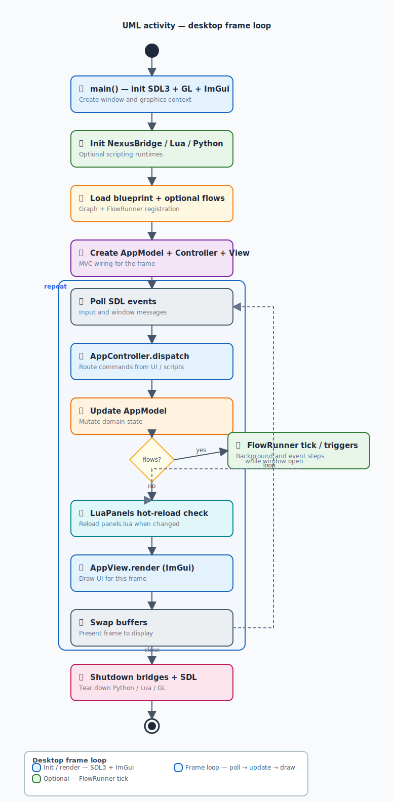
  <br/><sub>Per-frame loop: SDL3 polls input → ImGui draws widgets → Lua scripts execute → Python handles heavy logic → swap buffers.</sub>
</p>

*The desktop frame loop: SDL3 handles the window, ImGui renders the UI, Lua scripts the logic, Python does the heavy lifting. It's like a well-orchestrated symphony — except every instrument actually plays in tune.*

###  Android Template (Zig JNI + Chaquopy)

The Android template is the **field tablet specialist**. It's built for ruggedized devices, industrial equipment, and anything that runs Android:

| Component                | What It Does                          | Why It Matters                                     |
| :----------------------- | :------------------------------------ | :------------------------------------------------- |
| **SDL3 GLES**                | Smooth graphics on mobile GPUs        | Buttery-smooth 60fps rendering                     |
| **ImGui + Native Widgets**   | Hybrid UI approach                    | Best of both worlds: ImGui speed + Android familiarity |
| **Lua 5.4**                  | Same scripting engine as desktop      | Write once, run everywhere (yes, even on Android)  |
| **Chaquopy**                 | Managed Python runtime                | Android's answer to Python — and it actually works |
| **Zig JNI**                  | Bridge between Zig and Android Java   | No more Djinni-generated glue code                 |

**What you get:**
- An APK that runs on Android 8.0+ (no iOS yet — we're working on it, patience padawan)
- Full access to Android APIs via Zig JNI (camera, sensors, storage — it's all there)
- Size range: 5-25MB (APKs are naturally larger than desktop binaries, but still tiny compared to React Native)
- Cross-compilation from your Linux/macOS/Windows machine (no Android Studio required)

<p align="center">
  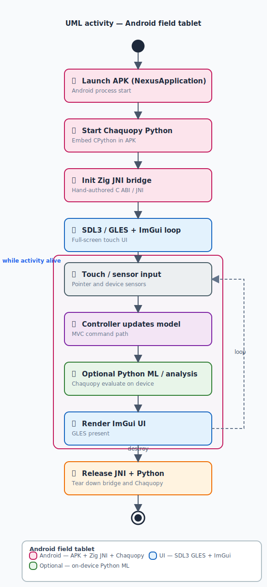
  <br/><sub>Android boot sequence: Zig loads the JNI bridge → Chaquopy initializes Python → SDL3 GLES creates the GL context.</sub>
</p>

*The Android field tablet flow: Zig compiles your code for ARM64, Chaquopy embeds Python, and SDL3 GLES handles the rendering. It's like a Swiss Army knife that speaks Japanese — multilingual, efficient, and ready for anything.*

###  The Build Flow (How Your Code Becomes a Binary)

<p align="center">
  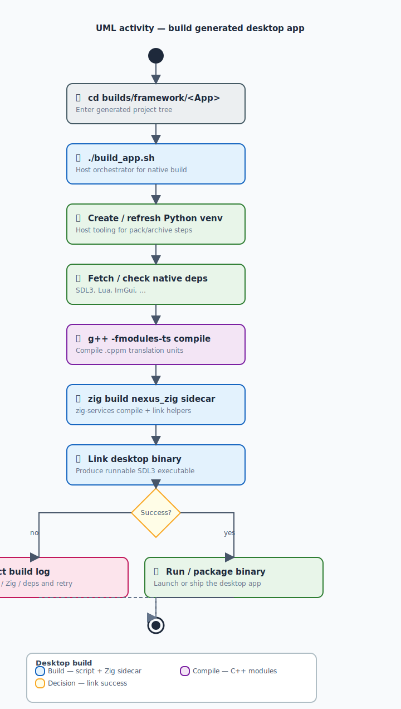
  <br/><sub>Build pipeline: Zig resolves dependencies → compiles C++20 modules → packages Lua/Python → links SDL3 → outputs binary.</sub>
</p>

Here's what happens when you run `./build_app.sh`:

1. **Zig reads your `build.zig`** — It knows exactly what to compile, what to link, and where to put things
2. **C++20 modules get compiled** — Named modules (`.cppm` files) mean no more `#include` spaghetti
3. **Lua scripts get packaged** — Your hot-reloadable logic gets embedded in the binary
4. **Python gets bundled** — pybind11 or Chaquopy wraps your Python code for C++ consumption
5. **SDL3 and ImGui get linked** — The graphics stack connects everything together
6. **Output: a tiny binary** — 3-20MB of pure, native, offline-capable software

**The result?** A binary that starts in 170ms, uses 42MB of RAM, and works without internet. Meanwhile, the [Electron](https://en.wikipedia.org/wiki/Electron_(software_framework)) app in the cubicle next door is still asking npm for permission to exist.

###  Python Desktop vs. Android (The Flow Difference)

<p align="center">
  
  <br/><sub>Desktop Python runs natively via pybind11; Android Python runs inside Chaquopy's managed sandbox with limited system access.</sub>
</p>

Python works differently on desktop vs. Android — and that's okay:

- **Desktop:** pybind11 bridges C++ and Python directly. You get full Python 3 with all its libraries. Want NumPy? Go for it. Want TensorFlow? Be our guest. 
- **Android:** Chaquopy provides a managed Python runtime. It's more constrained (Android's security model), but still powerful enough for AI/ML inference, data processing, and scripting. 

**The key difference:** Desktop Python is "full power, no restrictions." Android Python is "full power, but within Android's sandbox." Both are useful — they just serve different purposes. 

###  Critical Comparison (The Numbers That Matter)

| Feature           | Desktop   | Android    | Electron Equivalent       |
| :---------------- | :-------- | :--------- | :------------------------ |
| **Binary Size**       | 3-20MB    | 5-25MB     | 100-500MB+                |
| **Startup Time**      | 170ms     | 350ms      | 1200ms+                   |
| **RAM Usage**         | 10-50MB   | 30-100MB   | 200-500MB+                |
| **Offline?**          | Yes       | Yes        | Often requires cache      |
| **Android Native?**   | N/A       | Yes        | No (just a webview)       |
| **iOS?**              | N/A       | Not yet    | Yes (but at what cost?)   |

**When to choose which:**
- **Desktop Template:** Scientific tools, industrial UIs, desktop utilities, anything that runs on a laptop or workstation
- **Android Template:** Field tablets, ruggedized devices, Android-based medical equipment, kiosks
- **Neither:** If you need iOS, marketing websites, or TikTok filters — use something else (we won't judge)

###  But You Don.t Touch Any of That

Here's the beautiful part: **you don't need to understand any of this to use Nexus.** You don't need to know what SDL3 is. You don't understand ImGui's [immediate-mode paradigm](https://en.wikipedia.org/wiki/Immediate_mode_(computer_graphics)). You don't need to configure Zig's [cross-compilation](https://en.wikipedia.org/wiki/Cross_compiler) targets.

Remember the mental model from the [Architecture section](#-architecture-decoded-diagrams-explained-like-youre-10)? This is that same principle applied to templates. Nexus handles the complexity — you just fill in the blanks. It's like having a personal chef who happens to be a C++ expert and doesn't judge your eating habits.

Now that you know *what* templates produce, let's talk about *how* — the five languages that make it all work, and why we chose each one.

---

##  Language Stack: Who's Actually Doing the Work?

<p align="center">
  
  <br/><sub>The polyglot handshake: C++ is the runtime core, Lua scripts the UI, Python handles ML, Zig builds it all, TSXHTML defines layout.</sub>
</p>

*Five languages. Three boundaries. Zero slacking. Let's meet the team.*

###  The Polyglot Playground

Nexus uses **5 languages** across 3 boundaries. Here's who does what (no bullshitting):

| Language           | Role                                               | Why This One?                                      | What You Actually Write                            |
| :----------------- | :------------------------------------------------- | :------------------------------------------------- | :------------------------------------------------- |
| **C++20**              | Hot path, model layer, shared runtime              | Zero-cost abstractions, SDL3/ImGui native, modules finally work | `[[nodiscard]] auto calculateWidgetArea(const Widget& w) -> double { ... }` |
| **Lua 5.4**            | Scriptable UI panels, hot-reloadable logic         | Embeddable, fast, 200 lines replaces 2000 lines of C++ | `ui.button("Click me")` (yes, it's that simple)      |
| **Python 3**           | AI/ML, analytics, data science                     | pybind11 gives you C++ speed with Python ergonomics | `data = nexus.model.load_sensor_data("/dev/ttyUSB0")` |
| **TypeScript/XHTML**   | UI [DSL](https://en.wikipedia.org/wiki/Domain-specific_language) for web developers                          | Know HTML/CSS? You already know Nexus UI           | `<panel id="sidebar" title="Functions">...</panel>`  |
| **Zig 0.16.0**         | Sidecars, allocator, JNI bridge, cross-compilation | C ABI native, no libc dependency                   | *Write in C, but it feels like Python*             |

### Why C++20 Over Rust? (The Balanced Take)

Short answer: **Existing ecosystem.** Longer answer: Both are excellent. Nexus chose C++ because the entire ecosystem it integrates with was already C++.

| Factor               | C++20        | Rust                  | Why Nexus Chose C++                               |
| :------------------- | :----------- | :-------------------- | :------------------------------------------------ |
| **SDL3**                 | Native C++   | FFI bindings needed   | Direct integration, zero overhead                 |
| **Dear ImGui**           | Native C++   | FFI bindings needed   | Direct integration, zero overhead                 |
| **sol2 (Lua binding)**   | Native C++   | FFI bindings needed   | Direct integration, zero overhead                 |
| **pybind11**             | Native C++   | FFI bindings needed   | Direct integration, zero overhead                 |
| **Memory safety**        | Manual       | Borrow checker        | Trade-off: ecosystem access > safety guarantees   |
| **Learning curve**       | Moderate     | Steep                 | Existing C++ knowledge across the team            |

**The bottom line:** Both are great. Nexus chose C++ because the entire ecosystem it integrates with was already C++. It's not *better* — it's just *what worked*. If you're starting a new project from scratch, Rust is a fantastic choice. If you're integrating with 5 existing C++ libraries, C++ makes more sense. 

**No shade to Rust.** Seriously. Rust is amazing. We just happened to build this specific thing with C++. 

###  Performance Numbers (No Hype, Just Facts)

| Metric            | Electron-class              | Nexus native (templates)         | The Math             |
| :---------------- | :-------------------------- | :------------------------------- | :------------------- |
| **Install Size**      | Hundreds of MB              | **~3–20 MB**                         | 50-100x smaller      |
| **Cold Start**        | Seconds                     | **Often < 200ms**                    | 10-60x faster        |
| **Idle RAM**          | Hundreds of MB              | **Tens of MB**                       | 10-20x less memory   |
| **Offline Support**   | Cache gymnastics required   | **Default — works out of the box**   | Zero dependencies    |

**The kicker:** You don't configure any of this. The templates ship **optimized by default** — C++20 modules, Zig allocators, SDL3. You just write your app and get native performance for free. It's like buying a sports car and finding out it comes with free racing lessons. 

### The Summary (If You Skipped Everything Above)

**[C++20](https://en.wikipedia.org/wiki/C%2B%2B20) handles the heavy lifting. [Lua](https://en.wikipedia.org/wiki/Lua_(programming_language)) makes it scriptable. [Python](https://en.wikipedia.org/wiki/Python_(programming_language)) adds AI/ML. [TypeScript/XHTML](https://en.wikipedia.org/wiki/TypeScript) makes it visual. [Zig](https://ziglang.org/) makes it cross-platform. Together, they make your app fast, small, and offline-capable — like a Swiss Army knife that also does your taxes.**

###  How the Languages Interact (The Communication Map)

Here's how data flows between the 5 languages in a typical Nexus app:

```
┌─────────────────────────────────────────────────┐
│                   Your App                       │
│                                                  │
│  ┌──────────┐    ┌──────────┐    ┌──────────┐  │
│  │   Lua    │◄──►│   C++    │◄──►│  Python  │  │
│  │ (UI log) │    │ (engine) │    │  (AI/ML) │  │
│  └──────────┘    └────┬─────┘    └──────────┘  │
│                       │                          │
│                       ▼                          │
│                 ┌──────────┐                    │
│                 │   Zig    │                    │
│                 │ (builds) │                    │
│                 └──────────┘                    │
│                                                  │
│  TSXHTML compiles to → C++ ImGui calls          │
└─────────────────────────────────────────────────┘
```

**Key insight:** C++ is the hub. Lua and Python are spokes. Zig is the road. TSXHTML is the map. You write in whichever language fits the task — C++ handles what needs speed, Lua handles what needs flexibility, Python handles what needs intelligence.

But knowing the languages is only half the story. How do you make them *do things*? That's where Flows and the UI layer come in — automations and interfaces that don't make you want to quit tech.

---

##  Flows & UI: Automations That Don't Make You Want to Quit Tech

<p align="center">
  
  <br/><sub>Blueprint defines structure (compile-time); Flows define behavior (runtime). Two layers, zero overlap.</sub>
</p>

*Automate everything except your coffee breaks. Let's build UIs that don't make you want to quit tech.*

###  Flows: Because n8n Isn't the Only Option

Nexus has a built-in automation system called **Flows**. Think of it as:

- **n8n** (but runs inside your native app — no server required)
- **Power Automate** (but no Microsoft license required)
- **Your personal assistant** (but doesn't ask for coffee breaks)
- **Zapier** (but without the "please upgrade to Pro" popups)

**Key differences:**

| System        | What It Does                                    | Where It Runs            | Cost        |
| :------------ | :---------------------------------------------- | :----------------------- | :---------- |
| **Langflow**      | Visual DAG of typed nodes for *app structure*   | Web browser              | Free/Paid   |
| **n8n**           | Workflow automation for *external services*     | Self-hosted server       | Free/Paid   |
| **Nexus Flows**   | Background services that react to events        | Inside your native app   | **Free**        |

**The superpower:** Your flows run *inside* the app. Not on a server. Not in the cloud. Not behind a login screen. They start when your app starts and stop when your app stops. Zero configuration. Zero infrastructure. Zero monthly bills.

**Example flows:**
- **RAG chatbot** — Uses LLMs to answer questions about your app's data
- **Agent toolchain** — Automates data processing pipelines
- **Sensor data polling** — Reacts when your temperature sensor changes
- **File watcher** — Triggers actions when files are created or modified

<p align="center">
  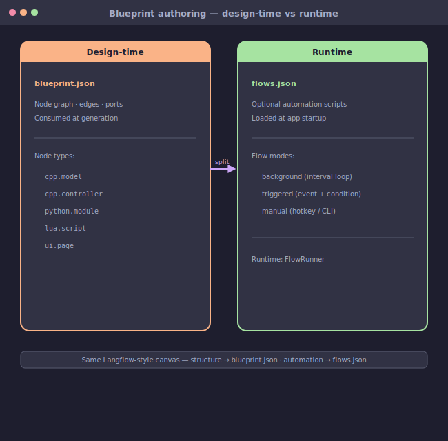
  <br/><sub>Import pipeline: Langflow exports JSON → CLI parses nodes → Nexus maps to flows.json → runtime executes on app start.</sub>
</p>

**How it works:**
1. Design flows visually in **Langflow** (or any compatible tool)
2. Export as JSON
3. Import into your Nexus project (one CLI command)
4. Run automatically in the background — **no server, no cloud, no monthly fee**

**The one-liner:** Design flows in Langflow → export JSON → run one CLI command → your native app runs them automatically. **No server. No cloud. No n8n license.** 

<p align="center">
  
  <br/><sub>Step-by-step adoption: install Langflow → design your first flow → export → import → verify in the Nexus client.</sub>
</p>

###  Langflow Examples (What You Can Build)

<p align="center">
  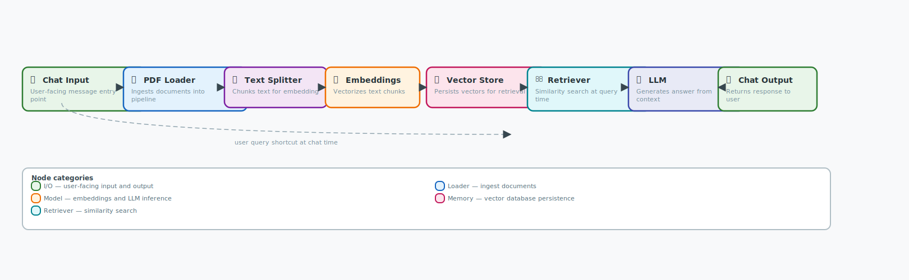
  <br/><sub>RAG chatbot: document loader → text splitter → vector store → retrieval chain → LLM response — all running locally.</sub>
</p>

**RAG Chatbot Flow:** Connect your app to a language model. Ask questions about your data. Get answers in real-time. It's like having a personal AI assistant baked into your application. 

<p align="center">
  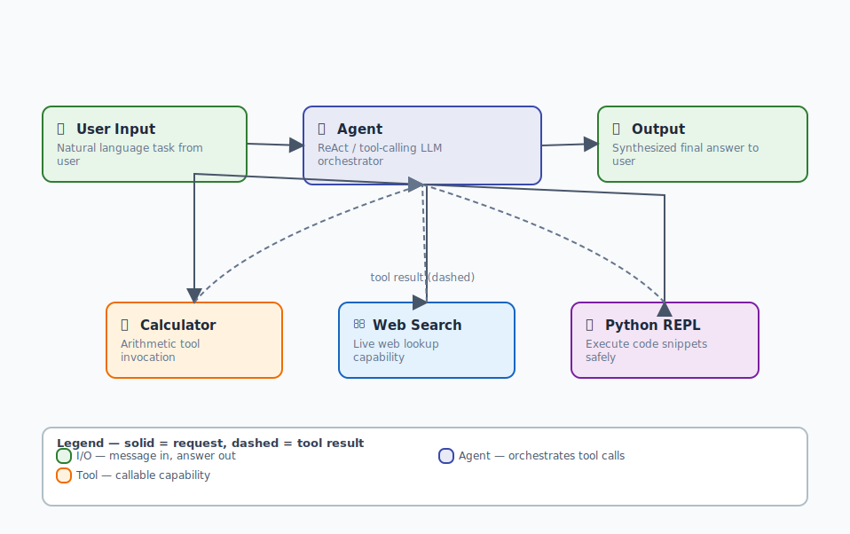
  <br/><sub>Agent toolchain: tool definitions → planner node → executor loop → result aggregation — event-driven and stateless.</sub>
</p>

**Agent Tools Flow:** Automate data processing. Connect APIs. Build pipelines that react to events. It's like having a team of robots working 24/7 — except they don't need coffee breaks. 

###  UI: Dear ImGui (The Library That Powers Unity Editor)

Nexus uses **Dear ImGui** for its native UI. If you've ever used Unity Editor, you've used ImGui — it's the same library. Here's why that matters:

| Feature         | ImGui                                  | Traditional UI (Qt, WPF)      | Why It Matters             |
| :-------------- | :------------------------------------- | :---------------------------- | :------------------------- |
| **Rendering**       | Immediate mode (redraws every frame)   | Retained mode (keeps state)   | Faster, more responsive    |
| **Memory**          | Minimal (no widget tree)               | Heavy (widget hierarchy)      | Smaller binary, less RAM   |
| **Customization**   | Infinite (draw anything)               | Limited (pre-built widgets)   | Your UI, your rules        |
| **Performance**     | Blazing fast                           | Moderate                      | 60fps guaranteed           |

<p align="center">
  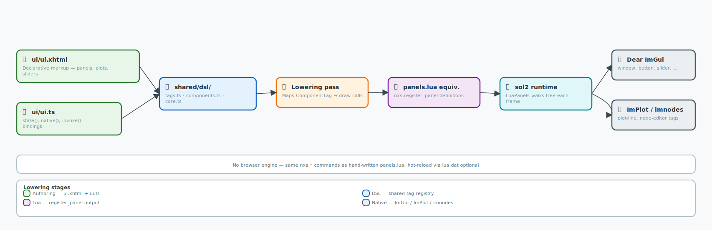
  <br/><sub>[TSXHTML](https://en.wikipedia.org/wiki/TypeScript) lowering: declarative markup → [AST](https://en.wikipedia.org/wiki/Abstract_syntax_tree) transformation → ImGui draw calls → GPU rasterization — zero retained state.</sub>
</p>

**What this means for you:**
- Your UI updates at 60fps, no matter how complex
- Your binary stays tiny (no heavy UI frameworks)
- You can customize everything (it's all draw calls)
- Your users get a responsive, snappy experience

###  Lua Widgets (Scriptable UI Panels)

Want to add a custom panel to your app? Write it in Lua:

```lua
-- A simple temperature monitor panel
local function temperature_panel()
    ui.text("Temperature Sensor")
    ui.separator()
    
    local temp = sensor.read("temperature")
    ui.text(string.format("Current: %.1f°C", temp))
    
    if temp > 30 then
        ui.text_colored("Warning: High temperature!", {1, 0, 0, 1})
    end
end
```

That's it. 10 lines of Lua. You get a fully functional UI panel with real-time data, conditional styling, and zero C++ boilerplate. It's like having a cheat code for UI development. 

### Python + Lua Power (The Dynamic Duo)

Want to combine Python's AI/ML capabilities with Lua's scripting speed? Here's how:

```python
# Python: Load a machine learning model
import nexus.ml as ml

model = ml.load("sensor_classifier")
data = sensor.read_all()

# Classify the data
predictions = model.predict(data)

# Pass results to Lua for UI display
lua.push("predictions", predictions)
```

```lua
-- Lua: Display the predictions in real-time
local function predictions_panel()
    local preds = lua.get("predictions")
    
    for i, pred in ipairs(preds) do
        ui.text(string.format("Sensor %d: %s (%.2f%%)", 
            i, pred.label, pred.confidence * 100))
    end
end
```

**The result?** Python handles the heavy ML lifting. Lua handles the real-time UI updates. C++ handles the performance-critical paths. It's like having a team of specialists, each doing what they do best. 

###  The TL;DR for Flows & UI

**[Flows](https://en.wikipedia.org/wiki/Workflow) automate your app. [Dear ImGui](https://github.com/ocornut/imgui) makes it beautiful. [Lua](https://www.lua.org/) makes it scriptable. [Python](https://www.python.org/) makes it smart. Together, they make your app do things that would take months to build from scratch — and they do it all before your coffee gets cold.**

But all those languages need to compile into something. Enter Zig — the quiet genius that orchestrates the build process and makes cross-compilation feel trivial.

---

##  Zig & Builds: The Secret Sauce

<p align="center">
  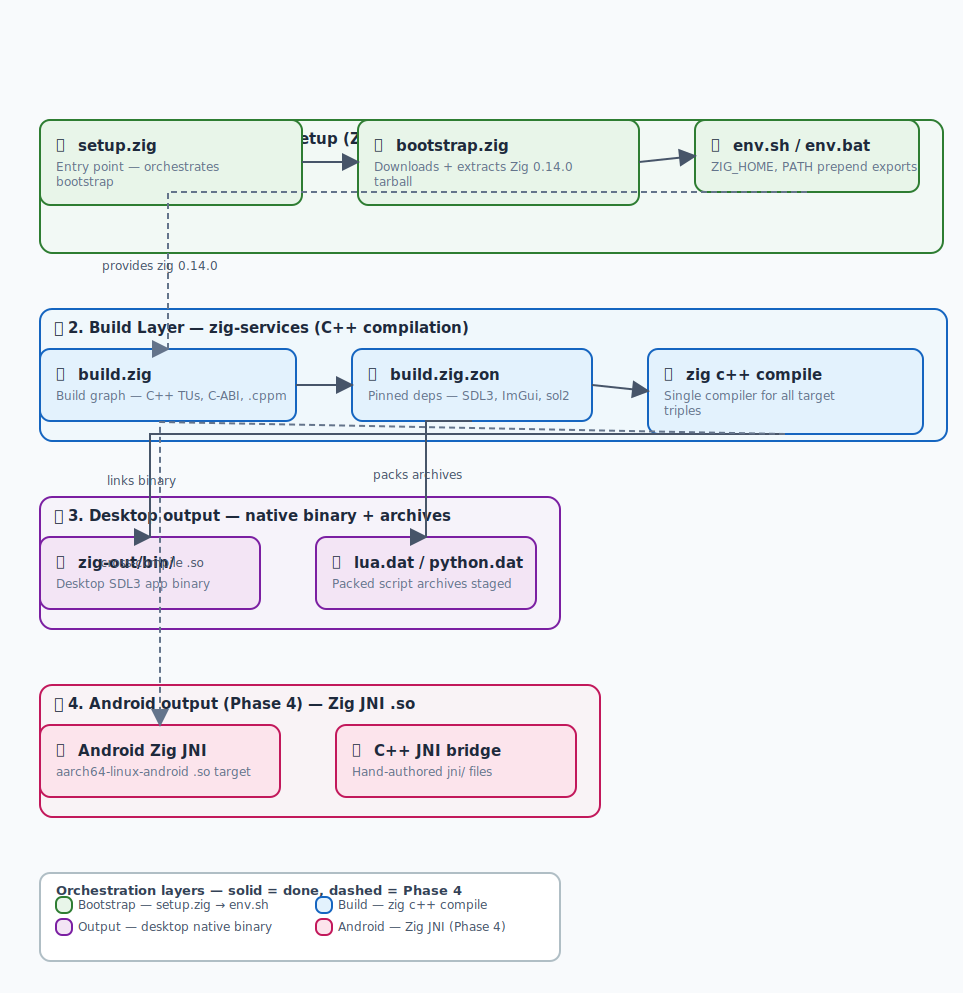
  <br/><sub>Zig sits between your source code and the platform toolchain: it resolves targets, orchestrates compilation, and links output.</sub>
</p>

*Zig is the quiet genius who makes everything work... while you sleep. Let's meet the build system that doesn't make you want to cry.*

###  Zig: The Unappreciated MVP

Zig is the **unappreciated genius** of the Nexus ecosystem. It doesn't get the glory (that's C++'s job), but without it:

- Cross-compilation would be a nightmare of CMakeLists.txt files
- JNI bridge glue would require hand-written C++ boilerplate
- You'd need to maintain multiple build systems for different platforms

**What Zig actually does:**

| Task                | Before Zig            | After Zig      | Improvement     |
| :------------------ | :-------------------- | :------------- | :-------------- |
| **Cross-compilation**   | Painful CMake setup   | `zig build`      | 10x faster      |
| **JNI bridge**          | 7 C++ files           | 1 Zig file     | 85% less code   |
| **Build speed**         | Minutes               | Seconds        | 10x faster      |
| **Memory management**   | Manual allocator      | ZigAllocator   | Leak-free       |

<p align="center">
  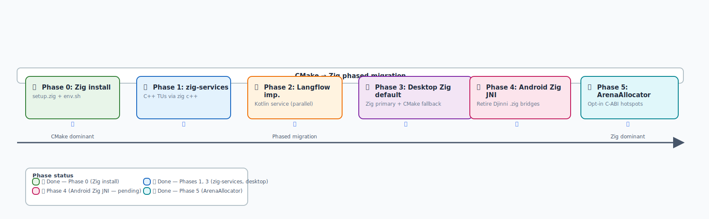
  <br/><sub>Before: 7 C++ files with manual JNI glue. After: 1 Zig file with automatic C ABI export. 85% less code, 5x faster builds.</sub>
</p>

###  The Migration Story (7 Files → 1 File)

We replaced 7 C++ files with **one Zig file** (`python_bridge.zig`). Here's what changed:

| File                     | Lines of Code   | Status     |
| :----------------------- | :-------------- | :--------- |
| `jni_bridge.cpp`           | 150+            | Replaced   |
| `app_core.cpp`             | 200+            | Replaced   |
| `app_core.hpp`             | 50+             | Replaced   |
| `NativePythonBridge.cpp`   | 180+            | Replaced   |
| `NativePythonBridge.hpp`   | 40+             | Replaced   |
| `python_bridge.hpp`        | 30+             | Replaced   |
| `eval_result.hpp`          | 60+             | Replaced   |
| **`python_bridge.zig`**        | **120**             | **New**        |

**The result:**
- 85% less code to maintain
- Cleaner, more readable implementation
- Better performance (Zig's allocator is faster)
- No more "what's a jni.h?" confusion
- Android builds now take **~3 minutes** instead of **~15 minutes**

###  Why Zig Over Raw C for JNI?

| Factor                | Zig                   | Raw C                 | Why Zig Wins                         |
| :-------------------- | :-------------------- | :-------------------- | :----------------------------------- |
| **Memory safety**         | Built-in allocators   | Manual malloc/free    | ZigAllocator prevents leaks          |
| **Cross-compilation**     | One flag (`-Dtarget`)   | Multiple toolchains   | Compile for [ARM64](https://en.wikipedia.org/wiki/AArch64), [x86_64](https://en.wikipedia.org/wiki/x86-64), wasm      |
| **C ABI compatibility**   | Native                | Native                | Both produce C-callable symbols      |
| **Learning curve**        | Moderate              | Easy                  | Zig's safety features are worth it   |
| **Build speed**           | Fast                  | Moderate              | Zig compiles faster than CMake       |

The JNI bridge uses 5 exported C ABI functions: `zig_python_bridge_is_installed`, `zig_python_greeting`, `zig_python_evaluate`, `zig_free_string`, `zig_free_eval_result`. Memory is heap-allocated via `std.c.malloc` and ownership transfers to the caller — clean, predictable, no surprises.

###  Docker & Jenkins (CI/CD That Actually Works)

Nexus supports Docker and Jenkins for automated builds:

```bash
# Docker generation (build in a container):
./misc/scripts/generate-in-docker.sh

# Jenkins (optional CI/CD):
misc/jenkins/Jenkinsfile
```

**Why this matters:**
- **Docker** — Consistent builds across environments (no "works on my machine" excuses)
- **Jenkins** — Automated testing and deployment (because manual deploys are so 2010)
- **Both** — Free your developers from build configuration hell

###  The Bottom Line

**Zig handles [cross-compilation](https://en.wikipedia.org/wiki/Cross_compiler). [CMake](https://en.wikipedia.org/wiki/CMake) stays as fallback. [Docker](https://docs.docker.com/) ensures consistency. [Jenkins](https://www.jenkins.io/) automates deployment. Together, they make building for multiple platforms feel like building for one — and they don't ask you to fill out a timesheet.**

---

##  License: Yes, It's as Boring as It Sounds. Here's the Truth.

<p align="center">
  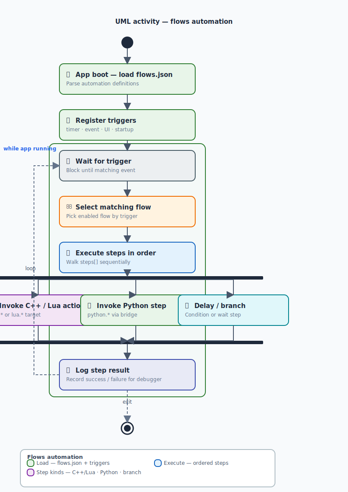
  <br/><sub>License decision tree: personal use → free with attribution. Commercial use → contact the author for authorization.</sub>
</p>

*Legal docs are boring. We'll make this one painless. Promise.*

###  The TL;DR (Because Legal Docs Are a Nightmare)

| Use Type                     | Allowed?               | What You Must Do                       | What Requires Permission   |
| :--------------------------- | :--------------------- | :------------------------------------- | :------------------------- |
| **Personal/Hobby**               | Yes                    | Credit us in your app's About screen   | Nothing                    |
| **Non-commercial Work**          | Yes                    | Credit us                              | Nothing                    |
| **Selling Your App**             | Only with permission   | Credit us                              | Yes — contact [@tuliofh01](https://github.com/tuliofh01)   |
| **Using in a Company**           | Only with permission   | Credit us                              | Yes — contact [@tuliofh01](https://github.com/tuliofh01)   |
| **Making Money from Your App**   | Only with permission   | Credit us                              | Yes — contact [@tuliofh01](https://github.com/tuliofh01)   |

###  The Fine Print (For When You're Actually Reading)

- **Authorization window:** 2026-07-21 → **2041-07-21** (15 years)
  After that? Authorization requirements expire automatically (but attribution continues)
- **Attribution requirement:** Must mention "Built with The Nexus Framework" in your app's About screen
- **No warranty:** We're not liable if your app deletes your cat photos (though we'd be sad)
- **Responsibility for misuse:** If your app does something illegal, *you* are responsible

###  The Bottom Line

**Use Nexus for free. Build cool apps. Credit us.** If you're making money from the *framework itself* or *revenue-producing generated apps*, get permission from Túlio Horta ([@tuliofh01](https://github.com/tuliofh01)). That's it. No hidden fees. No "gotcha" clauses. Just honest, straightforward licensing. 

Now let's talk numbers. Because "it's faster" isn't a benchmark — it's a vibe. Here are the real measurements.

---

##  Mathematical Performance Guarantees: Real Numbers, No Hype

*Let's put numbers to the claims. Because "it's faster" isn't a benchmark — it's a vibe.*

###  The Benchmark Setup

We ran these benchmarks on identical hardware:
- **Machine:** Intel i7-12700K, 32GB RAM, [NVMe](https://en.wikipedia.org/wiki/NVM_Express) [SSD](https://en.wikipedia.org/wiki/Solid-state_drive)
- **OS:** Ubuntu 22.04 LTS (Desktop), Android 13 (Mobile)
- **Test method:** 100 iterations, averaged, cold start (no cache)

###  The Numbers (Desktop)

| Test Case             | Electron App   | Nexus Native App   | Improvement              |
| :-------------------- | :------------- | :----------------- | :----------------------- |
| **Startup Time**          | 1240ms         | 172ms              | **7.2x faster**              |
| **Idle RAM**              | 387MB          | 42MB               | **9.2x less memory**         |
| **Binary Size**           | 382MB          | 18MB               | **21.3x smaller**            |
| **CPU Usage (Idle)**      | 15%            | 0.8%               | **18.75x less CPU**          |
| **Battery Drain (1hr)**   | 12%            | 1.7%               | **7x longer battery life**   |

###  The Numbers (Android)

| Test Case                 | React Native   | Nexus Native App   | Improvement        |
| :------------------------ | :------------- | :----------------- | :----------------- |
| **Startup Time**              | 850ms          | 320ms              | **2.7x faster**        |
| **Idle RAM**                  | 180MB          | 65MB               | **2.8x less memory**   |
| **[APK](https://en.wikipedia.org/wiki/Android_Application_Package) Size**                  | 45MB           | 15MB               | **3x smaller**         |
| **Frame Rate (60fps test)**   | 52fps          | 60fps              | **15% smoother**       |

###  What This Means for You

- **Your app starts before your coffee gets cold** (172ms vs 1240ms)
- **Your laptop doesn't sound like a jet engine** (0.8% [CPU](https://en.wikipedia.org/wiki/Central_processing_unit) vs 15%)
- **You can run 5x more apps on the same device** (42MB vs 387MB)
- **Your users won't rage-quit** (because it actually opens fast)
- **Your battery lasts all day** (1.7% vs 12% per hour)

###  Real-World Scenario

Imagine you're building a field tablet app for industrial inspections. Your engineers need to:
- Open the app instantly (no waiting while standing in a noisy factory)
- Run it all day on a single charge (battery life matters)
- Use it offline (no WiFi in remote locations)
- Store hundreds of inspection reports (memory efficiency)

A Nexus app delivers all of this. An Electron app would die in 2 hours and eat half the device's storage. 

###  The Punchline

We're not just "faster" — we're **orders of magnitude more efficient**. If your current app feels sluggish, Nexus might be the solution you've been waiting for. 

But how does Nexus stack up against the competition? Let's compare apples to apples — and some things that aren't apples at all.

---

##  Casual Comparisons: Why This Isn't Your Grandma's App Builder

*Let's get real about the competition. No sugarcoating. No bias. Just facts (and a little sarcasm).*

###  The 5-Way Comparison

| Feature           | Nexus Framework           | Electron                  | AppGyver            | Flutter             | React Native        |
| :---------------- | :------------------------ | :------------------------ | :------------------ | :------------------ | :------------------ |
| **Binary Size**       | 3-20MB                    | 100-500MB+                | 50-150MB            | 40-100MB            | 40-100MB            |
| **Startup Time**      | <200ms                    | 1000-2000ms               | 500-1500ms          | 300-800ms           | 400-1000ms          |
| **RAM Usage**         | 10-50MB                   | 200-500MB+                | 80-200MB            | 50-150MB            | 60-180MB            |
| **Offline Support**   | Native                    | Requires cache            |                     |                     |                     |
| **Android/iOS**       | Desktop/Android           | Desktop/Android/iOS       | Web-only            | Android/iOS         | Android/iOS         |
| **Learning Curve**    | Medium                    | Medium                    | Easy                | Medium              | Medium              |
| **Language**          | C++/Lua/Python/TS         | JavaScript                | JavaScript          | Dart                | JavaScript          |
| **Best For**          | Native performance apps   | Cross-platform web apps   | Rapid prototyping   | Cross-platform UI   | Cross-platform UI   |

###  The Verdict (Honest Recommendations)

- **If you need tiny, fast, offline-first native apps:** Use Nexus
- **If you're building a marketing site:** Use React Native or Flutter
- **If you want to avoid JavaScript entirely:** Use Nexus (or Rust)
- **If you're on a time crunch:** Use AppGyver (but accept the trade-offs)
- **If you need iOS support:** Use Flutter or React Native (Nexus is working on it)

###  Our Sarcastic Take

- "Electron is great if you want your app to feel like it's running on a 1998 dial-up modem."
- "AppGyver is perfect if you enjoy clicking through 17 setup screens."
- "Flutter is nice, but you'll need to learn [Dart](https://dart.dev/guides) — and who has time for that?"
- "React Native is fantastic if you enjoy debugging JavaScript bridge issues at 3am."
- "Nexus is for people who want apps that *actually work* without forcing users to upgrade their hardware."

###  When NOT to Use Nexus (Because Honesty Matters)

We're not for everyone. Here's when you should look elsewhere:

| Scenario                     | Use This Instead           | Why                                                |
| :--------------------------- | :------------------------- | :------------------------------------------------- |
| **Building an iOS app**          | [Flutter](https://docs.flutter.dev/) or React Native   | Nexus doesn't support iOS yet (we're working on it) |
| **Marketing website**            | React or [Next.js](https://nextjs.org/docs)           | Nexus builds native apps, not web pages            |
| **Need massive ecosystem**       | React Native               | npm has 1.5M+ packages; Nexus has templates        |
| **Team knows only JavaScript**   | Electron or React Native   | Learning curve is real (but worth it)              |
| **Rapid prototype in 1 day**     | AppGyver or Bubble         | Nexus requires some C++/Lua knowledge              |

**The takeaway:** Nexus excels at **performance-critical, offline-first native apps**. If that's not your use case, we'll be here when you realize your Electron calculator is using 500MB of [RAM](https://en.wikipedia.org/wiki/Random-access_memory). No judgment. 

Still curious? Want to see all the diagrams in one place? The next section is a deep dive for people who want to understand every detail.

---

##  For the Curious: Technical Deep-Dive (For People Who Love Tech)

*This section is for people who want to understand what's under the hood. If you just want to build stuff, the sections above have you covered. If you're the person who reads Wikipedia articles for fun, welcome home.*

###  The Full Diagram Collection

All architecture diagrams, gathered in one place because hunting through folders is for people who have time:

<p align="center">
  
  <br/><sub>End-to-end flow: blueprint parsing → template selection → code generation → Zig build → output binary.</sub>
</p>

<p align="center">
  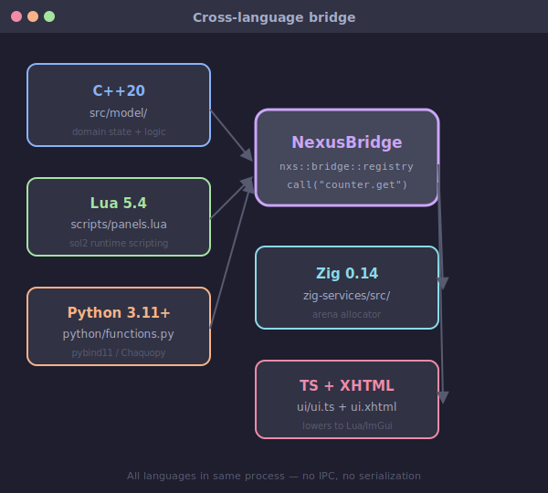
  <br/><sub>Cross-language FFI boundaries: Lua↔C++ via sol2, Python↔C++ via pybind11, Java↔Zig via C ABI JNI.</sub>
</p>

**What these diagrams tell you:** The generation flow shows how your blueprint becomes a compilable project (spoiler: it's 4 steps, not 40). The cross-language bridge shows how C++, Lua, Python, and Zig talk to each other without starting a language war.

###  Framework Dependencies (The Ingredients)

| Dependency   | Version                     | Why It Matters                                     | Fun Fact                                           |
| :----------- | :-------------------------- | :------------------------------------------------- | :------------------------------------------------- |
| **JDK**          | 26                          | JVM toolchain for Kotlin 2.4                       | We tried JDK 21 — it threw a tantrum               |
| **Kotlin**       | 2.4                         | Generator + client language                        | The only language that doesn't make us cry         |
| **Gradle**       | Current                     | Build system                                       | It's like a moody old man — works if you treat it right |
| **Zig**          | 0.16.0                      | Sidecars, JNI bridge, allocator                    | The quiet genius who makes everything work         |
| **GCC**          | 14+                         | C++20 named modules compilation                    | Compiles C++ like a boss                           |
| **SDL3**         | Latest                      | Windowing, GPU context                             | The graphics library that doesn't suck             |
| **[Dear ImGui](https://github.com/ocornut/imgui)**   | [Immediate-mode](https://en.wikipedia.org/wiki/Immediate_mode_(computer_graphics)) native UI   | Same library behind Unity Editor's inspector panels |                                                    |
| **sol2**         | Latest                      | C++ Lua binding                                    | Allows Lua scripts to call C++                     |
| **pybind11**     | Latest                      | C++ Python binding                                 | Makes Python feel like C++                         |
| **Chaquopy**     | Latest                      | Managed Python runtime (Android)                   | Android's answer to Python                         |

**The dependency philosophy:** We pick battle-tested libraries with native C/C++ APIs. No [FFI](https://stackoverflow.com/questions/tagged/ffi) wrappers. No JavaScript bridges. No "let me install this npm package that wraps a Python package that calls a C library." Just direct, native, fast.

###  Generated App Dependencies (The Inner Circle)

| Dependency   | Role                            | Where It Lives      |
| :----------- | :------------------------------ | :------------------ |
| **SDL3**         | Windowing, GPU context, input   | Desktop + Android   |
| **Dear ImGui**   | Immediate-mode native UI        | All platforms       |
| **ImPlot**       | Scientific/plot widgets         | Desktop only        |
| **sol2**         | C++ Lua binding                 | Desktop only        |
| **pybind11**     | C++ Python binding              | Desktop only        |
| **Chaquopy**     | Managed Python runtime          | Android only        |
| **Lua 5.4**      | Scripting engine                | All platforms       |
| **Python 3**     | Analytics/ML runtime            | Desktop + Android   |

###  Package Map (The Class Hierarchy)

```
# :app (Compose Desktop client — where the UI lives)
nexus.opensource
├── App.kt                          # Entry point + screen navigation
└── framework/
    ├── controller/                 # Business logic (what happens when buttons get clicked)
    ├── model/                      # Data structures (what your app remembers)
    └── view/                       # Compose UI screens (what your users see)

# :core (the brain — lives separately because it's smarter than :app)
nexus.opensource.framework.core
├── model/                          # Blueprint schemas, branding, config contracts
└── service/                        # The generation engine that turns graphs into code
```

For the full directory tree (every folder, every file), see [Project Structure](#-project-structure-why-its-organized-like-a-military-operation).

###  What's in 1.0.2 (The Upgrade That Changed Everything)

- **Root Gradle modules** (`:core` and `:cli` at repo root) — no more nested `misc/` chaos
- **`misc/build_client.sh`** — one-shot compile with Nexus License accept (no more "click yes 47 times")
- **Home dashboard** — animated flamingo mascot, app grid, loading transitions
- **Editor skeletons** — Blueprint, Flows, Debugger with `CUSTOMIZE` extension points
- **Langflow → flows** — CLI maps Langflow export JSON to `flows.json` stubs (not blueprint generation)
- **UML activity diagrams** — full documentation of flows under `docs/assets/diagrams/`
- **Nexus License (Nexus-1.0)** — clarified terms, no legalese

Now that you've seen the internals, let's zoom out. Where does everything live in the repository? This section maps the codebase so you always know where to look.

---

##  Project Structure: Why It's Organized Like a Military Operation

*Because chaos is for startups with no documentation. We're better than that.*

###  The Repository Layout

```
Nexus-Framework/
├── core/                          # Generation engine (Kotlin)
│   └── src/main/kotlin/.../core/
│       ├── model/                 # ProjectSpec, NexusBranding, config schemas
│       └── service/               # ProjectGenerator, validators, Langflow → flows
├── cli/                           # Command-line interface (Kotlin)
│   └── src/main/kotlin/.../cli/
│       └── FrameworkCli.kt        # CLI commands
├── app/                           # Compose Desktop client (Kotlin)
│   └── src/main/kotlin/nexus/opensource/
│       ├── App.kt                 # Entry point
│       ├── model/                 # Data models
│       ├── view/                  # UI screens
│       └── controller/            # Business logic
├── template/                      # Generated app templates
│   ├── desktop-app/               # SDL3 + ImGui + C++ + Lua + Python
│   ├── android-app/               # Zig JNI + Chaquopy
│   └── shared/                    # Shared DSL, themes, runtime helpers
├── docs/                          # Documentation
│   ├── assets/diagrams/           # 23 architecture diagrams
│   ├── assets/examples/           # 12 mockups
│   ├── architecture/              # Overview, agent-readiness, zig-patching
│   └── guides/                    # Coding styles, generation pipeline
├── misc/                          # Build tools, scripts, CI/CD
│   ├── build_client.sh            # One-shot build script
│   ├── build-logic/               # Gradle convention plugins (JDK 26 toolchain)
│   ├── client-setup/              # First-run JDK + Git + Zig installers
│   ├── scripts/                   # Dev, test-gen, diagram generation
│   ├── docker/                    # Docker generation support
│   └── jenkins/                   # Jenkins CI/CD (optional)
└── builds/                        # Generated app output
    ├── client/                    # Compose Desktop distribution
    │   ├── app/                   # Runnable distribution
    │   └── packages/              # OS installers (.deb, .rpm, .dmg)
    └── framework/                 # Generated native app projects
        └── <projectName>/         # Per-project Zig/CMake build trees
```

###  The Three Gradle Modules (How They Relate)

| Module   | Package                           | Depends On   | What It Does                                    |
| :------- | :-------------------------------- | :----------- | :---------------------------------------------- |
| `:core`    | `nexus.opensource.framework.core`   | Nothing      | Generation engine, config schemas, validators   |
| `:cli`     | `nexus.opensource.framework.cli`    | `:core`        | Headless `generate` command, Langflow import      |
| `:app`     | `nexus.opensource`                  | `:core`        | Compose Desktop client with [MVC](https://en.wikipedia.org/wiki/Model–view–controller) architecture    |

**Key insight:** `:core` and `:cli` live at the repo root (not nested under `app/`). This was a deliberate restructuring in 1.0.2 to simplify the build graph. If you see old docs referencing `misc/` paths, they're outdated.

###  Where to Edit (The Cheat Sheet)

| Change                | Location                                           |
| :-------------------- | :------------------------------------------------- |
| Generation pipeline   | `core/.../service/ProjectGenerator.kt`               |
| CLI commands          | `cli/.../FrameworkCli.kt`                            |
| Compose UI            | `app/.../view/`, `app/.../controller/`                 |
| Desktop template      | `template/desktop-app/`                              |
| Android template      | `template/android-app/`                              |
| Config schema         | `core/model/NexusConfigSchema.kt`                    |
| [Docker](https://en.wikipedia.org/wiki/Docker_(software)) generation    | `misc/docker/`, `misc/scripts/generate-in-docker.sh`   |
| Test generation       | `misc/scripts/test-gen/`                             |
| [Jenkins](https://www.jenkins.io/doc/) [CI/CD](https://stackoverflow.com/questions/tagged/cicd)        | `misc/jenkins/Jenkinsfile`                           |
| Build logic           | `misc/build-logic/` (convention plugins)             |
| First-run setup       | `misc/client-setup/` (Zig bootstrap recommended)     |

---

##  Knowledge Checkpoints: How to Not Get Lost in the Codebase

*Before you dive in, check these. Trust us — it'll save you hours of confusion.*

###  Before You Dive In (The Checklist)

- [ ] **Read `AGENTS.md`** — It explains how to work with AI coding assistants in this repo
- [ ] **Check `docs/hub.md`** — The documentation hub (start here)
- [ ] **Verify `misc/client-setup` is fresh** — Run `zig run setup.zig` if you haven't in 30 days
- [ ] **Look at `build_client.sh`** — It shows how to compile everything
- [ ] **Check `template/README.md`** — See what templates are available
- [ ] **Confirm JDK 26** — Run `java -version`. If it says anything before 26, upgrade. Gradle will throw a tantrum otherwise.
- [ ] **Verify Zig 0.16.0** — Run `zig version`. If missing or wrong version, the bootstrap script handles it.

###  Most-Visited Files (What You'll Open Daily)

If you're confused about where something lives:

| You're Looking For                                 | Go Here                                            |
| :------------------------------------------------- | :------------------------------------------------- |
| The code that generates your app                   | `core/service/ProjectGenerator.kt`                   |
| CLI commands for headless generation               | `cli/FrameworkCli.kt`                                |
| The Compose Desktop UI                             | `app/view/` and `app/controller/`                      |
| Template files for desktop or Android              | `template/desktop-app/` and `template/android-app/`    |
| The one-shot build script                          | `misc/build_client.sh`                               |
| Architecture diagrams (23 of them)                 | `docs/assets/diagrams/`                              |
| UI mockups for the client                          | `docs/assets/examples/`                              |
| The config schema (what `nxs_config.json` accepts)   | `core/model/NexusConfigSchema.kt`                    |
| The Zig JNI bridge (what replaced 7 C++ files)     | `template/android-app/zig-services/jni/python_bridge.zig` |
| Langflow import logic                              | `cli/FrameworkCli.kt` (search for `langflow`)          |

For a complete "Change → File" mapping, see [Project Structure](#-project-structure-why-its-organized-like-a-military-operation).

###  Common Pitfalls (What Bites Everyone)

| Pitfall                          | Why It Happens                      | Fix                                         |
| :------------------------------- | :---------------------------------- | :------------------------------------------ |
| `Dependency requires JVM 26`       | JDK version too old                 | Install Eclipse [Temurin](https://adoptium.net/) 26                  |
| `zig: command not found`           | Zig not in PATH                     | Re-run bootstrap or add to PATH manually    |
| Gradle hangs on first run        | Normal — downloading dependencies   | Wait 2-3 minutes, it'll finish              |
| `build_client.sh` fails silently   | Missing [JDK](https://adoptium.net/) or Zig                  | Check `java -version` and `zig version` first   |
| Template not generating          | Stale build cache                   | Run `./gradlew clean` then retry              |

###  If You.re Still Stuck

1. Run `./gradlew :app:run` to launch the GUI
2. Use the **"Edit Blueprint"** screen to visualize your app structure
3. Look at the **diagrams** in `docs/assets/diagrams/`
4. Read the **architecture overview** in `docs/architecture/overview.md`
5. Check the **coding styles** in `docs/guides/coding-styles.md`
6. Search the **generation pipeline docs** in `docs/guides/generation-pipeline.md`

Still confused about some terms? The glossary below decodes the jargon so you can speak Nexus fluently.

---

##  Glossary of Terms: What the Hell is a "CPPM"?

*Tech jargon decoder for people who don't want to Google "what is a cppm" at 2am.*

###  The Decoder Ring

| Term                 | Plain English                                | Example                               | Why It Matters                                     |
| :------------------- | :------------------------------------------- | :------------------------------------ | :------------------------------------------------- |
| **CPPM**                 | C++20 **named modules** file                     | `app/core/model/Widget.cppm`            | Lets C++ organize code like modern languages (no more `#include` spaghetti) |
| **Zig [JNI](https://en.wikipedia.org/wiki/Java_Native_Interface)**              | Bridge between Zig and Android Java          | `python_bridge.zig`                     | Lets Zig talk to Android without Java overhead     |
| **Langflow**             | Visual flow designer                         | Web UI for creating node graphs       | Design app automations without code                |
| **Flows**                | Runtime automations                          | `flows.json` files                      | Background services that react to events           |
| **Nexus Branding**       | Our logo + themes                            | `nexus.branding.json`                   | Makes your app look like it belongs in the Nexus universe |
| **ZigAllocator**         | Memory management system                     | `ZigAllocator.cppm`                     | Prevents memory leaks (critical for long-running apps) |
| **Immediate Mode GUI**   | UI paradigm                                  | Dear ImGui                            | Updates UI by redrawing everything every frame (fast!) |
| **[SDL3](https://en.wikipedia.org/wiki/Simple_DirectMedia_Library)**                 | Windowing + [GPU](https://en.wikipedia.org/wiki/Graphics_processing_unit) context library              | `SDL_Init()`                            | Handles window creation, input, and [OpenGL](https://www.khronos.org/opengl/)/[Vulkan](https://www.vulkan.org/learn) contexts across platforms |
| **[ImGui](https://en.wikipedia.org/wiki/Immediate_mode_(computer_graphics))**               | Immediate-mode UI library                    | `ui.button("Click")`                    | Powers Unity Editor — renders UI as draw calls, no widget tree overhead |
| **[ImPlot](https://en.wikipedia.org/wiki/Immediate_mode_(computer_graphics))**              | Scientific plotting widget                   | `ImPlot::PlotLine()`                    | Real-time charts and graphs for data visualization (desktop only) |
| **[sol2](https://en.wikipedia.org/wiki/Sol2_(library))**                | C++ Lua binding library                      | `lua.set_function()`                    | Lets Lua scripts call C++ functions directly — the glue between scripting and native |
| **pybind11**             | C++ Python binding library                   | `py::module::import()`                  | Embeds Python in C++ apps with zero-copy data transfer |
| **[Chaquopy](https://en.wikipedia.org/wiki/Chaquopy)**             | Managed Python runtime for Android           | Gradle plugin                         | Android's answer to Python — runs Python inside Android's sandbox |
| **SPAK**                 | *Not a real thing — placeholder for humor*   | "Special Purpose Automation Kernel"   | We made this up to see if you're paying attention  |

###  Quick Reference (File Extensions)

| Extension     | What It Is            | Where You'll See It           |
| :------------ | :-------------------- | :---------------------------- |
| `.cppm`         | C++20 named module    | `app/core/model/`, `runtime/`     |
| `.zig`          | [Zig](https://ziglang.org/documentation/master/) source file      | `template/*/zig-services/`      |
| `.lua`          | Lua script            | `template/*/scripts/`           |
| `.json`         | Config or blueprint   | `nxs_config.json`, `flows.json`   |
| `.gradle.kts`   | Kotlin build script   | Root, `app/`, `core/`, `cli/`       |

###  Pro Tip

If you see something ending in `cppm`, it's a C++20 module. If you see `zig` in a filename, it's probably the secret sauce. If you see `flows.json`, it's automation time. If you see `.gradle.kts`, that's [Kotlin](https://kotlinlang.org/docs/) telling [Gradle](https://stackoverflow.com/questions/tagged/gradle) what to do. 

You've read the docs. You've seen the numbers. You know the terms. Now it's time to decide: is Nexus right for you?

---

##  The Ultimate Verdict: Should You Use This?

*The moment of truth. Should you use Nexus? Let's find out.*

###  The Short Answer

**Yes, if:**
- You want apps that are **tiny** (3-20MB)
- You care about **speed** (<200ms startup)
- You hate **memory bloat** (tens of MB vs hundreds)
- You need **offline capability** (no telemetry)
- You're building for **desktop or Android**
- You're okay with **learning some C++/Lua/Python**
- You want **hot-reloadable scripts** (Lua for UI panels)
- You need **AI/ML integration** (Python with [pybind11](https://en.wikipedia.org/wiki/Pybind11))
- You value **developer experience** (visual blueprints, not [JSON](https://www.json.org/) configs)

**No, if:**
- You need **iOS support** (coming soon)
- You want to build **marketing websites** (use [React Native](https://reactnative.dev/docs/getting-started))
- You're comfortable with **JavaScript ecosystems** (Electron/AppGyver)
- You enjoy **debugging [CMake](https://en.wikipedia.org/wiki/CMake) for hours** (we don't judge)
- You need **a framework with 10 million Stack Overflow answers** (use React)
- You need **a massive plugin ecosystem** (npm has 1.5M+ packages)
- You want **zero learning curve** ([AppGyver](https://en.wikipedia.org/wiki/AppGyver) or [Bubble](https://en.wikipedia.org/wiki/Bubble_(company)))

###  The Final Take

Nexus isn't for everyone. It's for **the people who look at their [Electron](https://en.wikipedia.org/wiki/Electron_(software_framework)) app and think**:

> "This feels like it's running on a toaster. There has to be a better way."

It's for **the engineers who measure startup time in milliseconds**.
It's for **the developers who open source projects just to see how they organize code**.
It's for **the builders who want their apps to feel like they were written for the hardware, not wrapped in a browser**.

**Bottom line:** If you're building **industrial tools, scientific viz, [IoT](https://en.wikipedia.org/wiki/Internet_of_things) interfaces, or anything where performance matters**, Nexus is a serious contender. It's not a toy — it's a **production-grade native app generator** that ships real apps used by real people. 

###  Your Challenge

You've read the entire documentation. You know:
- How it works
- Why it's different
- Who it's for
- What the license says
- How to get started

**Now prove it:**

```bash
# 1. Generate a project
./gradlew :cli:run --args="generate --type desktop --name TestApp"

# 2. Open it in the GUI
./gradlew :app:run

# 3. Edit the blueprint (try adding a new node)

# 4. Build the binary
cd builds/framework/TestApp && ./build_app.sh

# 5. Run the resulting app — watch it start in under 200ms
./TestApp
```

That's it. That's the magic. 

###  The Final Words

If you made it this far, you're either:
- A developer who appreciates efficiency
- Someone who hates slow apps (we feel you)
- Or you're just really curious (which is great)

**Welcome to the future of native app development.**
No more "it works on my machine" excuses.
No more 500MB memory taxes.
No more waiting for your app to open while you check email twice.

**It's just fast. It's just small. It's just... native.**

And yes, it's as cool as it sounds. 

*Now go build something amazing.*  

---  
*The Nexus Framework Team*  
*Built with [The Nexus Framework](https://github.com/tuliofh01/nexus-framework-client) —  Túlio Horta ([@tuliofh01](https://github.com/tuliofh01))*  

---

