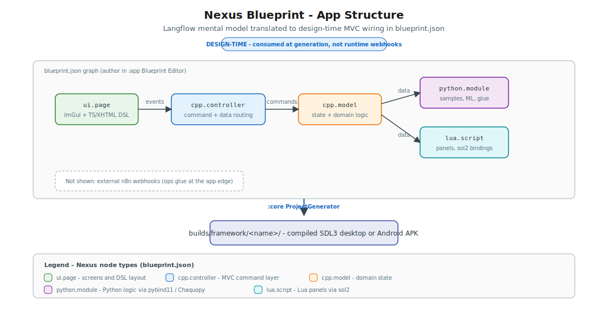

# The Nexus Company's Framework For Native Applications Development

<p align="center">
  
</p>

<p align="center"><strong>🧩 Native apps, not browser tabs</strong> — ship SDL3 binaries from a blueprint graph.</p>

<p align="center">
  <a href="README.md"></a>
  <a href="README.pt-BR.md"></a>
</p>

<p align="center">
  <a href="https://www.apache.org/licenses/LICENSE-2.0"></a>
  <a href="https://kotlinlang.org/"></a>
  <a href="https://www.libsdl.org/"></a>
  <a href="https://github.com/ocornut/imgui"></a>
</p>

> [!TIP]
> **Welcome aboard.** Run [first-run setup](#first-run), then `./gradlew :app:run` — you'll have a Compose client, a blueprint editor, and a path to `builds/framework/<name>/` in minutes. No Chromium download required.

**The Nexus Framework** is an **open source native app builder**: it generates **C++**, **Lua**, and **Python** applications for **desktop** (Windows, macOS, Linux) and **Android** from a [Langflow](https://github.com/langflow-ai/langflow)-style [`blueprint.json`](#blueprint-nodes-langflow-style-vs-n8n) and optional [`flows.json`](#optional-runtime-flows-services). The **Kotlin Compose** Desktop client (`:app`) authors graphs; [`misc/core`](#the-misc-directory) validates and writes out [`template/`](#repository-layout) projects with **SDL3** windowing, **Dear ImGui** widgets, sol2 scripting, TypeScript + XHTML UI authoring, and built-in **Python** (pybind11 on desktop, Chaquopy + Djinni on Android). ImPlot charts render without a browser engine.

*Think of it as a code generation flow with opinions — and a plotter sample that actually runs.*

If you're evaluating **web-shell** stacks — **Electron** (Chromium + JavaScript) or **Tauri** (OS WebView + Rust) — Nexus is a different bet: native **C++** runtime, immediate-mode widgets, and in-process Lua/Python instead of HTML layout engines. Those tools excel when DOM/CSS is the product surface; Nexus excels when throughput, binary size, and a shared SDL3 stack across desktop and Android field hardware matter more.

## Table of contents

- [Blueprint nodes: Langflow-style vs n8n](#blueprint-nodes-langflow-style-vs-n8n)
- [Optional runtime flows (services)](#optional-runtime-flows-services)
- [What this repo is](#what-this-repo-is)
- [First run](#first-run)
- [Quick start](#quick-start)
- [Repository layout](#repository-layout)
- [The `misc/` directory](#the-misc-directory)
- [Use cases — what Nexus is built for](#use-cases--what-nexus-is-built-for)
- [Why Nexus performs better](#why-nexus-performs-better)
- [Learning curve](#learning-curve)
- [Python: Desktop vs Android](#python-desktop-vs-android)
- [TypeScript + XHTML DSL](#typescript--xhtml-dsl)
- [Modern C++ in Nexus](#modern-c-in-nexus)
- [Architecture](#architecture)
- [Documentation](#documentation)
- [Adding dependencies after setup](#adding-dependencies-after-setup)
- [Development status and limitations](#development-status-and-limitations)
- [Beyond quick-fix automation: from flows to real applications](#beyond-quick-fix-automation-from-flows-to-real-applications)
- [Copyright and license](#copyright-and-license)
- [See also](#see-also)
- [Road to MVP](#road-to-mvp)

---

## 🧩 Blueprint nodes: Langflow-style vs n8n

Nexus ships a **Langflow-style app graph** at the project root via [`blueprint.json`](docs/templates/blueprint-schema.md). Nodes declare modules (`python.module`, `cpp.model`, `ui.page`, …); edges wire data and command flow inside the generated MVC app. The **[`:core` generator](#the-misc-directory)** validates and consumes the graph when materializing `builds/framework/<name>/`.

<!-- Diagram: Langflow vs n8n vs Nexus blueprint comparison -->


| Node type | Role |
|-----------|------|
| `python.module` | Python sampling / analytics (`python/functions.py`) |
| `cpp.model` | C++ domain state (`FunctionRegistry`, caches) |
| `cpp.controller` | Commands + wiring (`PlotController`) |
| `ui.page` | TS/XHTML page (`ui/ui.ts`, `ui/ui.xhtml`) |
| `lua.script` | Runtime Lua panels (`scripts/panels.lua`) |

| | **[Langflow](https://github.com/langflow-ai/langflow)** | **[n8n](https://n8n.io/)** | **Nexus [`blueprint.json`](docs/templates/blueprint-schema.md)** |
|---|-------------|---------|---------------------------|
| **Purpose** | ML / LLM flow authoring | Workflow automation (triggers, HTTP, integrations) | **At build time** — native app structure |
| **Node model** | Typed components (model, tool, memory) | Steps + triggers (webhook, cron, Slack, …) | Typed modules (`python.module`, `cpp.model`, …) |
| **Edges** | Data between components | Event / payload routing | MVC ports (`evaluate`, `sampleCache`, `commands`, …) |
| **Execution** | **Runtime** — user runs the flow | **Runtime** — schedule or webhook fires | **At build time** — `ProjectGenerator` validates + writes out |

**Edit in the client:** `./gradlew :app:run` → **Generate Project** → **Edit blueprint** (Compose canvas + JSON inspector in v1; native **imnodes** panel planned for v1.1 — same schema). Samples: [template/desktop-app/blueprint.json](template/desktop-app/blueprint.json) · [template/android-app/blueprint.json](template/android-app/blueprint.json). Schema: [docs/templates/blueprint-schema.md](docs/templates/blueprint-schema.md).

### Langflow-style nodes vs n8n

Nexus [`blueprint.json`](docs/templates/blueprint-schema.md) is closer to **[Langflow](#langflow-style-examples)** (typed in-app graph) than to **n8n** (external workflow automation) — see the comparison table above. Nexus does **not** replace n8n; a generated app can call n8n webhooks from Python/Lua while `blueprint.json` stays focused on **internal** MVC wiring. For when a flow should graduate into shipped native software, see [Beyond quick-fix automation](#beyond-quick-fix-automation-from-flows-to-real-applications).

**Edit blueprint** in `:app` mirrors the Langflow canvas (v1.1 adds native **imnodes** on the same schema).

### Langflow-style examples

These diagrams show how Langflow authors runtime AI flows — and how Nexus adopts the same node-and-edge mental model for **at-build-time** native app structure in `blueprint.json`.

#### RAG chatbot flow
*Langflow runtime — retrieval, model, and chat output*

Reference for typed nodes and data edges in Langflow — Nexus mirrors the **visual pattern** in `blueprint.json`, not the runtime.

<!-- Example: Langflow RAG chatbot runtime flow -->


#### Agent with tools
*Langflow runtime — LLM, memory, and tool nodes*

Agent loop with tools and memory — map each logical module to blueprint node types (`python.module`, `cpp.controller`, …) that `:core` emits at generation time.

<!-- Example: Langflow agent with tools and memory -->


#### Nexus blueprint app structure
*Design-time codegen — MVC modules from `blueprint.json`*

The Nexus equivalent: `python.module`, `cpp.model`, `cpp.controller`, `ui.page`, and `lua.script` wired by MVC ports — consumed once by `ProjectGenerator`. Sample: [template/desktop-app/blueprint.json](template/desktop-app/blueprint.json).

<!-- Example: Nexus blueprint MVC app structure -->


---

## ⚡ Optional runtime flows (services)

Nexus separates **design-time structure** from **runtime automation**:

| Layer | File | Purpose |
|-------|------|---------|
| App structure | [`blueprint.json`](docs/templates/blueprint-schema.md) | Langflow-style MVC wiring (modules, ports, screens) |
| Runtime flows | [`flows/flows.json`](docs/templates/flows-schema.md) | Optional in-app services — background loops, event triggers, schedules |

### Blueprint vs flows layers
*Design-time codegen vs optional runtime automation*

`blueprint.json` wires MVC structure consumed once by `:core`; `flows.json` registers in-process triggers loaded by FlowRunner at startup. A single Langflow canvas may split across both files after translation.


**Edit in the client:** `./gradlew :app:run` → **Generate Project** → **Edit flows** — list flows, enable/disable, JSON preview (visual editor v1.1). Schema: [docs/templates/flows-schema.md](docs/templates/flows-schema.md).

### Adoption paths

Three ways to adopt runtime flows — pick the weight that fits your app:

1. 🚫 **No flows** — Omit or disable flows; fully custom app; starter works without FlowRunner
2. 🔧 **Flows as helpers** — Small automation services (timers, event hooks) inside a larger app
3. 🔀 **Hybrid** — Blueprint MVC + background/triggered flows in the same binary

### Background vs triggered

| Mode | When it runs | Example trigger |
|------|----------------|-----------------|
| `background` | While app is alive | `interval` every 5000 ms |
| `triggered` | On condition only | `event` `curve.added`, `startup`, `manual` |

Add multiple flows by appending objects to the `flows` array in [`flows.json`](docs/templates/flows-schema.md) (each needs a unique `id`). Disable globally via `nxs_config.json` → `"flows": { "enabled": false }` or per-flow with `"enabled": false`.

### Using Langflow to author flows

[Langflow](https://github.com/langflow-ai/langflow) is an optional **external authoring tool** — export flow JSON and adopt it as native `flows.json` services. Structure graphs map to [`blueprint.json`](docs/templates/blueprint-schema.md); automation graphs map to **`flows.json`** (see [Blueprint vs flows layers](#blueprint-vs-flows-layers) above). Langflow/n8n distinctions: [Blueprint nodes](#blueprint-nodes-langflow-style-vs-n8n).

#### Step A — Design in Langflow (optional external tool)

1. Build a visual DAG in Langflow: nodes (LLM, Prompt, Tool, Retriever, Agent, …), edges, and per-node parameters.
2. Export the flow as JSON — typically via **Export flow** or the Langflow API (`/api/v1/flows/{id}`). The export is a flow-definition document (nodes, edges, `data` payloads, positions). Field names and nesting **differ from Nexus** `flows.json`; treat the export as a design artifact, not a drop-in file.

#### Step B — Map to Nexus `flows.json`

Nexus adopts the graph as **in-process automation** — not a hosted Langflow server.

| Langflow concept | Nexus `flows.json` |
|------------------|-------------------|
| Langflow component (LLM, Tool, Agent, …) | `steps[]` with `type: invoke` targeting `nxs.*`, `python.*`, or `lua.*` |
| Edges / execution order | Ordered `steps` array; branches via `condition` (v1.1) |
| Trigger (chat input, webhook, schedule) | `trigger.type`: `event`, `interval`, `startup`, `manual`, `hotkey` |
| Long-running / polling loop | `mode: background` |
| On-demand / user-initiated run | `mode: triggered` |

#### Step C — Adoption workflow

Export from Langflow → translate to Nexus schema → ship in `flows/` → FlowRunner registers triggers at startup.


1. **Export** JSON from Langflow → **translate** to [flows schema](docs/templates/flows-schema.md) (manual v1; importer v1.1).
2. **Place** in `flows/flows.json` or paste in **Edit flows** (`./gradlew :app:run` → **Generate Project** → **Edit flows**).
3. **Enable** in `nxs_config.json` → `"flows": { "enabled": true }`. Custom handlers work without Langflow.

#### Honest limits (v1)

- No automatic Langflow importer; no bundled Langflow runtime; LLM nodes become `invoke` stubs (model call lives in `python.module`).
- Flows are **local, in-process** — not cloud webhook orchestration ([n8n](#langflow-style-nodes-vs-n8n)). HTTP/webhook step types planned v1.1.

Sample: [template/desktop-app/flows/flows.json](template/desktop-app/flows/flows.json).

---

> *"Give me six hours to chop down a tree and I will spend the first four sharpening the axe."* — Abraham Lincoln

## 📦 What this repo is

| Today | Roadmap (v1.1+) |
|-------|-----------------|
| Compose Desktop client (`:app`) — Counter MVC demo + **Generate Project** + **Blueprint Editor** (JSON graph) | Full 6-step wizard, imnodes native panel |
| Compose **Flows Editor** — optional runtime `flows.json` (list, enable/disable, JSON preview) | Visual flows canvas (v1.1) |
| Generation pipeline ([`:core`, `:cli` in `misc/`](#the-misc-directory)) — emit [templates](template/README.md) to `builds/framework/<name>/` | Remote template catalog, iOS template |
| Script archive packs — `lua.dat` + `python.dat` (desktop), `lua.dat` in APK assets (Android) | Chaquopy `python.dat` (not applicable — sources ship in APK) |

This is the **Framework** monorepo (`:app`, `:core`, `:cli`). It is not the separate [Nexus Framework Client](https://github.com/tuliofh01/nexus-framework-client) repo (`:client-desktop` wizard there).

## 🚀 First run

Run one platform setup script, load the env file, then Gradle:

| Platform | Setup | Env |
|----------|-------|-----|
| Linux | `./misc/client-setup/linux/setup.sh` | `source misc/client-setup/env.sh` |
| macOS | `./misc/client-setup/macos/setup.sh` | `source misc/client-setup/env.sh` |
| Windows | `misc\client-setup\windows\setup.bat` | `call misc\client-setup\env.bat` |

Requires **JDK 26** and Git — see [misc/client-setup/README.md](misc/client-setup/README.md).

## ⚡ Quick start

```bash
source misc/client-setup/env.sh          # after first-run setup
./gradlew :app:run                  # Compose client
./gradlew :cli:run --args="generate --type desktop --name MyApp --dry-run"
./gradlew :cli:run --args="generate --type desktop --name MyApp"
```

Compile and test: `./gradlew :core:compileKotlin :cli:compileKotlin :app:compileKotlin :app:test`

Deploy client: `./gradlew :app:deployToBuildsClient` → [builds/client/app/](builds/client/app/)

Build desktop template: `cd template/desktop-app && cmake --preset debug && cmake --build --preset debug`

Output layout: [builds/README.md](builds/README.md) · Templates: [template/README.md](template/README.md) · MVP progress: [Road to MVP](#road-to-mvp)

## 📁 Repository layout

```
Framework/
├── app/                 Compose Desktop client (`:app`) — MVC under `nexus.opensource/`
├── misc/                Tooling + generation pipeline — see [The `misc/` directory](#the-misc-directory)
├── builds/              Client → builds/client/ · apps → builds/framework/<name>/
├── template/            desktop-app · android-app · shared
├── docs/                Documentation hub → docs/README.md
└── Jenkinsfile          Optional pipeline entry (→ misc/jenkins/)
```

## 🧰 The `misc/` directory

The `misc/` folder consolidates **Framework repo tooling** — Gradle modules, convention plugins, first-run setup, container images, CI notes, and helper scripts. None of this ships inside generated native apps under `builds/framework/<name>/`; it only builds and runs the scaffolder.

| Path | Gradle / role |
|------|----------------|
| [misc/core/](misc/core/) | `:core` — `ProjectGenerator`, `TemplateEngine`, `nxs_config.json` schema (v2) |
| [misc/cli/](misc/cli/) | `:cli` — headless `generate` command |
| [misc/build-logic/](misc/build-logic/) | Included build (formerly root `buildSrc`) — JVM toolchain 26, convention plugins |
| [misc/client-setup/](misc/client-setup/) | First-run installers (Linux/macOS/Windows) for JDK 26 + Git; `env.sh` / `env.bat` set `JAVA_HOME` before Gradle |
| [misc/scripts/](misc/scripts/) | Repo automation — [dev/](misc/scripts/dev/) (build/validate/run client), [test-gen/](misc/scripts/test-gen/) (smoke/instrumented stubs for `builds/framework/`), [generate-diagrams/](misc/scripts/generate-diagrams/) (docs SVGs) |
| [misc/docker/](misc/docker/) | `Dockerfile` + compose for containerized generation |
| [misc/jenkins/](misc/jenkins/) | Optional Jenkins setup — see [misc/jenkins/README.md](misc/jenkins/README.md) |

Gradle exposes `:core` and `:cli` at the repo root while their sources live under `misc/` — see [settings.gradle.kts](settings.gradle.kts):

```kotlin
includeBuild("misc/build-logic")
include(":core", ":cli", ":app")
project(":core").projectDir = file("misc/core")
project(":cli").projectDir = file("misc/cli")
```

The included build at `misc/build-logic/` replaces a root `buildSrc/` directory (Gradle only auto-discovers `buildSrc/` at the repository root).

**Not in `misc/`** — these top-level paths serve different roles:

| Path | Role |
|------|------|
| [app/](app/) | Compose Desktop scaffolder (`:app`) — Generate Project, blueprint/flows editors |
| [template/](template/) | Source templates copied into `builds/framework/<name>/` |
| [builds/](builds/) | Deploy outputs — client under `builds/client/`, generated apps under `builds/framework/` |
| [docs/](docs/) | Documentation hub |

**Quick commands** (paths under `misc/`):

```bash
./misc/client-setup/linux/setup.sh && source misc/client-setup/env.sh
./gradlew :core:compileKotlin
./gradlew :cli:run --args="generate --type desktop --name MyApp --dry-run"
./misc/scripts/dev/nexus-dev.sh compile
./misc/scripts/dev/generate-in-docker.sh desktop MyApp builds/framework/MyApp
./misc/scripts/test-gen/linux/generic.sh --dry-run --project _fixture
```

Hub: [misc/README.md](misc/README.md) · pipeline: [docs/guides/generation-pipeline.md](docs/guides/generation-pipeline.md)

### Initial setup scripts (`misc/client-setup/`)

Run **once** before first `./gradlew :app:run` — same flow as [First run](#first-run). Per-distro helpers and troubleshooting: [misc/client-setup/README.md](misc/client-setup/README.md).

### Automated tests & test generation (`misc/scripts/test-gen/`)

[test-gen/](misc/scripts/test-gen/) generates smoke and instrumented test **stubs for built apps** under `builds/framework/<project>/` — not for the scaffolder itself. It reads `nxs_config.json`, detects desktop vs Android, and writes idempotent files (desktop C++ smoke via CTest; Android `androidTest` Kotlin stubs). Generation is idempotent; pass `--force` to overwrite.

Platform entry points wrap a shared core at [test-gen/common/generate-tests.sh](misc/scripts/test-gen/common/generate-tests.sh):

| Platform | Script |
|----------|--------|
| Linux (Arch) | `linux/arch.sh` |
| Linux (Debian/Ubuntu) | `linux/debian.sh` |
| Linux (Fedora/RHEL) | `linux/fedora.sh` |
| Linux (POSIX fallback) | `linux/generic.sh` |
| macOS | `macos/darwin.sh` |
| Windows | `windows/win32.ps1` |

```bash
./misc/scripts/test-gen/linux/generic.sh --dry-run --project MyApp
./misc/scripts/test-gen/linux/debian.sh builds/framework/MyApp
./gradlew :core:test   # Gradle tests for the scaffolder (:core, :cli, :app)
```

For local build/validate/run of the Compose client, use [misc/scripts/dev/nexus-dev.sh](misc/scripts/dev/nexus-dev.sh) (`compile`, `generate`, `docker`, …). Full usage: [misc/scripts/test-gen/README.md](misc/scripts/test-gen/README.md).

### Other repo scripts

| Family | Entry point | Purpose |
|--------|-------------|---------|
| `dev/` | `./misc/scripts/dev/nexus-dev.sh compile` | Local Gradle workflow + Docker generation |
| `generate-diagrams/` | `python3 misc/scripts/generate-diagrams/generate-styled-diagrams.py` | Regenerate docs SVGs |

## 🎯 Use cases — what Nexus is built for

Nexus targets **native, data-heavy, and field-deployed tools** — trading desks, CAD viewers, scientific viz, game-dev utilities, audio/DSP benches, robotics panels, and Android field tablets. Throughput, binary size, and a shared SDL3 stack matter more than HTML layout.

| Use case | Why Nexus | Template |
|----------|-----------|----------|
| Trading / market-data desk | Sub-ms UI; C++ parsers; Python in-process | Desktop |
| CAD / mesh / point-cloud viewer | SDL3 GPU viewport; geometry in C++ | Desktop |
| Scientific visualization | numpy via pybind11; ImPlot charts | Desktop |
| Game dev tools | Immediate-mode UI; Lua hot-reload | Desktop |
| Audio / DSP workbench | Low-latency C++ signal path | Desktop |
| DevOps / infra monitor | Lightweight single binary | Desktop |
| Android field tablet | SDL3/GLES ImGui; Djinni; Chaquopy | Android |
| Robotics / teleop panel | Touch ImGui; `android.*` Lua bindings | Android |
| Embedded HMI | Same SDL3 stack on desktop and Android | Both |

Default template: **general-purpose starter** (hello + counter). Optional **Desmos-style plotter** under `examples/plotter/`. [docs/templates/desktop-app.md](docs/templates/desktop-app.md) · [docs/templates/android-app.md](docs/templates/android-app.md)

---

## 🏎️ Why Nexus performs better

Nexus is built for **throughput, footprint, and field deployment** — not for rendering marketing websites. Where Electron bundles Chromium and Tauri delegates to the OS WebView, generated Nexus apps stay in native address space end-to-end: C++ domain logic, SDL3 GPU surfaces, ImGui/ImPlot widgets, and optional Lua/Python layers without a browser process.

| Advantage | What it means in practice | Electron / Tauri context |
|-----------|---------------------------|---------------------------|
| **Binary size** | ~3–20 MB native binary + assets (grows with vendored `libs/`) | Electron installers commonly **85–250 MB** (bundled Chromium); Tauri typically **3–15 MB** but still ships WebView + frontend bundle |
| **No Chromium / WebView** | UI is ImGui + SDL3/OpenGL — no renderer subprocess, no DOM layout/paint | Electron = full browser stack; Tauri = system WebView + JS runtime |
| **Native memory for arrays** | Meshes, order books, and numpy buffers stay in the C++ heap; Python via pybind11/Chaquopy without marshaling through JS | Web shells copy or serialize data across JS boundaries |
| **SDL3 cross-platform** | Same windowing/input layer on Windows, macOS, Linux, and Android GLES | Mobile is secondary or a separate toolchain in most web-shell stacks |
| **sol2 + Lua hot-reload** | Edit `panels.lua`, repack optional `lua.dat` — runtime UI panels without recompiling C++ | Frontend HMR helps, but still an HTML/CSS/JS round-trip |
| **`python.dat` / `lua.dat` protection** | Optional v2 encrypted packs ship logic without loose `.py`/`.lua` on disk (desktop `misc/`; Android `lua.dat` in APK assets) | Not a first-class concern in typical Electron/Tauri asset models |
| **Sub-ms ImGui refresh** | Immediate-mode UI targets **<1 ms** per Dear ImGui guidance; no layout thrash | WebView layout + paint cycles dominate steady-state CPU |
| **Field tablet APK** | Android template: full-screen SDL3/GLES ImGui + Chaquopy Python on rugged devices — no WebView | Electron Android is not primary; Tauri Mobile remains WebView-based |
| **Same blueprint, desktop + Android** | One `blueprint.json` / imnodes workflow wires MVC on both templates | Separate web + mobile pipelines are common |
| **Djinni vs hand-rolled JNI** | Generated type-safe C++ ↔ Kotlin bridge on Android | N/A on desktop web shells; manual JNI boilerplate on native Android hybrids |

**When Nexus wins:** native throughput, small binaries, SDL3 parity from trading desk to Android field tablet, in-process Python/numpy, blueprint-driven rewiring, and game-engine-style immediate-mode UX — without paying for a browser engine you don't need.

**When Electron or Tauri wins:** your team is web-first, the UI is HTML/CSS/React, or you need iOS from a web-shell toolchain today. That's a fair trade — not a failure mode.

> **Honest caveat:** cross-framework benchmarks vary by app complexity, OS, and measurement method. Always profile *your* workload before choosing on size or RAM alone.

---

## 📚 Learning curve

Nexus has a real ramp — CMake, C++20, and immediate-mode UI are part of the deal — but the generated plotter gives you a working app on day one. The path below is designed to scan quickly.

### Who learns Nexus fastest

| Persona | Why it clicks | Start here |
|---------|---------------|------------|
| **Game devs** (ImGui debug overlays) | Already think in immediate-mode panels and hotkeys | `scripts/panels.lua` → tweak hotkeys and quick-add buttons |
| **C++ engineers** (CAD, scientific, trading) | Own the performance-critical path; Python/Lua are optional layers | `src/model/` + `src/controller/` → add a domain type to `FunctionRegistry` |
| **Web devs** (component mental models) | TS/XHTML DSL maps tags and `on-click` to familiar patterns — no DOM, native ImGui widgets | `ui/ui.xhtml` + `ui/ui.ts` → add a panel and wire a handler |
| **Python-first analysts** | Keep numpy/math in Python; C++ handles render and input | `python/functions.py` → new curve sampling without rewriting math in JS |
| **Android devs** (Kotlin, NDK-curious) | Djinni generates the JNI-free bridge; SDL3 hosts full-screen native UI | Generate `android-app` template → trace `MainActivity` → Djinni → C++ core |

**Harder fit:** designers-only or React-only teams who expect CSS layout and won't touch CMake/C++. Nexus is utilitarian ImGui, not a design system — willingness to read C++ and run a native build matters.

### Skills matrix

| Skill | Required? | Role in Nexus |
|-------|-----------|---------------|
| C++20 / CMake | **Yes** | Domain logic, MVC, native build |
| SDL3 / ImGui | Conceptual | Immediate-mode UI — widgets, not HTML |
| Lua / sol2 | Optional → recommended | Runtime panels, hotkeys, quick experiments |
| TypeScript + XHTML | Optional | Web-familiar UI authoring → native widgets |
| Python | Optional | pybind11 (desktop) · Chaquopy (Android) |
| Android / Djinni | Android only | JNI-free bridge, APK packaging |
| Kotlin Compose | Scaffold client only | `:app` wizard — not the generated app |

### Progression path (by persona)

| Step | Everyone | Game dev | C++ engineer | Web dev | Python analyst | Android dev |
|------|----------|----------|--------------|---------|----------------|-------------|
| 1 | Run generated template | ✓ plotter + Lua panels | ✓ CMake build | ✓ open UI files | ✓ run + edit Python | ✓ Gradle/APK |
| 2 | Tweak one visible behavior | Hotkey in `panels.lua` | New model field | Button in `ui.xhtml` | New function in `functions.py` | Trace Djinni bridge |
| 3 | Wire MVC end-to-end | Lua → controller call | Controller command | TS handler → C++ | C++ refresh from Python | Kotlin ↔ C++ eval |
| 4 | Extend authoring | Mix Lua + XHTML | Add ImPlot series | Full sidebar panel | numpy → ImPlot path | `android.*` Lua API |
| 5 | Blueprint workflow | Edit in Compose editor (v1) | Rewire modules | imnodes panel (v1.1) | Protect with `.dat` (roadmap) | Same shared MVC |

Full guide: [docs/guides/coding-with-nexus.md](docs/guides/coding-with-nexus.md)

<details>
<summary><strong>When another stack may fit better</strong> (honest caveat)</summary>

| Situation | Consider instead |
|-----------|------------------|
| Web-only team, no appetite for C++/CMake | Electron or Tauri — faster ramp for HTML/CSS teams |
| Pixel-perfect marketing UI or design-system fidelity | Web or native UI toolkit with layout engines |
| iOS from this repo today | Not shipped yet — wait for v1 iOS template or use platform-native Swift |
| Greenfield safety-critical with compile-time memory proofs | Rust — see [Modern C++ in Nexus](#modern-c-in-nexus) below |

**Worth the Nexus ramp when:** you need native throughput, small binaries, SDL3 parity across desktop and Android field tablets, in-process Python/numpy, or blueprint-driven rewiring — see [Why Nexus performs better](#why-nexus-performs-better). For incremental migration vs full rewrite, see [Modern C++ in Nexus](#modern-c-in-nexus).

</details>

---

## 🐍 Python: Desktop vs Android

The same `python.module` node in [`blueprint.json`](docs/templates/blueprint-schema.md) wires curve sampling on **both** templates — only the embed, packaging, and C++↔Python boundary change. Generated-project guides: [template/desktop-app/AGENTS.md](template/desktop-app/AGENTS.md) · [template/android-app/AGENTS.md](template/android-app/AGENTS.md).

| | **Desktop** | **Android** |
|---|-------------|-------------|
| **Embedding** | pybind11 — CPython inside the native process | Chaquopy on the JVM; Djinni `ChaquopyPythonBridge` |
| **Source tree** | `python/` (e.g. `functions.py`) | `app/src/main/python/` |
| **Archive** | `misc/python.dat` (PYAC) via CMake `pack_python_dat` | **None** — Gradle/Chaquopy bundle `.py` in the APK |
| **Runtime loader** | `PythonEngine` in `src/controller/` | `PlotterCore` → Djinni → Kotlin `ChaquopyPythonBridge` |
| **`nxs_config.json`** | `features.python.embedding = "pybind11"` | `features.python.embedding = "chaquopy"` |
| **Typical rebuild** | `cmake --build` (refreshes `python.dat`) | `./gradlew :app:assembleDebug` |

### Python embedding flow
*Same `python.module` evaluate port — different pack and bridge per platform*

The diagram traces how one blueprint edge fans out into desktop pybind11 + `python.dat` vs Android Chaquopy + Djinni, then reconverges on the shared PlotController → ImPlot path.


Same blueprint edge on both paths: Python `evaluate` → controller `sampleCache` → ImPlot. See also [Desktop vs Android runtime](#architecture).

---

## 📝 TypeScript + XHTML DSL

Nexus exposes **two UI authoring layers** that lower to the same ImGui/Lua API — imperative Lua for quick panels, declarative TS/XHTML when a component mental model fits better. Neither path uses a browser engine.

### Imperative Lua (`panels.lua`)

Runtime panels register through sol2: `nxs.register_panel(...)` with `ui.button`, `ui.text`, `ui.separator`, and `nxs.register_hotkey`. This is the lowest layer — edit `scripts/panels.lua`, optionally repack `lua.dat`, hot-reload without recompiling C++.

```lua
nxs.register_panel("Quick add", function()
    if ui.button("sin(x)") then nxs.add_function("sine") end
end)
```

### Declarative TS/XHTML (`ui/`)

[`ui/ui.xhtml`](template/desktop-app/ui/ui.xhtml) + [`ui/ui.ts`](template/desktop-app/ui/ui.ts) describe the same sidebar and chart in markup and TypeScript. The toolchain lowers them into Lua panel definitions equivalent to `panels.lua` — **not** Node or a WebView.

| Mechanism | TS/XHTML | Lowers to |
|-----------|----------|-----------|
| `state()` in `ui.ts` | `bind="sampleCount"` on `<slider>` | Two-way ImGui widget state |
| `native()` in `ui.ts` | `items-source="activeCurves"` | Read-only C++ model projection (`FunctionRegistry`) |
| `invoke("nxs.add_function", …)` | `on-click="addPending"` | Same `nxs.*` commands Lua calls directly |

### `ComponentTag` → native widgets

[`template/shared/dsl/tags.ts`](template/shared/dsl/tags.ts) maps every XHTML tag to a Dear ImGui, ImPlot, or imnodes draw call. [`components.ts`](template/shared/dsl/components.ts) provides typed classes per tag; [`core.ts`](template/shared/dsl/core.ts) defines the `Component` base, style props, and event callbacks the native runtime walks each frame.

| Tag (examples) | Native API |
|----------------|------------|
| `window`, `panel`, `button`, `slider`, `checkbox` | Dear ImGui |
| `plot`, `plot-line`, `plot-scatter`, `plot-bars` | ImPlot |
| `node-editor` | imnodes (`BeginNodeEditor`) |

Key widgets for the plotter sample: **Window**, **Panel**, **Button**, **Slider**, **Plot**, **PlotLine**. Future blueprint **imnodes** panel (v1.1) reuses the same `NodeEditor` tag on the same schema.

**Where to start:** [template/shared/dsl/](template/shared/dsl/) · sample markup [template/desktop-app/ui/ui.xhtml](template/desktop-app/ui/ui.xhtml) · [docs/guides/coding-with-nexus.md](docs/guides/coding-with-nexus.md)

---

> *"Perfection is achieved not when there is nothing more to add, but when there is nothing left to take away."* — Antoine de Saint-Exupéry

## ⚙️ Modern C++ in Nexus

Generated projects use **C++20** with conventions that address common legacy C++ pain points. Rust still wins on compile-time safety guarantees — this is an honest trade-off, not a language war.

| Topic | Nexus templates (C++20) | Rust (context) |
|-------|-------------------------|----------------|
| **Memory** | `shared_ptr` / RAII patterns; no raw owning pointers in template code; `.clang-format` enforced | Ownership + borrow checker — stronger static guarantees |
| **Concurrency** | `std::mutex`, atomics; `std::jthread` where threads are used | Fearless concurrency by default |
| **Tooling** | CMake presets (debug/release), Ninja, `compile_commands.json`, clang-format in every template | `cargo` — excellent, different ecosystem |
| **UI / media stack** | ImGui, SDL3, sol2, pybind11, ImPlot — mature, battle-tested | No direct ImGui-first equivalent; egui/wgpu paths differ |
| **Android NDK** | Djinni + SDL3 GLES — proven C++ on device | Possible via FFI, less turnkey for this stack |

**Rust is often the better default** for greenfield safety-critical services, async web backends, or teams already standardized on `cargo` and `#![deny(unsafe_code)]`.

**Modern C++ + Nexus fits** when you already depend on C++ libraries (CAD kernels, codecs, exchange APIs), need ImGui immediate-mode tooling UX, want pybind11/Chaquopy in-process Python, or must ship the same SDL3 stack on desktop and Android without rewriting in a new language.

### Incremental evolution — not a greenfield rewrite

Nexus generates **C++/SDL3** apps meant to grow layer by layer. You do not need to throw away an existing binary core and redesign the whole infrastructure in Rust, Go, or another language just to chase native performance. Your C/C++ libraries, CMake presets, vendor SDKs, and in-process **Lua**/**Python** glue remain first-class: swap UI surfaces (TS/XHTML pages, new ImGui panels), wire [`flows.json`](docs/templates/flows-schema.md) services, or extend the [`blueprint.json`](docs/templates/blueprint-schema.md) graph without discarding hand-written `src/` or legacy `panels.lua`.

That compatibility is **backwards compatible-ish**, not ABI magic. New blueprint nodes, runtime flows, and XHTML-authored screens can land alongside older Lua scripts and bespoke C++ modules in the same process. Teams stuck on Electron or Tauri often face a fork: accept web-shell overhead or commit to a full stack rewrite. Nexus offers a third path — keep the performance-critical C++ you've already paid for, modernize authoring incrementally, and profile before rewriting anything in another language.

> *"Make it work, make it right, make it fast — in that order."* — often attributed to Kent Beck

**Honest caveat:** you still maintain C++ source, chase compiler warnings, and own threading/memory trade-offs Rust would catch at compile time. The win is strategic: you are not forced to migrate your entire stack to escape a sluggish web shell.

---

## 🏗️ Architecture

### 📊 Nexus full-stack architecture
*Client, generation pipeline, templates, and native runtimes*


### 📊 Generation and builds flow
*From client-setup and Gradle modules to `builds/framework/<name>/`*


### 📊 Desktop vs Android runtime
*Shared MVC on SDL3/ImGui; pybind11 vs Chaquopy + Djinni*


Blueprint vs Langflow vs n8n: [Blueprint nodes](#blueprint-nodes-langflow-style-vs-n8n) (diagram there). Layer reference: [docs/architecture/overview.md](docs/architecture/overview.md) · Scaffold tooling: [The `misc/` directory](#the-misc-directory) · Python split: [Python: Desktop vs Android](#python-desktop-vs-android) · UI authoring: [TypeScript + XHTML DSL](#typescript--xhtml-dsl)

## Documentation

| Doc | Description |
|-----|-------------|
| [docs/README.md](docs/README.md) | Documentation hub |
| [docs/guides/coding-with-nexus.md](docs/guides/coding-with-nexus.md) | UI, MVC, Python, Lua, themes |
| [docs/guides/generation-pipeline.md](docs/guides/generation-pipeline.md) | ProjectGenerator, CLI, Docker |
| [docs/templates/blueprint-schema.md](docs/templates/blueprint-schema.md) | `blueprint.json` — Langflow-style nodes vs n8n |
| [docs/templates/flows-schema.md](docs/templates/flows-schema.md) | `flows.json` — optional runtime services |
| [docs/architecture/agent-readiness.md](docs/architecture/agent-readiness.md) | AI agent onboarding |
| [docs/architecture/risk-analysis.md](docs/architecture/risk-analysis.md) | Architecture risks |
| [AGENTS.md](AGENTS.md) | Build commands for coding assistants |
| [template/desktop-app/AGENTS.md](template/desktop-app/AGENTS.md) | Generated desktop app — pybind11, Lua, TS/XHTML |
| [template/android-app/AGENTS.md](template/android-app/AGENTS.md) | Generated Android app — Chaquopy, Djinni |
| [docs/guides/adding-dependencies.md](docs/guides/adding-dependencies.md) | C++, Lua, Python packages after client-setup |

## 📎 Adding dependencies after setup

After [client-setup](misc/client-setup/README.md) (JDK 26 + Git) and **Generate Project**, native dependencies are added in the **generated app** under `builds/framework/<ProjectName>/` — not in the Compose scaffolder modules. The scaffolder only emits templates; CMake, Gradle, pip, and `scripts/` edits happen in that output tree.

**C++ (desktop):** install CMake, Ninja, and SDL3 system libs if needed, then extend the project `CMakeLists.txt` with `FetchContent` (Nexus default for SDL3, ImGui, sol2, pybind11) or optional vcpkg. Link new targets into `src/` and rebuild with `cmake --build --preset debug`. **C++ (Android):** same `CMakeLists.txt` is driven by `app/build.gradle.kts` `externalNativeBuild`; see [template/android-app/AGENTS.md](template/android-app/AGENTS.md).

**Python:** desktop uses pybind11 — `pip install -r requirements.txt`, edit `python/`, rebuild (CMake runs `pack_python_dat`). Android uses Chaquopy — add wheels in `app/build.gradle.kts` `chaquopy { pip { install("numpy") } }` and sources in `app/src/main/python/`, then `./gradlew :app:assembleDebug`. Mirror packages in `nxs_config.json` → `features.python.packages` on Android.

**Lua:** drop `.lua` files in `scripts/` and `require` them from `panels.lua`; rebuild repacks `lua.dat`. No package manager — sol2 loads from the archive at runtime.

Full walkthrough, per-distro apt/dnf/pacman examples, and a desktop vs Android rebuild table: **[docs/guides/adding-dependencies.md](docs/guides/adding-dependencies.md)**. Optional smoke-test stubs after changes: [misc/scripts/test-gen/](misc/scripts/test-gen/README.md).

## 🚧 Development status and limitations

**Shipped:** `:app` (Counter + Generate Project + Blueprint Editor + Flows Editor), `:core` / `:cli` (template emit + `BlueprintValidator` + `FlowsValidator`), `template/*`, script archive packs (`lua.dat` / `python.dat` on desktop, `lua.dat` in Android APK), `builds/`, `misc/client-setup/`, `docs/`.

**Not yet:** see [Road to MVP](#road-to-mvp) for the full checklist (v1 ships 2-screen Generate + Compose editors).

**Limitations (v1):** Compose Desktop scaffolder only; ImGui aesthetics are utilitarian; Chaquopy adds APK size on Android; no iOS from this toolchain today.

**Branch:** active development on **`main`** (`origin/main`).

> *"The first rule of any technology used in a business is that automation applied to an efficient operation will magnify the efficiency."* — Bill Gates

## 🔄 Beyond quick-fix automation: from flows to real applications

**Power Automate**, **n8n**, and similar tools excel at ops glue — webhooks, SaaS integrations, scheduled ETL. That breaks down when the quick fix *is* the product: no native UI, weak offline packaging, cloud dependency.

**Nexus** keeps the node-and-edge mental model in [`blueprint.json`](docs/templates/blueprint-schema.md) but emits a **real native app** — C++/SDL3, Lua/Python, ImGui + TS/XHTML, script packs, desktop/Android binaries. See [Blueprint nodes](#blueprint-nodes-langflow-style-vs-n8n) for how this differs from n8n.

**Migration path:** start where you already think — wire modules in the blueprint editor → generate with `:cli` or **Generate Project** → iterate in normal code layers (`cpp.model`, `python.module`, `ui.page`, Lua panels) instead of stacking flow patches. An n8n or Power Automate webhook can remain at the edge for ops glue while the app owns state, UI, and offline behavior in-process.

**Capabilities beyond flows:**

| Area | Flow tools (typical) | Nexus output |
|------|----------------------|--------------|
| **Runtime** | Server-side step engine, browser admin UI | Native desktop binary or Android APK |
| **Offline / field** | Requires connectivity to the workflow host | Offline-first SDL3 app; script packs in the bundle |
| **Performance** | HTTP round-trips between steps | Game-loop-friendly C++; in-process Python/numpy |
| **UI surface** | Vendor dashboard or none | ImGui + DSL pages; [Desmos-style plotter](docs/templates/desktop-app.md) sample |
| **Cross-platform** | Separate integrations per target | One [`blueprint.json`](docs/templates/blueprint-schema.md) wires [desktop + Android](docs/assets/diagrams/desktop-vs-android-runtime.svg) |
| **Authoring UX** | n8n / Power Automate canvas | Compose blueprint editor today; native **imnodes** panel (v1.1) on the same schema |

Diagrams: [full-stack architecture](docs/assets/diagrams/full-stack-architecture.svg) · [generation → builds](docs/assets/diagrams/generation-builds-flow.svg)

> [!WARNING]
> **Nexus is not n8n or Power Automate.** Use those for cloud SaaS orchestration; use Nexus when the flow should graduate into shipped software.

## 📜 Copyright and license

> [!IMPORTANT]
> **Apache License 2.0** — commercial use, modification, and distribution are allowed. Keep copyright notices and the [LICENSE](LICENSE) file when you redistribute. Generated app code is yours; copied template snippets should retain Apache notices.

### Copyright

- © 2026 Nexus Framework contributors — Nexus Framework Client and bundled templates/docs
- **Generated projects:** you own the application code the scaffolder emits; portions copied from Nexus templates should keep the Apache 2.0 notice where those snippets appear

### Apache License 2.0 — what it means (plain language)

*This is a practical summary, not legal advice.*

- **Permissive use:** commercial and private use, modification, and distribution are allowed
- **Patent grant:** contributors grant patent rights needed to use the software
- **Attribution:** keep the copyright notice, include the [LICENSE](LICENSE) file, and note changes when you redistribute
- **No warranty:** the software is provided “as is”
- **Trademark:** the license does not grant permission to use project names or trademarks
- **Template output:** scaffolding generates your app; you may license generated code as you choose; copied Nexus template snippets should retain notices per Apache terms

Full license text: [Apache License 2.0](LICENSE) · [https://www.apache.org/licenses/LICENSE-2.0](https://www.apache.org/licenses/LICENSE-2.0)

## 🔗 See also

*Blueprint your app, generate the tree, ship the binary — then iterate in real code layers. That's the Nexus loop.*

### Ecosystem and dependencies

| Technology | Official site |
|------------|---------------|
| [SDL3](https://www.libsdl.org/) | Cross-platform windowing, input, and GPU surfaces |
| [Dear ImGui](https://github.com/ocornut/imgui) | Immediate-mode UI widgets |
| [ImPlot](https://github.com/epezent/implot) | Plotting extension for ImGui |
| [sol2](https://github.com/ThePhD/sol2) | C++ ↔ Lua bindings |
| [pybind11](https://pybind11.readthedocs.io/) | C++ ↔ Python embedding (desktop) |
| [Chaquopy](https://chaquo.com/chaquopy/) | Python on Android (JVM) |
| [Djinni](https://github.com/dropbox/djinni) | Type-safe C++ ↔ Kotlin/Java bridge |
| [Langflow](https://github.com/langflow-ai/langflow) | Visual DAG editor for LLM flows (optional authoring) |
| [n8n](https://n8n.io/) | Workflow automation (external ops glue) |
| [Kotlin](https://kotlinlang.org/) | Compose Desktop scaffolder client |
| [Kotlin Compose](https://www.jetbrains.com/compose-multiplatform/) | Multiplatform UI for `:app` |

<!-- Maintainer: consider GitHub repo topics — native-app, scaffolder, sdl3, imgui, kotlin-compose, cpp, lua, python, android, blueprint, langflow, open-source -->

### Related repositories

| Repo | Role |
|------|------|
| [Nexus Framework Client](https://github.com/tuliofh01/nexus-framework-client) | Separate `:client-desktop` wizard distribution |

## 🏁 Road to MVP

When every row is ✅, Nexus Framework is **MVP-ready**: scaffold native apps, edit blueprints/flows, generate, and ship a documented desktop/Android project.

> *"If you are not embarrassed by the first version of your product, you've launched too late."* — Reid Hoffman

| Area | Item | Status |
|------|------|--------|
| Client / scaffolder | Compose 6-step wizard *(v1 ships 2-screen Generate + editors — sufficient for MVP)* | ⬜ |
| Client / scaffolder | Generate desktop + android from templates | ✅ |
| Client / scaffolder | Blueprint editor (Compose) | ✅ |
| Client / scaffolder | Flows editor UI (list, enable/disable, JSON preview) | ✅ |
| Client / scaffolder | ProjectGenerator + validators | ✅ |
| Templates | General-purpose desktop + android templates | ✅ |
| Templates | End-to-end desktop binary build verified in CI | ⬜ |
| Templates | End-to-end Android APK build verified in CI | ⬜ |
| Templates | `blueprint.json` + optional `flows.json` structure | ✅ |
| Templates | TS/XHTML DSL stubs, Lua, Python paths | ✅ |
| Runtime | Desktop pybind11 embed fully wired in generated app (Phase 2 — blueprint-driven codegen) | ⬜ |
| Runtime | `python.dat` / `lua.dat` pack parity | ✅ |
| Runtime | Android Chaquopy bridge E2E tested on device | ⬜ |
| Runtime | TS/XHTML → Lua lowering compiler *(manual `panels.lua` path documented today)* | ⬜ |
| Docs / DX | README architecture + comparison sections | ✅ |
| Docs / DX | Template `AGENTS.md` guides | ✅ |
| Docs / DX | CLI `debug validate --all` or equivalent template validation in CI | ⬜ |
| Docs / DX | `client-setup` scripts (JDK 26) | ✅ |
| Release | CI pipeline green on `main` | ⬜ |
| Release | Published client binary (`builds/client/`) | ⬜ |
| Release | Version tag `v1.0.0` | ⬜ |

<details>
<summary><strong>Post-MVP roadmap (v1.1+) — click to expand</strong></summary>

Not required for MVP — track separately:

| Item |
|------|
| imnodes native blueprint panel (same `blueprint.json` schema) |
| Visual flows canvas editor |
| Remote template catalog · iOS template |
| HTTP/webhook step types in `flows.json` |
| SDL3 Android runner polish |

</details>
