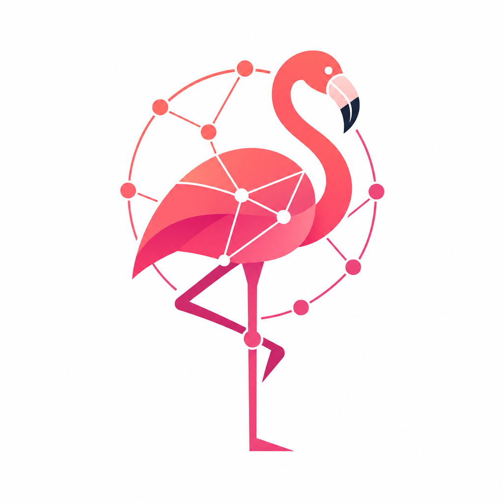
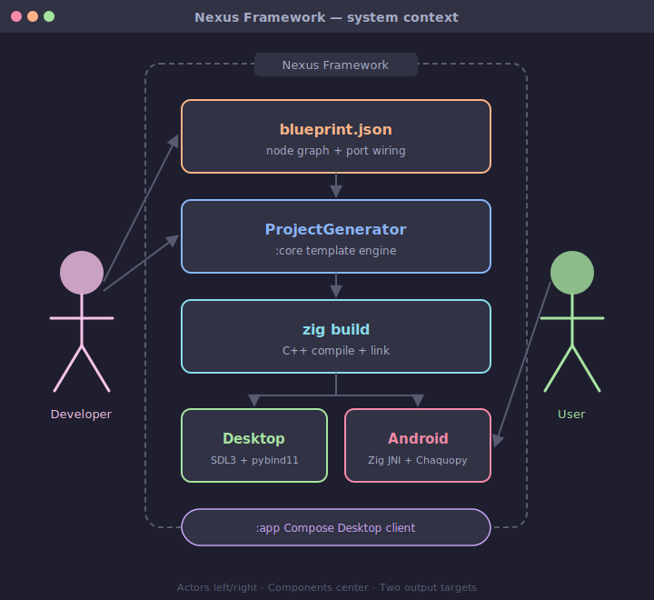
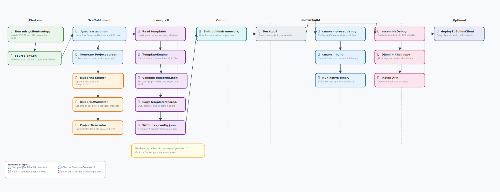
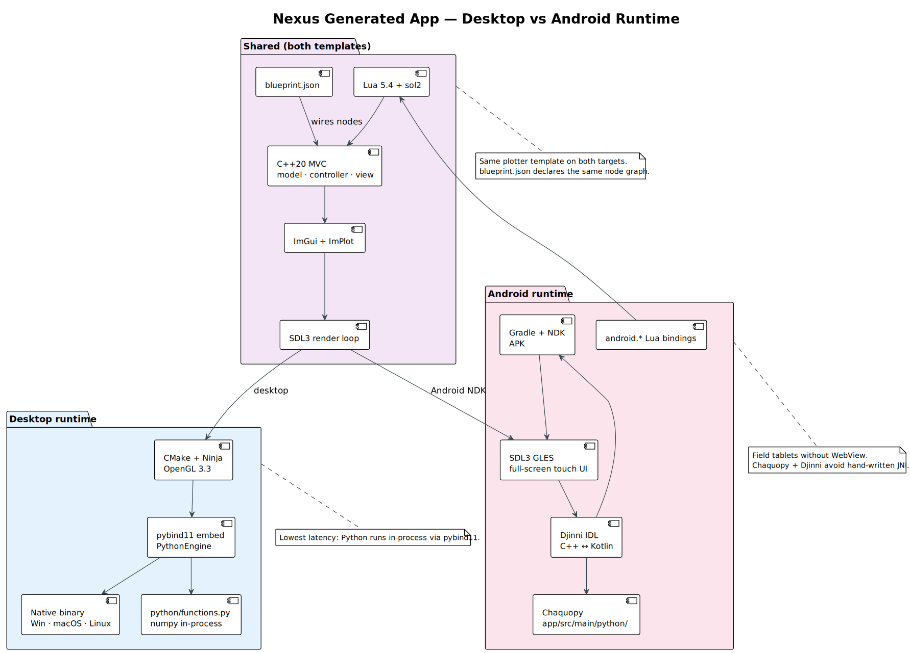
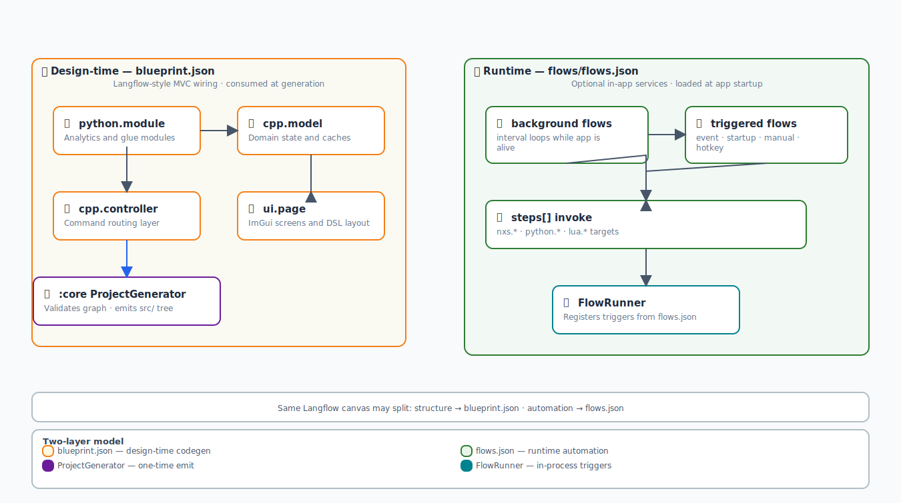
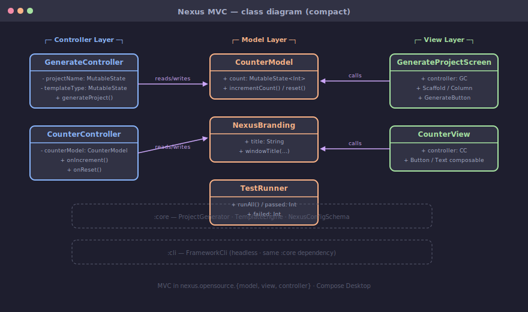
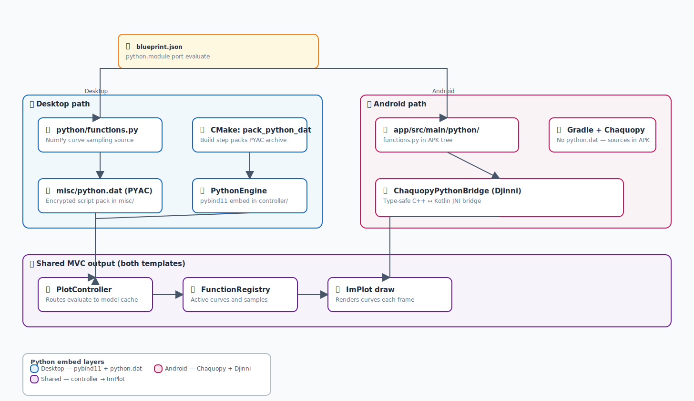

# The Nexus Framework — Native App Generation from Visual Blueprints

<p align="center">
  
</p>

<p align="center"><strong>🧩 Sketch an app as a graph. Get a compiled native binary. No browser. No Electron. No cloud.</strong></p>

<p align="center">
  🌐 <strong>Translations:</strong>
  <a href="misc/translations/README.pt-BR.md">Português</a> ·
  <a href="misc/translations/README.es.md">Español</a> ·
  <a href="misc/translations/README.de.md">Deutsch</a> ·
  <a href="misc/translations/README.ru.md">Русский</a> ·
  <a href="misc/translations/README.zh-CN.md">简体中文</a>
</p>

<p align="center">
  <a href="README.md"></a>
  <a href="misc/translations/README.pt-BR.md"></a>
  <a href="misc/translations/README.es.md"></a>
  <a href="misc/translations/README.de.md"></a>
  <a href="misc/translations/README.ru.md"></a>
  <a href="misc/translations/README.zh-CN.md"></a>
</p>

<p align="center">
  <a href="https://www.apache.org/licenses/LICENSE-2.0"></a>
  <a href="https://kotlinlang.org/"></a>
  <a href="https://www.libsdl.org/"></a>
  <a href="https://ziglang.org/"></a>
  <a href="https://github.com/ocornut/imgui"></a>
  <a href="#"></a>
</p>

> **🚀 Fastest path from zero to running:**  
> `zig run misc/client-setup/setup.zig && source misc/client-setup/env.sh && ./gradlew :app:run`  
> Five minutes. No Chrome download. No Docker. No npm install.

---

## Table of Contents

- [What is Nexus?](#what-is-nexus)
- [Why native matters](#why-native-matters)
- [What can you build with it?](#what-can-you-build-with-it)
- [Architecture overview](#architecture-overview)
- [The generation pipeline](#the-generation-pipeline)
- [Blueprint & flows](#blueprint--flows)
- [Building your app](#building-your-app)
- [Nexus vs the alternatives](#nexus-vs-the-alternatives)
- [How progressive enhancement works](#how-progressive-enhancement-works)
- [Performance & footprint](#performance--footprint)
- [Quick start](#quick-start)
- [The full workflow](#the-full-workflow)
- [Who is this for?](#who-is-this-for)
- [What makes it special](#what-makes-it-special)
- [The Zig story](#the-zig-story)
- [Community & contributions](#community--contributions)
- [The misc/ folder](#the-misc-folder)
- [Roadmap](#roadmap)
- [Docs & resources](#docs--resources)
- [Copyright & ownership model](#copyright--ownership-model)
- [See also](#see-also)

---

## What is Nexus?

**Nexus is a desktop and Android application generator that turns a visual node graph into compiled native code.** It fills the gap between "too much overhead" (Electron, web shells) and "too much repetitive work" (hand-rolling CMake + pybind11 + ImGui for every project).

You sketch your app's architecture as a [`blueprint.json`](docs/templates/blueprint-schema.md) graph — each node is a module (C++ model, Python analytics, Lua script, UI page), each edge is a data flow. Nexus reads that graph and writes out a complete, buildable project tree with SDL3 windowing, Dear ImGui widgets, Lua scripting (sol2), embedded Python (pybind11 / Chaquopy), and a TypeScript+XHTML UI layer that compiles down to native calls.

**The result is a binary:**
- **~3–20 MB** on disk (your code + SDL3 + ImGui + sol2 + pybind11)
- **Booting in under 200 ms** straight to an interactive ImGui frame
- **Running with 15–40 MB RAM** at idle
- **Working fully offline** — no network calls, no telemetry, no cloud dependency
- **Cross-compilable** from Linux to Windows in one Zig command

**Nexus is not a workflow engine** (like n8n or Langflow) — those wire cloud APIs together. Nexus generates a shipped application with a native UI that runs on your hardware. Same visual graph paradigm, completely different output.

**Nexus is not an Electron alternative** — it's a fundamentally different category. Electron puts a browser around your content. Nexus generates native code from a blueprint. One is a runtime, the other is a code generator.

---

## Why native matters

The software industry has spent a decade convincing itself that shipping a browser is an acceptable way to deliver a desktop application. For chat apps and CRUD dashboards, it mostly is. But there's a whole category of software where the web shell tax is unacceptable:

- **Trading terminals** that tick at 60 Hz and process market data in-process
- **Scientific instruments** where a 200 MB installer won't fit on the embedded target
- **Robotics control panels** that need direct serial port and GPU access
- **Field-deployed Android tablets** running ML inference offline
- **Data acquisition tools** that must boot and capture before the operator finishes walking to the machine

| What matters           | Web shell tax                          | Nexus native                          |
|------------------------|----------------------------------------|---------------------------------------|
| **Install size**       | 120–200 MB (Chromium)                  | **3–20 MB** (SDL3 + your code)        |
| **Cold start**         | 2–8 seconds (renderer spin-up)         | **< 200 ms** (no VM, no sandbox)      |
| **RAM at idle**        | 150–500 MB                             | **15–40 MB**                          |
| **GPU access**         | WebGL (limited)                        | **Vulkan / GLES / Metal native**      |
| **File system**        | Sandboxed, async, mediated             | **POSIX / Win32 direct**              |
| **Offline**            | Cache-manifest dance                   | **Always offline by default**         |
| **Build determinism**  | npm + browser version roulette         | **Pinned toolchain, offline builds**  |

**Nexus exists for the apps where native performance is the requirement, not a nice-to-have.** If you're shipping an Electron wrapper around a web app and your users are happy, Nexus is not for you. If you're fighting Chromium's memory allocator on a sensor-processing app, read on.

---

## What can you build with it?

| You want to...                                                          | Nexus generates...                                                                 |
|--------------------------------------------------------------------------|------------------------------------------------------------------------------------|
| **Plot waveforms with live Lua scripting**                                | C++20 data model + ImPlot canvas + Lua console panel + Python FFT pipeline — all in one binary |
| **Field-deploy an Android tablet with ML inference**                     | Touch SDL3/GLES UI + Chaquopy Python runtime + Zig JNI bridge to native sensors   |
| **Build a configurable dashboard with hot reload**                       | Blueprint nodes per panel + `flows.json` automations + Lua scripts editable while running |
| **Ship a desktop tool with web-style UI (but native)**                   | XHTML markup + TypeScript logic that lowers to ImGui calls — no browser included   |
| **Prototype C++ performance + Python analysis in one process**          | Both run in-process — no IPC, no serialization, no REST calls, no numpy copy overhead |
| **Cross-compile a Linux app to Windows from CI**                         | `zig build -Dtarget=x86_64-windows` — no MSVC VM, no extra license               |

*This isn't aspirational — these are the existing templates in action.*

---

## Architecture overview

Nexus follows a three-layer architecture: **authoring** (Compose Desktop client), **generation** (Kotlin pipeline), and **runtime** (the generated native app). Each layer is independently testable and replaceable.

### Layer 1: Authoring (Compose Desktop + CLI)

The `:app` module provides a Compose Desktop UI for creating and editing blueprint graphs and flow configurations. It currently ships with a JSON inspector and a canvas area for arranging nodes. The `:cli` module provides the same generation pipeline from the command line — useful for CI/CD pipelines and headless environments.

### Layer 2: Generation (`ProjectGenerator` in `:core`)

This is where the magic happens. The `ProjectGenerator` reads a `blueprint.json` graph, validates it against the v2 schema, and materializes template files into a complete project tree:

- Source files for every declared node type (C++, Python, Lua, TypeScript, XHTML)
- Build configuration (`build.zig` + `build.zig.zon`)
- Scripting bridges (pybind11 module definitions, sol2 bindings, Lua entry points)
- Platform-specific packaging (desktop installer config, Android Gradle wrapper)
- `nxs_config.json` — the project's identity and dependency manifest

The generation is **deterministic** — same blueprint + same template version = identical output tree, every time. This makes it CI-friendly and auditable.

### Layer 3: Runtime (SDL3 + ImGui + polyglot bridges)

The generated app runs as a native SDL3 process with:
- **Immediate-mode UI** via Dear ImGui and ImPlot — full redraw in < 0.5 ms, no framework overhead
- **Lua 5.4** via sol2 — scripting panels that can be edited and reloaded at runtime
- **Python 3.11+** via pybind11 (desktop) or Chaquopy (Android) — NumPy, scipy, ML models in-process
- **TypeScript + XHTML** — declarative UI that lowers to Lua/ImGui calls at build time

### Visual architecture diagram

The full architecture — from client through generation to runtime:



The generation and deployment pipeline, showing how templates become builds:



Desktop vs Android runtime — same blueprint, different Python bridge:



### Polyglot design: 7 languages, 3 boundaries

Nexus doesn't force one language to do everything. Each language lives in its natural layer:

| Language          | Where                                    | What it owns                                                    |
|-------------------|------------------------------------------|-----------------------------------------------------------------|
| **Kotlin**        | `:app` / `:core` / `:cli`                | Compose Desktop UI + generation pipeline + CLI                  |
| **C++20**         | `template/desktop-app/src/`              | Runtime MVC — RAII, `std::ranges`, `constexpr`, `[[nodiscard]]` |
| **Zig 0.14**      | `zig-services/` · `misc/client-setup/`   | Build orchestration, cross-compilation, C-ABI allocator         |
| **Lua 5.4**       | `template/desktop-app/scripts/`          | sol2 runtime scripting — panels, hotkeys, quick iteration       |
| **Python 3.11+**  | `template/desktop-app/python/`           | pybind11 embedded NumPy/scipy analytics                         |
| **TypeScript**    | `template/desktop-app/ui/ui.ts`          | Declarative UI bindings (lowers to Lua)                         |
| **XHTML**         | `template/desktop-app/ui/ui.xhtml`       | XML UI markup (lowers to ImGui calls)                           |

The **generation boundary** is crossed by `ProjectGenerator` (Kotlin → native source trees).  
The **build boundary** is crossed by Zig (`build.zig` → compiled binary).  
The **runtime boundary** is crossed by sol2, pybind11, and Chaquopy (in-process language bridges).

---

## The generation pipeline

The pipeline is a straightforward chain: **blueprint → validate → materialize → output**. Here's what happens when you run `generate`:

```
blueprint.json  ──┐
flows.json      ──┤
template/       ──┤
                  ▼
        ┌─────────────────┐
        │  ProjectGenerator│  (Kotlin, :core module)
        │  - Schema v2     │
        │  - Node dispatch │
        │  - Edge wiring   │
        └────────┬────────┘
                 ▼
        ┌─────────────────┐
        │  TemplateEngine  │  (Kotlin, :core module)
        │  - {{placeholders}}│
        │  - Conditional   │
        │    sections      │
        └────────┬────────┘
                 ▼
    builds/framework/MyApp/
    ├── build.zig              # Zig build orchestration
    ├── build.zig.zon          # Zig dependency manifest
    ├── nxs_config.json        # Project config (v2 schema)
    ├── src/                   # C++20 model + controller
    ├── python/                # Python analytics
    ├── scripts/               # Lua runtime panels
    ├── ui/                    # TypeScript + XHTML
    └── flows/                 # Runtime automations
```

**Key design decisions:**
- **Templates are bundled, not fetched** — `misc/templates/` lives in the repo. No network at generation time.
- **Placeholders use `{{doubleCurly}}`** — consistent across all template files for all languages.
- **Generation is additive** — if a file already exists in the output directory, it's not overwritten. You can regenerate without losing your work.
- **Build files are generated** — `build.zig` and `build.zig.zon` come from the template, so the output tree is immediately buildable with zero configuration.

---

## Blueprint & flows

Nexus separates **app structure** (what modules exist, how they connect) from **app behavior** (what happens at runtime). Two JSON files, two concerns, one generated app.

### `blueprint.json` — the app's anatomy

A build-time graph at the project root. Nodes declare modules; edges declare data flow direction.

| Node type | Runtime role | Source location |
|-----------|-------------|----------------|
| `python.module` | In-process Python analytics, filtering | `python/functions.py` |
| `cpp.model` | C++20 domain state with RAII | `src/model/` |
| `cpp.controller` | Commands, event wiring, undo/redo | `src/controller/` |
| `ui.page` | Declarative page layout in XHTML + TypeScript | `ui/ui.xhtml` · `ui/ui.ts` |
| `lua.script` | Live-editable Lua panels and hotkeys | `scripts/panels.lua` |

Each node maps to a **generated source directory** and a **build target** — the blueprint is both an architecture diagram and a makefile.

The visual structure of blueprint vs flows:



And the generated app's MVC architecture from the blueprint:



**Sample:** [template/desktop-app/blueprint.json](template/desktop-app/blueprint.json)  
**Schema:** [docs/templates/blueprint-schema.md](docs/templates/blueprint-schema.md)

### `flows.json` — the app's behavior

Optional runtime services that execute inside the app process:

| Mode | Trigger | Use case |
|------|---------|----------|
| `background` | `interval` every N ms | Poll sensor, check queue depth |
| `triggered` | `event` + condition | React to data arrival, connection state |
| `startup` | App launch | Preload datasets, init hardware |
| `manual` | User action | On-demand analysis pipeline |

**Sample:** [template/desktop-app/flows/flows.json](template/desktop-app/flows/flows.json)  
**Schema:** [docs/templates/flows-schema.md](docs/templates/flows-schema.md)

### Langflow import

[Langflow](https://github.com/langflow-ai/langflow) is supported as an **optional external authoring tool** — you can design AI flows in Langflow's visual editor and import them into Nexus. The `LangflowTransformationEngine` (Kotlin, 12 tests) handles:

- Component mapping (Langflow nodes → Nexus flow steps)
- Trigger inference (startup vs event vs interval)
- Topological sort and deduplication
- Schema validation

**Safety default:** every imported flow starts with `enabled: false`. You review and opt in.


Reference diagrams for AI flow patterns:

- [RAG Chatbot](docs/assets/diagrams/langflow-rag-chatbot.svg) — map retrieval-augmented generation steps to blueprint node types
- [Agent with Tools](docs/assets/diagrams/langflow-agent-tools.svg) — agent loop maps to `python.module`, `cpp.controller`, and Lua panels

---

## Building your app

### Templates

| Template | Stack | When to choose |
|----------|-------|----------------|
| `desktop-app` | SDL3 + ImGui + pybind11 + sol2 + TS/XHTML | You need a native desktop binary with multi-language runtime |
| `android-app` | SDL3/GLES + Chaquopy + Zig JNI | You need the same app model on Android tablets |

Output goes to `builds/framework/<project-name>/`. See [builds/README.md](builds/README.md) for the layout.

### Where to start, by persona

| You are... | Your entry point |
|------------|-----------------|
| **Game dev** (ImGui comfortable) | `scripts/panels.lua` — hotkeys, overlay panels, quick-add buttons |
| **C++ backend engineer** | `src/model/` + `src/controller/` — extend domain logic, generate UI around it |
| **Web developer** exploring native | `ui/ui.xhtml` + `ui/ui.ts` — declarative markup + TypeScript, no browser |
| **Python analyst** shipping a tool | `python/functions.py` — write your logic, get an ImGui viewer and plot for free |
| **Android developer** | Generate `android-app` — touch-friendly SDL3 UI with Zig JNI bridge |

Full guide: [docs/guides/coding-with-nexus.md](docs/guides/coding-with-nexus.md)  
Coding styles: [docs/guides/coding-styles.md](docs/guides/coding-styles.md)

### Python: desktop vs Android

| Aspect           | Desktop (pybind11)                            | Android (Chaquopy)                        |
|------------------|----------------------------------------------|-------------------------------------------|
| **Bridge**       | CPython linked into the native process       | Jython on the JVM + Zig JNI bridge        |
| **Source tree**  | `python/functions.py`                        | `app/src/main/python/`                    |
| **Archive**      | `python.dat` packed at build time            | Bundled in APK by Gradle                  |
| **Rebuild**      | `zig build` re-packs `python.dat`            | `./gradlew :app:assembleDebug`            |



### TypeScript + XHTML UI

You get two UI authoring modes, neither uses a browser engine:

- **Imperative Lua** (`panels.lua`) — `nxs.register_panel(...)` with `ui.button()`, hotkeys, callbacks. Editable while the app runs.
- **Declarative TS/XHTML** (`ui/ui.xhtml` + `ui/ui.ts`) — markup and TypeScript that lower to Lua/ImGui calls at build time.

| TS/XHTML construct | What it becomes at runtime |
|-------------------|---------------------------|
| `bind="sampleCount"` on `<slider>` | Two-way ImGui slider tied to C++ model state |
| `items-source="activeCurves"` on `<listbox>` | Read-only projection of C++ data |
| `on-click="addPending"` | The same `nxs.*` command Lua calls directly |

Start here: [template/desktop-app/ui/ui.xhtml](template/desktop-app/ui/ui.xhtml)

---

## Nexus vs the alternatives

### vs Electron, Tauri, Flutter

|                   | Electron               | Tauri                    | Flutter                  | **Nexus**                          |
|-------------------|------------------------|--------------------------|--------------------------|------------------------------------|
| **Runtime**       | Chromium + Node.js     | OS WebView + Rust        | Dart + Skia              | **C++20 + SDL3 native**           |
| **Binary size**   | 120–200 MB             | 5–15 MB                  | 15–50 MB                 | **3–20 MB**                        |
| **RAM at rest**   | 150–500 MB             | 50–100 MB                | 50–100 MB                | **15–40 MB**                       |
| **Cold boot**     | 2–8 seconds            | 1–2 seconds              | 1–2 seconds              | **< 200 ms**                       |
| **UI model**      | DOM / CSS / React      | HTML in WebView          | Widget tree              | **Immediate-mode ImGui**           |
| **Scripting**     | Node.js (same process) | Rust commands            | Dart isolates            | **Lua + Python in-process**        |
| **Platforms**     | Desktop                | Desktop + mobile WebView | Desktop + mobile         | **Desktop + Android SDL3**         |
| **Codegen**       |                       |                         |                         | ** Blueprint-driven**            |
| **Offline**       | Partial (cache API)    | Partial                  | Full                     | **Full (always offline)**          |
| **SDK footprint** | npm + node_modules     | Rust toolchain           | Flutter SDK + Dart       | **Zig 0.14 (~80 MB)**              |

**When Nexus wins:** sub-millisecond UI response, consistent codebase from trading terminal to Android field tablet, in-process Python for NumPy/CUDA without serialization, offline-first requirement, small binary requirement.

**When alternatives win:** your team is HTML/CSS-first, iOS is required from the same codebase, or you're building a traditional consumer app where ecosystem matters more than performance.

### vs n8n, Langflow, Power Automate

This is the most common confusion. **Nexus is NOT a workflow engine.** Here's the distinction:

|                  | n8n / Langflow                  | **Nexus**                                    |
|------------------|---------------------------------|----------------------------------------------|
| **Output**       | Cloud automations, API workflows | **Native desktop / Android binary**          |
| **Runtime**      | Node.js on a server             | **SDL3 + ImGui on your hardware**            |
| **User interface** | Web dashboard                 | **Compiled native UI**                       |
| **When it runs** | As a hosted service             | **On your user's machine**                   |
| **Offline**      | Requires network                | **Always offline by default**                |
| **Graph approach** | Connected steps at runtime    | **Build-time codegen + optional runtime flows** |

n8n connects SaaS APIs. Langflow connects LLM chains. Nexus connects C++ models, Python modules, and Lua scripts into a compiled application. **If your flow IS the product** (not the orchestration behind it), Nexus is for you.

> **Can they complement each other?** Absolutely. A generated Nexus app can call n8n webhooks or Langflow endpoints from its Python and Lua layers.

### vs bare C++ / CMake from scratch

You can hand-roll SDL3 + ImGui + pybind11. Many of us have. Nexus exists because:

- **Blueprint iteration is cheaper than CMake refactoring** — changing a node type regenerates the build graph, no manual target editing
- **Cross-platform Zig builds** — one `build.zig` replaces platform-specific CMake presets
- **Scripting bridges are pre-tested** — pybind11 and sol2 bindings come generated and tested
- **Deterministic generation** — CI can regenerate and diff the output tree

Nexus doesn't replace C++ — you still write your domain logic in C++20. It replaces the scaffolding you'd otherwise write for the tenth time.

---

## How progressive enhancement works

Nexus is designed so you don't have to adopt everything at once. You can start minimal and add layers as your project grows.

### Stage 1: Just C++ on SDL3

Generate the project, get a bare ImGui window with SDL3. Write your C++20 domain logic in `src/model/` and `src/controller/`. This is the equivalent of hand-rolling ImGui + SDL3 — but with correct build files, cross-platform routing, and input handling already working.

You don't need Lua. You don't need Python. You don't need TypeScript. You get a functioning native app.

### Stage 2: Add Lua panels

Add a `lua.script` node to your blueprint. Re-generate. You now have a live Lua console and a panel system. Write `scripts/panels.lua` with hotkeys and quick-add buttons. Lua reloads without recompiling — great for iteration while the app is running against live data.

### Stage 3: Add Python analytics

Add a `python.module` node. Re-generate. pybind11 bindings are generated for your C++ model types. Write `python/functions.py` with NumPy pipelines. Your Python code runs in-process with zero-copy access to C++ state — no pickle, no serialization, no REST endpoint.

### Stage 4: Add TypeScript/XHTML UI

Add a `ui.page` node. Re-generate. Write UI structure in XHTML and logic in TypeScript. The build pipeline lowers both to Lua/ImGui calls — you get a declarative UI authoring experience that produces native widgets.

### Stage 5: Add flows

Add `flows.json` with background loops, event triggers, and scheduled tasks. The FlowRunner loads them at startup. Your app now has automations — polling sensors, reacting to events, preloading data.

### The progression visualized

```
Stage 1: [SDL3 + ImGui]                          ──   C++ only, 3 MB binary
Stage 2: + sol2 Lua                              ──   + live scripting
Stage 3: + pybind11 Python                       ──   + NumPy/scipy in-process
Stage 4: + TS/XHTML lowering                     ──   + declarative UI layer
Stage 5: + flows.json automactions               ──   + runtime behavior graph

Each stage adds capabilities without breaking what came before.
The blueprint graph encodes which stages are active.
```

This staged approach means your project's complexity grows with its requirements, not with the framework's marketing ambitions.

---

## Performance & footprint

Generated apps are lean because the toolchain is lean and there's no browser involved:

| Metric | What you can expect |
|--------|-------------------|
| **Binary size** | 3–20 MB (your code + SDL3 + ImGui + sol2 + pybind11) |
| **RAM at idle** | 15–40 MB |
| **RAM under load** | 50–150 MB (with embedded Python + NumPy) |
| **Cold start** | < 200 ms to first ImGui frame |
| **UI refresh** | Full redraw in < 0.5 ms (immediate mode on GPU) |
| **Build time** | 30–90 seconds for a generated project (Zig incremental) |
| **Cross-compile** | `zig build -Dtarget=x86_64-windows` from Linux, no MSVC |
| **Toolchain size** | ~80 MB (Zig 0.14.0) vs 10–12 GB (MSVC + NDK + g++ + clang) |

These aren't aspirational targets — they're measurements from the existing templates.

---

## Quick start

```bash
# 1. Bootstrap (once per machine) — installs JDK 26 + Zig 0.14.0
zig run misc/client-setup/setup.zig
source misc/client-setup/env.sh

# 2. Launch the Compose Desktop client
./gradlew :app:run

# 3. Generate a project from the CLI
./gradlew :cli:run --args="generate --type desktop --name MyApp"

# 4. Build the generated app
cd template/desktop-app && cmake --preset debug && cmake --build --preset debug

# 5. Edit the blueprint, edit the flows, ship the binary
```

Your system Zig (any version) runs the bootstrap once, which pins a known-good **Zig 0.14.0** for all native builds. Full details: [misc/client-setup/README.md](misc/client-setup/README.md).

**Compile and test the generator:** `./gradlew :core:compileKotlin :cli:compileKotlin :app:compileKotlin :app:test`

**Deploy the client:** `./gradlew :app:deployToBuildsClient` → [builds/client/app/](builds/client/app/)  
**Package installers:** `./gradlew :app:deployPackageToBuildsClient` → [builds/client/packages/](builds/client/packages/)

---

## The full workflow

```
IDEA ──→ BLUEPRINT ──→ GENERATE ──→ CODE ──→ BUILD ──→ SHIP
          │               │          │         │         │
       blueprint.json   :core      src/     zig build   .exe
       flows.json     pipeline   python/               .apk
                                       scripts/         or
                                       ui/            installer
```

1. **Sketch** — Define modules in `blueprint.json`. Add automations in `flows.json`. Use the Compose Desktop client or a text editor.
2. **Generate** — The Kotlin pipeline reads your graph and materializes a complete project tree into `builds/framework/<name>/`.
3. **Code** — Write your domain logic: C++ for performance, Python for analysis, Lua for scripting, TypeScript for UI structure.
4. **Build** — One command. Zig orchestrates C++ compilation, Lua bytecode, Python archives, and TypeScript lowering.
5. **Ship** — A native binary (~3-20 MB) or Android APK. Platform installers via Gradle deploy tasks. Always offline.

---

## Who is this for?

**You should use Nexus if:**

- You're building a **desktop or Android application that processes real data** — sensor streams, financial ticks, scientific measurements, CAD geometry, ML inference
- Your app needs **native performance and small footprint** — Chromium overhead is a dealbreaker
- You want **multiple languages in one process** — C++ for speed, Python for analysis, Lua for scripting, TypeScript for UI
- You're tired of **hand-rolling CMake + pybind11 + sol2** for every new project
- You need **offline-first** — your app runs in a factory, on a boat, in a field, on a tablet without connectivity

**Who should wait:**

| Reason                                        | Come back at                                                    |
|-----------------------------------------------|-----------------------------------------------------------------|
| You need iOS from this toolchain               | v0.5+ (not currently on the roadmap)                            |
| You need pixel-perfect marketing page UIs      | ImGui gets better every year, but it's not a CSS layout engine  |
| You want a pure-Python toolkit                 | Nexus expects C++ at the core. Consider PySide/PyQt or Briefcase |
| You're a beginner to C++ and build systems     | Nexus is developer tooling — some CLI and C++ comfort assumed   |

---

## What makes it special

**Blueprint-driven codegen.** Most frameworks generate from a single option or a configuration file. Nexus generates from a directed graph — your app's architecture is the input, not its settings.

**Graph-native app structure.** The same visual paradigm that made n8n and Langflow intuitive for automation now applies to application architecture. Your app is a graph of modules. Nexus makes that explicit, editable, and generative.

**Progressive language layers.** C++ for the hot path. Python for analysis. Lua for quick iteration. TypeScript for UI structure. Each language does what it's best at — no one-language-fits-all compromise. They communicate in-process through generated bindings, not over IPC or REST.

**Zig-native builds.** One tool (80 MB) replaces CMake + Ninja + NDK-build + Djinni CLI (10-12 GB). Offline-first dependency management. Cross-compilation as a first-class feature.

**Offline by design.** No cloud dependency, no telemetry, no runtime that phones home. Your binary works wherever your users are.

**Deterministic generation.** Same blueprint + same templates = identical output tree. CI can regenerate and diff. No hidden state, no network at generation time.

---

## The Zig story

Over the course of v0.1 → v0.3, Zig progressively replaced a tangled stack of build tooling in generated apps — without touching the Kotlin generator or the Compose client. This is a case study in incremental replacement:

| What                  | Before (v0.1)                                           | After (v0.3)                  | Why it matters                                                     |
|-----------------------|---------------------------------------------------------|-------------------------------|--------------------------------------------------------------------|
| **Bootstrap**         | 3 shell scripts per OS (~450 LOC)                       | 1 `setup.zig` (~130 LOC)     | Cross-platform from day one, one file to audit                     |
| **Build tools**       | CMake + Ninja + NDK-build + Djinni CLI (4 tools)        | `zig build` (1 tool)          | Less to install, less to break, same interface everywhere          |
| **Toolchain weight**  | MSVC + NDK + g++ + clang (~10-12 GB)                    | Zig 0.14.0 (~80 MB)          | CI images shrink from 20 GB to 2 GB                                |
| **Android JNI**       | 8 generated files + `regen-djinni.sh`                    | 2 hand-authored `.zig` modules | No IDL codegen step, no regen script fragility                     |
| **Cross-compilation** | Not supported (needed MSVC for Windows targets)          | `zig build -Dtarget=x86_64-windows` | Linux CI → Windows binaries, no VM, no license                 |
| **Dependencies**      | 7 FetchContent clones, network-dependent, ~174s cold     | `build.zig.zon` pinned tarballs, offline-capable | Deterministic, no internet after initial vendor         |
| **C++ compilation**   | CMake target per platform                               | `zig c++` — same compiler everywhere | Consistent warnings, flags, and ABI across OSes            |

**The bottom line:** one language for build orchestration instead of four tools, ~99% smaller toolchain, 100% offline builds, cross-compilation as a first-class feature.

Full plan: [docs/architecture/zig-patching.md](docs/architecture/zig-patching.md)  
Services: [docs/architecture/services-architecture.md](docs/architecture/services-architecture.md)

---

## Community & contributions

Nexus is Apache 2.0 licensed and built in the open.

**Where the active work is:**

| Area                | What it involves                                                     | Skill level        |
|---------------------|----------------------------------------------------------------------|--------------------|
| `:core` pipeline    | Kotlin — `ProjectGenerator`, `TemplateEngine`, `nxs_config.json` v2 schema | Intermediate Kotlin |
| `:app` client       | Compose Desktop — blueprint editor, flows editor, project wizard     | Compose Desktop UI |
| `template/`         | C++20, Zig, Lua, Python, TypeScript — the generated app's runtime   | Your stack choice  |
| `zig-services/`     | Zig — build orchestration, JNI bridges, allocator modules            | Zig                |
| `misc/client-setup/`| Zig — bootstrap installer, env management                            | Zig + packaging    |
| **Docs**            | Markdown — you're reading them                                       | Anyone             |

Report issues, open PRs, or start a discussion on the [GitHub repository](https://github.com/tuliofh01/nexus-framework-client).

---

## The misc/ folder

Framework repo tooling — none of this ships inside generated native apps.

| Path | Contents |
|------|----------|
| [misc/core/](misc/core/) | `ProjectGenerator`, `TemplateEngine`, `nxs_config.json` schema (v2) |
| [misc/cli/](misc/cli/) | Headless `generate` CLI command |
| [misc/build-logic/](misc/build-logic/) | Included Gradle build — JVM toolchain 26, convention plugins |
| [misc/client-setup/](misc/client-setup/) | First-run bootstrap — **Zig `setup.zig`** (cross-platform) |
| [misc/scripts/](misc/scripts/) | Dev helpers, smoke tests, diagram generators |
| [misc/docker/](misc/docker/) | Containerized generation for CI |
| [misc/jenkins/](misc/jenkins/) | Optional Jenkins CI pipeline |
| [misc/translations/](misc/translations/) | Localized READMEs |

Hub: [misc/README.md](misc/README.md) · Pipeline: [docs/guides/generation-pipeline.md](docs/guides/generation-pipeline.md)

---

## Roadmap

**v0.4.0** — closing remaining MVP gaps:

- Structured error reporting (machine-readable JSON from `ProjectGenerator`, not log scraping)
- Android template parity with desktop (touch ImGui controls, sensor access patterns)
- IDE integration support (language servers for generated Lua and Python layers)
- First-run experience polish (the Zig bootstrap is fast, but the flow could be friendlier)

Full roadmap: **[misc/ROADMAP.md](misc/ROADMAP.md)**

---

## Docs & resources

| Doc                                                             | What it covers                                    |
|-----------------------------------------------------------------|---------------------------------------------------|
| [docs/README.md](docs/README.md)                                | Documentation hub                                 |
| [docs/guides/coding-with-nexus.md](docs/guides/coding-with-nexus.md) | UI, MVC, Python, Lua, themes — practical guide  |
| [docs/guides/generation-pipeline.md](docs/guides/generation-pipeline.md) | How generation works end to end            |
| [docs/guides/coding-styles.md](docs/guides/coding-styles.md)    | C++20, Zig, Kotlin, Lua, TS, Python rules        |
| [docs/guides/adding-dependencies.md](docs/guides/adding-dependencies.md) | Adding C++, Lua, and Python packages      |
| [docs/templates/blueprint-schema.md](docs/templates/blueprint-schema.md) | `blueprint.json` full reference           |
| [docs/templates/flows-schema.md](docs/templates/flows-schema.md) | `flows.json` full reference                     |
| [docs/templates/shared-dsl.md](docs/templates/shared-dsl.md)    | TypeScript + XHTML DSL reference                 |
| [docs/architecture/runtime-stack.md](docs/architecture/runtime-stack.md) | Language ecosystem map — which language does what |
| [docs/architecture/zig-patching.md](docs/architecture/zig-patching.md) | Zig build orchestration — full plan and phases |
| [docs/architecture/services-architecture.md](docs/architecture/services-architecture.md) | Zig services layer |
| [docs/architecture/risk-analysis.md](docs/architecture/risk-analysis.md) | Architecture risks and mitigations    |
| [docs/archives/legacy-djinni.md](docs/archives/legacy-djinni.md) | Archived Djinni documentation                   |
| [AGENTS.md](AGENTS.md)                                         | Build commands for AI coding assistants           |
| [misc/ROADMAP.md](misc/ROADMAP.md)                             | v0.4.0 roadmap                                   |

### Ecosystem

| Technology                                                     | Role in Nexus                                                  |
|----------------------------------------------------------------|-----------------------------------------------------------------|
| [SDL3](https://www.libsdl.org/)                                | Windowing, input, GPU surfaces — desktop + Android              |
| [Dear ImGui](https://github.com/ocornut/imgui) / [ImPlot](https://github.com/epezent/implot) | Immediate-mode UI and scientific charts — redraw in < 0.5 ms |
| [sol2](https://github.com/ThePhD/sol2)                        | Lua 5.4 bindings — in-process scripting, hot-reloadable        |
| [pybind11](https://pybind11.readthedocs.io/)                  | Python bindings for desktop — NumPy, scipy, ML models in-process |
| [Chaquopy](https://chaquo.com/chaquopy/)                       | Python for Android — runs alongside NDK code via Zig JNI        |
| [Langflow](https://github.com/langflow-ai/langflow)           | Optional external AI flow authoring — import into Nexus         |
| [n8n](https://n8n.io/)                                         | Optional external automation — Nexus apps can call n8n webhooks |

---

## Copyright & ownership model

Understanding who owns what is straightforward with Nexus, but worth stating explicitly.

### The framework itself (this repo)

The Nexus Framework — the Kotlin generator, the Compose Desktop client, the CLI, the build logic, the scripts, and the documentation — is licensed under **Apache License 2.0**. You can:

- Use it commercially to build and ship applications
- Modify it for your internal needs
- Redistribute it with your own changes
- Sell products built with it

The only requirement: retain the copyright notice and the [LICENSE](LICENSE) file if you redistribute the framework itself (modified or not).

### What you generate (your app)

**The generated project tree — the source files, build configuration, and assets in `builds/framework/<name>/` — is YOUR code.** Nexus is a tool, not a publisher. You own the output completely.

You can:
- License your generated app under any terms you choose (proprietary, GPL, MIT, — your call)
- Sell it, ship it, embed it in proprietary hardware
- Modify the generated files without attribution to Nexus
- Remove or replace any template snippets

The one nuance: if you copy template files directly (not generated, but literally copied from `template/desktop-app/`), those specific files retain their Apache 2.0 headers. In practice, the generation pipeline handles this — the manifest in `nxs_config.json` tracks which templates were used and their licenses.

### What this means for your business

| Concern | Answer |
|---------|--------|
| Can I sell apps built with Nexus? | **Yes.** No royalties, no license fees, no revenue sharing. |
| Do I need to open-source my app? | **No.** Apache 2.0 does not require derivative works to be open-source. |
| Do I need to credit Nexus in my app's UI? | **No.** There's no attribution requirement in generated code. |
| Can my legal team audit this? | **Yes.** The full license text is in [LICENSE](LICENSE). 98 words of legible terms. |
| What about third-party dependencies in templates? | Generated `build.zig.zon` and `nxs_config.json` list all dependencies and their licenses. Review before shipping. |

### The copyright line

 2026 Nexus Framework contributors. The Nexus Framework Client, bundled templates, documentation, and build tooling are developed in the open by contributors. Each contributor retains copyright over their individual contributions under the Apache 2.0 terms.

---

## See also

- **[misc/ROADMAP.md](misc/ROADMAP.md)** — v0.4.0 roadmap and remaining MVP items
- **[docs/README.md](docs/README.md)** — full documentation hub
- **[AGENTS.md](AGENTS.md)** — condensed build commands for AI coding assistants
- **[The Nexus Framework Client](https://github.com/tuliofh01/nexus-framework-client)** — separate distribution for the Compose Desktop wizard
- **[API Integration Skills](https://github.com/tuliofh01/api-integration-skills)** — turnkey tutorials for Flask, FastAPI, chart.js, Vercel, Clerk, more

*Blueprint your app, generate the tree, ship the binary — then iterate in real code layers.*
