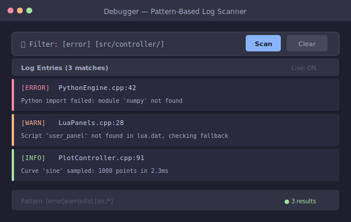
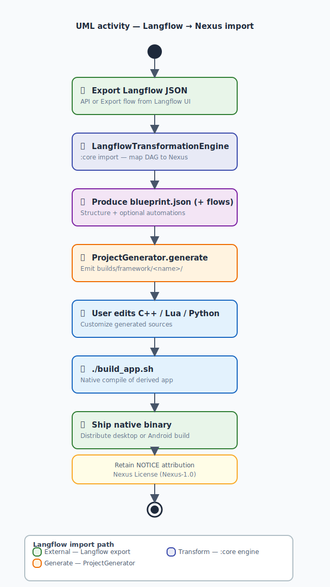

<!--
  @project Nexus Framework
  @language Kotlin (Compose Desktop), C++20, Lua 5.4, Python 3, TypeScript/XHTML, Zig 0.16.0
  @build ./gradlew :core:compileKotlin :cli:compileKotlin :app:compileKotlin
  @test ./gradlew check
  @templates desktop-app (SDL3/ImGui/C++/Lua/Python), android-app (Zig JNI/Chaquopy)
  @key-files
    core/src/main/kotlin/nexus/opensource/framework/core/service/ProjectGenerator.kt
    cli/src/main/kotlin/nexus/opensource/framework/cli/FrameworkCli.kt
    app/src/main/kotlin/nexus/opensource/App.kt
    template/desktop-app/build_app.sh
    template/android-app/zig-services/jni/python_bridge.zig
    misc/build_client.sh
  @license Nexus-1.0
  @docs docs/hub.md
  @description The Nexus Framework 1.0.2 is a native app generator — blueprint graphs become C++20 / Lua / Python desktop and Android projects via a Compose Desktop client and Kotlin CLI. Optional Langflow export → flows.json import (not blueprint). SDL3, Zig sidecars, Nexus License (Nexus-1.0).
  @keywords native app generator, blueprint-driven development, C++20 modules, Compose Desktop, SDL3, Zig, Lua, Python, Dear ImGui, Android JNI, Kotlin Gradle, Langflow import, Nexus Framework, Nexus License
-->

# The Nexus Framework

<p align="center">
  
</p>

<p align="center"><strong> Sketch an app as a graph. Ship a native binary.</strong></p>

<p align="center">No browser shell. No Electron tax. No cloud runtime. Just C++, Lua, Python — compiled, native, yours.</p>

<p align="center"><em>Simple when you want it. Powerful when you need it. Fun when you least expect it.</em> </p>

<p align="center">
   <strong>Translations:</strong>
  <a href="misc/translations/README.pt-BR.md">Português</a> ·
  <a href="misc/translations/README.es.md">Español</a> ·
  <a href="misc/translations/README.de.md">Deutsch</a> ·
  <a href="misc/translations/README.ru.md">Русский</a> ·
  <a href="misc/translations/README.zh-CN.md">简体中文</a>
</p>

<p align="center">
  <a href="LICENSE"></a>
  <a href="https://kotlinlang.org/"></a>
  <a href="https://www.libsdl.org/"></a>
  <a href="https://ziglang.org/"></a>
  <a href="https://github.com/ocornut/imgui"></a>
  <a href="#"></a>
</p>

> **Zero to binary**
> ```bash
> zig run misc/client-setup/setup.zig && source misc/client-setup/env.sh
> ./misc/build_client.sh && ./gradlew :app:run
> ```

---

##  Table of Contents

| # | Section | Vibe |
|:--|:--------|:-----|
| 1 | [What is Nexus?](#what-is-nexus) | The pitch, the dream, the honest limitations |
| 2 | [Architecture](#architecture) | Diagrams, client screens, the generation pipeline |
| 3 | [Quick Start](#quick-start) | Five commands, one native app |
| 4 | [Templates](#templates) | Desktop vs Android, MVC, C++20+, Zig JNI |
| 5 | [Language Stack](#language-stack) | C++, Lua, Python, TS, Zig — who does what |
| 6 | [Flows & UI](#flows--ui) | Langflow, ImGui, Lua widgets, TS/XHTML |
| 7 | [Zig & Cross-Platform Builds](#zig--cross-platform-builds) | Build system, Docker, Jenkins |
| 8 | [License](#license) | What you can and can't do |
| 9 | [For the Curious](#for-the-curious) | Diagrams, dependencies, package map, 1.0.2 notes |
| 10 | [Project & Docs](#project--docs) | Repository layout, documentation hub |

---

<a name="what-is-nexus"></a>
##  What is Nexus? (And why should you care?)

**Nexus is a native app generator with a rebellious streak.** You draw your app's architecture as a graph (we call it a *blueprint*), and Nexus spits out a real C++20 / Lua / Python project — ready to compile and ship. Desktop (SDL3) or Android (Zig JNI + Chaquopy), your call.

Most "app builders" give you a drag-and-drop toy that produces code you'd be embarrassed to show your mom. Nexus gives you actual, professional-grade C++20 with modules, Lua scripting, Python analytics, and Zig sidecars — organized in a proper MVC structure with a build system that actually works.

**What Nexus has enabled developers to build:**

|  You want… |  Nexus gives you… |
|:----------|:-----------------|
| Industrial plotters, field tablets, instrument UIs | Desktop + Android native apps that fit in 3–20 MB |
| Escape from the Electron memory tax | Cold starts under 200ms, RAM measured in tens of MB |
| Multiple languages in one process without the headache | C++ + Lua + Python (+ TypeScript/XHTML → ImGui) |
| Offline-first apps that don't phone home | No telemetry, no cloud dependency, no "sorry you need internet" |
| Something that works in an air-gapped factory | Yes. That's kind of the whole point. |

**Who this is for:** IoT developers, embedded engineers, data scientists who need real desktop tools, game devs who want native UI without Unity bloat, scientific visualization folks, medical device UI builders, fintech terminal creators, and basically anyone who's looked at Electron and thought "...really? 200MB for a to-do list?"

**Honest disclaimer:** Nexus is NOT for iOS, NOT for CSS-style marketing websites (ImGui is the UI paradigm), and NOT for pure-Python-only apps. If you need a landing page with gradients and parallax scrolling, use a web framework. If you need a native app that sips RAM and starts instantly, stick around.

---

<a name="architecture"></a>
##  Architecture — How the sausage is made

Here's the big picture. Nexus takes a JSON blueprint (your app's module graph), optionally some flows (automations), and generates a complete native project from templates.

<p align="center">
  <a href="docs/assets/diagrams/full-stack-architecture.svg">
    
  </a>
  <br/>
  <em>The full Nexus architecture: Kotlin generator → C++/Lua/Python/Zig project → native binary</em>
</p>

The Compose Desktop client is where you visually manage everything — create projects, edit blueprints, design flows, run tests, and debug logs.

<p align="center">
  <a href="docs/assets/examples/mockup-loading.svg">
    
  </a>
  <a href="docs/assets/examples/mockup-generate-project.svg">
    
  </a>
  <br/>
  <em>Loading splash (left) and the Generate Project wizard (right) — the first two screens you'll see</em>
</p>

<p align="center">
  <a href="docs/assets/examples/mockup-blueprint-editor.svg">
    
  </a>
  <a href="docs/assets/examples/mockup-flows-editor.svg">
    
  </a>
  <br/>
  <em>The Blueprint editor (left) and Flows editor (right) — where you design your app's architecture</em>
</p>

<p align="center">
  <a href="docs/assets/examples/mockup-debugger.svg">
    
  </a>
  <a href="docs/assets/examples/mockup-test-runner.svg">
    
  </a>
  <br/>
  <em>Debugger (left) and Test Runner (right) — because shipping without testing is a personality trait, not a strategy</em>
</p>

The generation pipeline itself is boring in the best way — same inputs always produce the same tree:

<p align="center">
  <a href="docs/assets/diagrams/activity-generate-pipeline.svg">
    
  </a>
  <br/>
  <em>From blueprint JSON to native binary: the pipeline in one diagram</em>
</p>

1.  **Author** — `blueprint.json` (modules/ports) + `flows.json` (automations). Optionally import a Langflow-compatible export into `flows.json` stubs.
2.  **Generate** — `ProjectGenerator` copies/transforms `template/desktop-app` or `template/android-app` into `builds/framework/<name>/`.
3.  **Implement** — Your domain logic in C++ / Lua / Python / TS.
4.  **Build** — `./build_app.sh` runs GCC (C++20 modules), Zig sidecars, Python venv, packaging.

**But here's the thing — you don't need to understand all this to use Nexus.** You draw a graph, click Generate, and get a project. The architecture is there so you don't have to think about it. Think of it like a car engine: nice that it exists, but you just turn the key and drive.

---

<a name="quick-start"></a>
##  Quick Start — From zero to binary in 5 commands

Because nobody reads 15 pages of introduction before trying something out:

```bash
# 1. Bootstrap once — installs JDK 26 + Zig 0.16.0
zig run misc/client-setup/setup.zig
source misc/client-setup/env.sh

# 2. Compile the generator + client (accepts Nexus License on first run)
./misc/build_client.sh
# For CI: ./misc/build_client.sh --accept-license

# 3. Launch the Compose Desktop GUI
./gradlew :app:run

# 4. Or skip the GUI and generate from CLI
./gradlew :cli:run --args="generate --type desktop --name MyApp"

# 5. Build the generated native app
cd builds/framework/MyApp && ./build_app.sh
```

**Optional** — import a Langflow export as app automations:
```bash
./gradlew :cli:run --args="import-langflow --file export.json --output builds/framework/MyApp/flows/flows.json"
```

After editing templates, repack script archives:
```bash
./gradlew :core:packTemplateLuaDat :core:packTemplatePythonDat
```

Details: [misc/client-setup/README.md](misc/client-setup/README.md) · [misc/README.md](misc/README.md)

**That's literally it.** Five commands and you have a working C++20/Lua/Python native app project. No npm install --global --save-dev --save-peer --force --legacy-peer-deps. No fighting webpack configs. No "it works on my machine."

---

<a name="templates"></a>
##  Templates — Desktop vs Android

Nexus ships two template flavors. Same blueprint, different binary.

<p align="center">
  <a href="docs/assets/diagrams/desktop-vs-android-runtime.svg">
    
  </a>
  <br/>
  <em>Desktop and Android share the same blueprint → generation pipeline, but target different runtimes</em>
</p>

|  Feature |  Desktop (SDL3) |  Android (Zig JNI + Chaquopy) |
|:-----------|:-----------------|:-------------------------------|
| Windowing | SDL3 | Android Activity + Surface |
| UI | Dear ImGui + ImPlot | ImGui via SDL3 + native widgets |
| Core logic | C++20 modules (`.cppm`) | C++20 modules |
| Scripting | Lua 5.4 + sol2 | Lua 5.4 + sol2 |
| Python | pybind11 (in-process) | Chaquopy (managed Python) |
| Build system | Zig 0.16.0 + GCC 14+ | Gradle + Zig NDK cross-compile |
| Binary size | ~3–20 MB | ~5–25 MB (APK) |

<p align="center">
  <a href="docs/assets/diagrams/activity-build-desktop-app.svg">
    
  </a>
  <a href="docs/assets/diagrams/activity-android-field-tablet.svg">
    
  </a>
  <br/>
  <em>Desktop build process (left) and Android field tablet activity flow (right)</em>
</p>

###  Desktop MVC with C++20+

The desktop template follows MVC (Model-View-Controller). Your model lives in C++20 modules, views are ImGui + Lua, and the controller is your C++ logic orchestrating it all.

<p align="center">
  <a href="docs/assets/diagrams/activity-desktop-frame-loop.svg">
    
  </a>
  <br/>
  <em>The SDL3 frame loop: input → update → render → repeat. Simple, fast, honest.</em>
</p>

The templates ship with modern C++20 idioms baked in — trailing return types, `[[nodiscard]]`, `std::string_view`, `constexpr` everything, concepts, `std::ranges::copy`. You don't need to memorize them; just follow the patterns in the generated code and you get modern C++ for free.

```cpp
// The template generates code like this — no 1998 nostalgia here
[[nodiscard]] auto calculateWidgetArea(const Widget& w) -> double {
    return w.width() * w.height(); // trailing return, constexpr-friendly
}
```

###  Android with Zig JNI and Chaquopy

Android apps use a Zig JNI bridge instead of the old Djinni-generated glue. Python runs via Chaquopy (Android's managed Python runtime).

<p align="center">
  <a href="docs/assets/diagrams/python-desktop-vs-android-flow.svg">
    
  </a>
  <br/>
  <em>Same Python code, different backends: pybind11 on desktop, Chaquopy on Android</em>
</p>

**But you don't touch any of that.** The template wires Zig JNI and Chaquopy automatically. You write Python and C++ exactly like on desktop — the bridge is invisible. It's like magic, except it's just Zig being really good at C ABI.

---

<a name="language-stack"></a>
##  Language Stack — The polyglot's playground

Nexus runs five languages in one process. They don't fight; they cooperate. Here's who does what:

|  Language |  Role |  Why this one? |
|:-----------|:-------|:---------------|
| **C++20** | Hot path, model layer, shared runtime | Zero-cost abstractions, SDL3/ImGui native, modules finally work |
| **Lua 5.4** | Scriptable UI panels, hot-reloadable logic | Embeddable, fast, 200 lines replaces 2000 lines of C++ |
| **Python 3** | AI/ML, analytics, data science | pybind11 gives you C++ speed with Python ergonomics |
| **TypeScript/XHTML** | UI DSL for web developers | Know HTML/CSS? You already know Nexus UI |
| **Zig 0.16.0** | Sidecars, allocator, JNI bridge, cross-compilation | C ABI native, no libc dependency, better than C at being C |

<p align="center">
  <a href="docs/assets/diagrams/dev-workflow.svg">
    
  </a>
  <br/>
  <em>How the languages fit together in a developer's day — write C++ model, Lua UI, Python analytics, Zig glues it all</em>
</p>

### Why C++20 (and not Rust)?

Short version: **SDL3, Dear ImGui, sol2, and pybind11 are all native C++ libraries.** Using them from C++ means zero FFI overhead, zero binding code, zero "oh no the ABI changed" surprises. Rust is excellent (seriously, no shade), but every library Nexus depends on was already C++. Choosing C++ meant direct integration instead of writing and maintaining FFI bindings for five libraries.

**The bottom line:** Both are great. Nexus chose C++ because the entire ecosystem it integrates with was already C++. No FFI tax, just compile and go.

### Performance — Numbers don't lie

| Metric |  Electron-class |  Nexus native (templates) |
|:-------|:---------------|:-------------------------|
| Install size | Hundreds of MB | **~3–20 MB** |
| Cold start | Seconds | **Often &lt; 200ms** |
| Idle RAM | Hundreds of MB | **Tens of MB** |
| Offline support | Cache gymnastics required | **Default — works out of the box** |

**But here's the kicker:** You don't configure any of this. The templates ship optimized by default — C++20 modules, Zig allocators, SDL3. You just write your app and get native performance for free. It's not a flex; it's just what happens when you don't drag an entire browser along for the ride.

---

<a name="flows--ui"></a>
##  Flows &  UI — Automations meet interface

### Flows (Because n8n shouldn't be your only option)

Nexus has a built-in automation system called **Flows**. Think of it as n8n or Power Automate, except your flows run inside a native app — no server, no cloud, no monthly license fee.

<p align="center">
  <a href="docs/assets/diagrams/blueprint-vs-flows-layers.svg">
    
  </a>
  <br/>
  <em>Blueprint defines the structure; Flows define the behavior. Two layers, one app.</em>
</p>

You design flows visually in **Langflow** (or any compatible tool), export the JSON, and import it into your Nexus project:

<p align="center">
  <a href="docs/assets/diagrams/langflow-import-pipeline.svg">
    
  </a>
  <a href="docs/assets/diagrams/langflow-adoption-workflow.svg">
    
  </a>
  <br/>
  <em>Langflow export → Nexus import pipeline (left) and adoption workflow (right)</em>
</p>

<p align="center">
  <a href="docs/assets/examples/langflow-rag-chatbot.svg">
    
  </a>
  <a href="docs/assets/examples/langflow-agent-tools.svg">
    
  </a>
  <br/>
  <em>Example flows: RAG chatbot (left) and agent toolchain (right) — design in Langflow, run natively</em>
</p>

At runtime, flows execute as background services — reacting to events, processing data, triggering actions:

<p align="center">
  <a href="docs/assets/diagrams/activity-flows-automation.svg">
    
  </a>
  <a href="docs/assets/diagrams/activity-langflow-import.svg">
    
  </a>
  <br/>
  <em>Flows executing at runtime (left) and the Langflow import activity flow (right)</em>
</p>

**But here's the one-liner:** Design flows in Langflow, export JSON, run one CLI command, and your native app runs them automatically — no server, no cloud, no n8n license. It's automation without the monthly bill.

###  UI — Lua, ImGui, and "Wait, I can use HTML?"

The UI layer uses **Dear ImGui** — the same library powering Unity Editor, Unreal Editor, and about half the developer tools you use daily. You can write UI in Lua directly, or use **TypeScript/XHTML** if you're more comfortable with web syntax:

<p align="center">
  <a href="docs/assets/diagrams/tsxhtml-lowering-pipeline.svg">
    
  </a>
  <br/>
  <em>TypeScript/XHTML gets lowered to ImGui C++ calls — write HTML, get native pixels</em>
</p>

**If you know HTML/CSS, you already know Nexus UI.** Write `<div>`, `<button>`, `<style>` and Nexus compiles it to native ImGui. No browser, no DOM, just pixels. It's the web dev experience without the "oops that's 150MB of Chrome" surprise.

Adding a custom widget is one Lua function:
```lua
ui.button("Click me")  -- Immediately native. No CSS, no flexbox, no margin-collapse nightmares.
```

And if you need real power — game engines, sensitive displays, 3D objects — ImGui handles all of it. It's the same library that runs NVIDIA's Omniverse UI.

###  Python + Lua: More power than their reputations suggest

**Python** isn't just for "import antigravity." With pybind11, your C++ model exposes functions directly to Python — your AI/ML code calls C++ at native speed:

```python
# This runs at C++ speed because pybind11 handles the bridge
data = nexus.model.load_sensor_data("/dev/ttyUSB0")
predictions = nexus.ml.run_inference(data)  # C++ under the hood
nexus.ui.show_results(predictions)          # ImGui renders this natively
```

**Lua** isn't just a config file format (we're looking at you, Neovim). It's a functional programming language with closures, coroutines, and higher-order functions. A 200-line Lua script can replace hundreds of lines of C++ UI code:

```lua
-- Lua coroutine for smooth UI animations
local fade_in = coroutine.create(function(widget)
    for alpha = 0, 1, 0.05 do
        widget:set_alpha(alpha)
        coroutine.yield()  -- yield control back to ImGui each frame
    end
end)
```

**From your perspective:** Import a Python library, call it from C++, get results back. No FFI boilerplate, no marshaling code — pybind11 handles it. Your AI model runs at C++ speed with Python ergonomics. And yes, you can absolutely have Python call Lua call C++ in the same function. It works because Nexus designed it to.

---

<a name="zig--cross-platform-builds"></a>
##  Zig & Cross-Platform Builds — The secret weapon

**Zig is the quietest MVP in this project.** It doesn't get the glory (that's C++'s job), but without it, cross-compilation would be a nightmare of CMakeLists.txt files and platform-specific Makefiles.

<p align="center">
  <a href="docs/assets/diagrams/zig-orchestration-layer.svg">
    
  </a>
  <br/>
  <em>Zig orchestrates compilation across platforms — one build, three OS targets</em>
</p>

Zig provides:
- **Platform-specific compilation** — Linux, macOS, Windows, Android, all from one `zig build`
- **The JNI bridge** — replaces the old Djinni-generated C++ JNI glue with cleaner Zig exports
- **The allocator** — `ZigAllocator.cppm` wraps Zig's arena allocator for C++ use
- **Build system** — `build.zig` handles everything CMake used to do, with less pain

<p align="center">
  <a href="docs/assets/diagrams/cmake-to-zig-migration.svg">
    
  </a>
  <br/>
  <em>The build system evolution: from CMake complexity to Zig simplicity</em>
</p>

**But in practice:** Run `./build_app.sh` on Linux, macOS, or Windows and get a native binary. Zig handles the platform details — you just pick the target. No CMakeLists.txt, no Makefiles, no "but it compiles on my machine." One `zig build` command and you're done.

###  Docker &  Jenkins — Because real projects need CI/CD

Nexus can generate projects inside Docker (no local toolchain needed) and integrates with Jenkins for automated builds:

| Tool | What it does | Location |
|:-----|:------------|:---------|
|  Docker | Generate Nexus projects without installing toolchain locally | `misc/docker/` |
|  Jenkins | CI/CD pipeline for testing and deploying generated apps | `misc/jenkins/Jenkinsfile` |

The Docker image bundles everything needed — JDK 26, Zig 0.16.0, GCC 14+ — so you can generate projects in clean-room environments. The Jenkins pipeline runs the full generation → build → test cycle automatically. Details in [misc/README.md](misc/README.md).

---

<a name="license"></a>
##  License — The boring but necessary part

This project uses the **[Nexus License](LICENSE)** (identifier: **Nexus-1.0**). Here's what it means in plain language:

| Use | Allowed? |
|:----|:---------|
| Non-commercial use (personal, hobby, non-commercial institution) | **Yes** (with attribution) |
| Commercial use of the Toolkit itself (selling/redistributing Nexus) | **Authorization required** through **2041-07-21** |
| Generated app that **produces revenue** (paid app, monetized SaaS) | **Authorization required** through **2041-07-21** |
| Generated app used in a **commercial institution** (company workplace) | **Authorization required** through **2041-07-21** |
| Attribution when you ship a derived app | **Required** (NOTICE/README/About credit) — continues after 2041 |
| Warranty / liability | **None** — provided "as is" |
| Responsibility for illegal acts by your generated app | **Yours alone** |

**Authorization window:** 2026-07-21 → **2041-07-21** (15 years). After that, the authorization restrictions expire; attribution and no-warranty remain.

**Owner / authorization:** [Túlio Horta (@tuliofh01)](https://github.com/tuliofh01) — project: [nexus-framework-client](https://github.com/tuliofh01/nexus-framework-client).

**Attribution example** (generated automatically in your app's `NOTICE` file):
> Built with [The Nexus Framework](https://github.com/tuliofh01/nexus-framework-client) —  Túlio Horta (@tuliofh01)

Third-party dependencies keep their own licenses.
Report issues: [github.com/tuliofh01/nexus-framework-client/issues](https://github.com/tuliofh01/nexus-framework-client/issues)

**But here's the TL;DR:** Use Nexus for free — personally, at work, for fun. Just credit us. If you're selling the framework itself or making money from a generated app, get in touch before 2041. That's it.

---

<a name="for-the-curious"></a>
##  For the Curious — Technical deep-dive

*This section is for people who want to understand what's under the hood. If you just want to build stuff, the sections above have you covered. If you're the person who reads Wikipedia articles for fun, welcome home.*

### The Full Diagram Collection

All architecture diagrams, gathered in one place because hunting through folders is for people who have time:

<p align="center">
  <a href="docs/assets/diagrams/generation-builds-flow.svg">
    
  </a>
  <br/>
  <em>How blueprint → generated project → built binary flows through the system</em>
</p>

<p align="center">
  <a href="docs/assets/diagrams/cross-language-bridge.svg">
    
  </a>
  <br/>
  <em>How C++20 modules, Lua, Python, TypeScript/XHTML, and Zig communicate in-process</em>
</p>

### Framework Dependencies

| Dependency | Version | Why |
|:-----------|:--------|:----|
| JDK | 26 | JVM toolchain for Kotlin 2.4 (Compose Desktop) |
| Kotlin | 2.4 | Generator + client language |
| Gradle | Current | Build system for :core :cli :app |
| Compose Desktop | Latest | UI toolkit for the Nexus client |
| Zig | 0.16.0 | Sidecars, JNI bridge, allocator, cross-compilation |
| GCC | 14+ | C++20 named modules compilation |

### Generated App Dependencies

| Dependency | Role |
|:-----------|:-----|
| SDL3 | Windowing, GPU context, input (desktop + Android) |
| Dear ImGui | Immediate-mode native UI |
| ImPlot | Scientific/plot widgets for ImGui |
| sol2 | C++  Lua binding |
| pybind11 | C++  Python binding (desktop) |
| Chaquopy | Managed Python runtime (Android) |
| Lua 5.4 | Scripting engine |
| Python 3 | Analytics/ML runtime |

### Package Map

```
# :app (Compose Desktop client)
nexus.opensource
├── App.kt                          # screens + navigation (Home = dashboard)
└── framework/
    ├── controller/                 # Generate, Loading, Blueprint, Flows controllers
    ├── model/                      # DebuggerService, TestRunner, RecentProjectsStore
    └── view/                       # Compose UI screens

# :core (separate Gradle module — not nested under :app)
nexus.opensource.framework.core
├── model/                          # ProjectSpec, NexusBranding, config schemas
└── service/                        # ProjectGenerator, validators, Langflow → flows
```

### What's in 1.0.2

- **Root Gradle modules** — `:core` and `:cli` at repo root (not under `misc/`), one `build.gradle.kts`, JVM toolchain 26
- **`misc/build_client.sh`** — one-shot compile with Nexus License accept dialog (`--accept-license` for CI)
- **Home dashboard** — animated flamingo mascot, generated-app grid, loading/transition overlays
- **Editor skeletons** — Blueprint, Flows, Debugger with `CUSTOMIZE` extension points
- **Langflow → flows** — CLI `import-langflow` maps Langflow export JSON to `flows.json` stubs (not blueprint generation)
- **UML activity diagrams** — framework + derived-app flows under `docs/assets/diagrams/`
- **Nexus License (Nexus-1.0)** — explained above

Prior releases (v0.1–v1.0.1) covered Zig sidecars, JNI bridge, and template hardening — see git history if you need archaeology.

---

<a name="project--docs"></a>
##  Project Structure & Docs

### Repository Layout

```
Nexus-Framework/
├── settings.gradle.kts      # include(":core", ":cli", ":app")
├── build.gradle.kts         # single build (JVM toolchain 26)
├── gradle/libs.versions.toml
├── core/                    # :core — ProjectGenerator, schemas
├── cli/                     # :cli  — `generate` + `import-langflow`
├── app/                     # :app  — Compose Desktop client
├── template/                # 📦 desktop-app + android-app scaffolds
├── misc/
│   ├── build_client.sh      # 🔨 License accept + compile :core :cli :app
│   ├── build-logic/         # Gradle conventions
│   ├── client-setup/        # 🛠️ JDK 26 + Zig 0.16.0 bootstrap
│   ├── docker/ · jenkins/ · scripts/ · translations/
├── docs/                    # 📖 Everything you need to understand this project
└── builds/                  # 📦 Generated apps + packaged client
```

| Module | Role |
|:-------|:-----|
| `:core` | Generation pipeline (`nexus.opensource.framework.core.*`) |
| `:cli` | `generate` and `import-langflow` (Langflow export → `flows.json`) |
| `:app` | Compose Desktop wizard, editors, debugger |

`misc/` is tooling only — Kotlin sources for `:core` / `:cli` / `:app` live at the repo root (not under `misc/`).

### Documentation

| Doc |  Covers |
|:----|:----------|
| [docs/hub.md](docs/hub.md) |  Documentation hub — start here |
| [docs/architecture/overview.md](docs/architecture/overview.md) |  Architecture narrative |
| [docs/assets/diagrams/activity-diagrams.md](docs/assets/diagrams/activity-diagrams.md) |  Full activity diagram index |
| [docs/guides/coding-with-nexus.md](docs/guides/coding-with-nexus.md) |  Coding in generated apps |
| [docs/templates/blueprint-schema.md](docs/templates/blueprint-schema.md) |  Blueprint / flows JSON reference |
| [AGENTS.md](AGENTS.md) |  Commands for AI coding assistants |
| [misc/README.md](misc/README.md) |  Tooling under `misc/` |

**Ecosystem:** SDL3 · Dear ImGui / ImPlot · sol2 · pybind11 · Chaquopy · Zig · Optional Langflow-compatible export import (`flows.json` only; unaffiliated).

---

*Blueprint your app, generate the tree, ship the binary — then iterate in real code layers.* 
