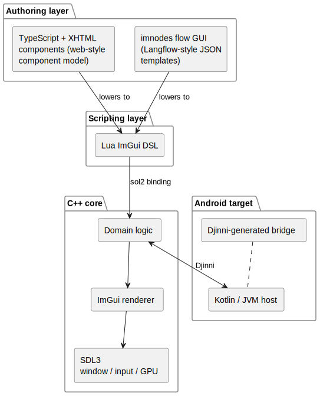
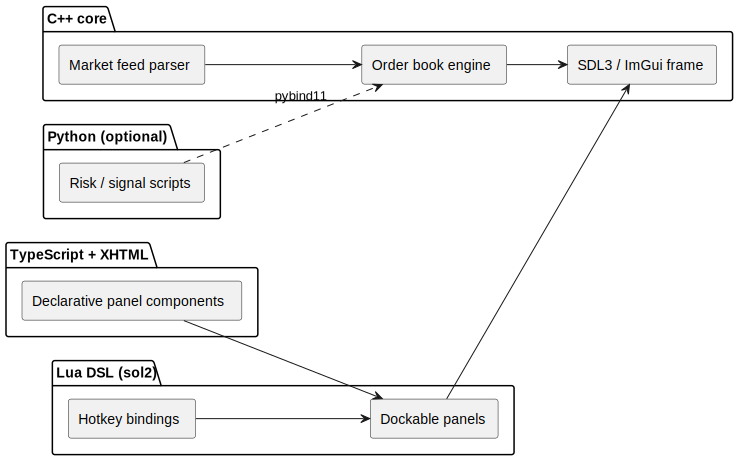
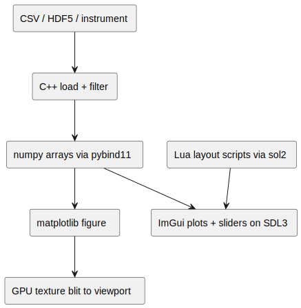
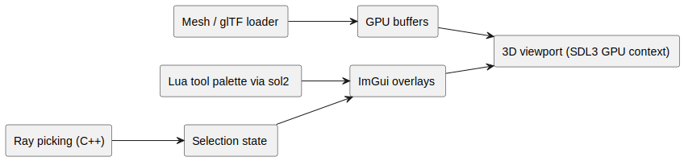
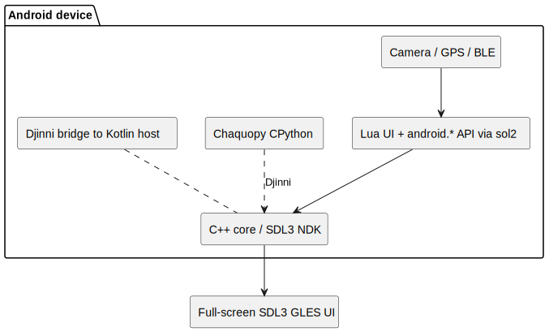
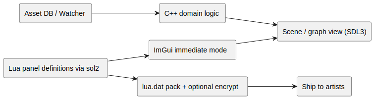

# O Framework da Nexus Company para Desenvolvimento de Aplicações Nativas

<p align="center">
  
</p>

<p align="center">
  <a href="README.md"></a>
  <a href="README.pt-BR.md"></a>
</p>

Este programa é o Cliente do Nexus Framework. Ele permite criar, com relativa facilidade, aplicações de aparência
moderna, principalmente em C++. Foi projetado para substituir soluções como Electron ou Tauri, gerando código de
template robusto tanto para Computadores Desktop/Notebooks (suporte multiplataforma a Windows, macOS e Linux) quanto
para Smartphones Android (dispositivos em geral). Além do C++ nativo, também são usados Lua (DSL de ImGui, vinculada
via **sol2**), TypeScript e XHTML (uma abstração de DSL que representa componentes estrangeiros com um modelo de
componentes familiar a desenvolvedores web) e Python (scripts embarcados, oferecendo funcionalidade estendida e alto
desempenho). As aplicações geradas renderizam através do **SDL3**, que garante que o mesmo backend de
janela/entrada/GPU funcione no desktop e no Android, e incluem um conjunto padrão de pacotes C++ — entre eles o
**Djinni** — que fazem a ponte entre o núcleo C++ e o lado Android (Kotlin/JVM).

## Por que adotar o Nexus?
O Nexus é voltado a equipes que querem **UIs poderosas e estilosas o bastante para competir com soluções front-end
modernas** sem precisar embutir um motor de navegador completo no código.

|                       |                    **Nexus**                    | Electron                 | Tauri                  |
| --------------------- | :---------------------------------------------: | ------------------------ | ---------------------- |
| Runtime de UI         | C++ nativo + ImGui sobre SDL3 + DSL Lua (sol2)  | Chromium + HTML/JS       | WebView + shell Rust   |
| Foco de linguagem     | C++20 + Lua + TypeScript/XHTML + Python         | JavaScript/TypeScript    | Rust + frontend        |
| Autoria de UI         | Componentes TS/XHTML + GUI de fluxo imnodes (templates JSON) | HTML/CSS/JS | HTML/CSS/JS            |
| Tamanho do binário    | Binário nativo menor                            | Grande (Chromium embutido) | Menor que o Electron |
| Saída Android         | O mesmo assistente gera o template de APK       | Ferramentas separadas    | Mobile não é o foco    |
| Proteção de scripts   | `lua.dat` v2 criptografado opcional             | N/A                      | N/A                    |


## Casos de uso em que o The Nexus Framework supera Electron ou Tauri
O Nexus se encaixa em **ferramentas nativas, com uso intenso de dados ou implantadas em campo**, onde um shell de
navegador adiciona peso sem agregar valor. Este programa traz dois templates — [Desktop App](docs/templates/desktop/usage.md) e
[Android App](docs/templates/android/usage.md) — que compartilham a mesma DSL Lua de ImGui.

| Cenário                                                                | Por que Nexus                                                                     | Template |
| ---------------------------------------------------------------------- | ---------------------------------------------------------------------------------- | -------- |
| **Mesa de trading / dados de mercado**                                 | Atualização de UI em sub-ms, parsers de feed diretos em C++, Python para análises  | Desktop  |
| **Visualizador CAD / malhas / nuvens de pontos**                       | Viewport OpenGL + painéis ImGui; sem thrash de layout do DOM                        | Desktop  |
| **Ferramentas de game dev** (editor de níveis, pipeline de assets, profilers) | Mesmos padrões immediate-mode das UIs de debug de engines; hot-reload de Lua via `lua.dat` | Desktop  |
| **Visualização científica**                                            | numpy + matplotlib in-process (pybind11); arrays grandes ficam na memória nativa    | Desktop  |
| **Bancada de áudio / DSP**                                             | Caminho de sinal C++ de baixa latência com superfícies de controle programáveis     | Desktop  |
| **Tablet Android de campo** (inspeção, inventário, quiosque robusto)   | ImGui SDL3/GLES nativo + ponte Djinni C++↔Kotlin + Python Chaquopy; sem WebView     | Android  |
| **Painel de robótica / teleoperação**                                  | ImGui amigável ao toque + bindings Lua `android.*` (sol2) para sensores/câmera      | Android  |
| **Monitor de DevOps / infra**                                          | Dashboard leve sempre ativo; pegada menor que apps de bandeja em Electron           | Desktop  |

### Arquitetura de referência

As aplicações geradas compartilham um único design em camadas, de cima para baixo:

1. **Abstração TypeScript + XHTML** — a superfície de autoria. A marcação XHTML declara a árvore de componentes e o TypeScript conduz sua lógica, oferecendo aos desenvolvedores web um modelo de componentes familiar. São *abstrações que representam componentes estrangeiros*: cada tag/componente é mapeado para um widget ImGui nativo, então nenhum motor de navegador é embutido.
2. **Autoria visual de fluxos (estilo Langflow)** — durante a criação da aplicação, o assistente abre uma GUI de grafo de nós baseada em **imnodes**. Telas, fluxos de dados e ligações entre componentes são construídos visualmente e salvos como **templates JSON**, que o gerador consome da mesma forma que o Langflow consome seu JSON de fluxo. Os templates JSON acompanham o projeto e podem ser reabertos e reeditados depois.
3. **DSL Lua de ImGui via sol2** — a camada de scripting em tempo de execução. Componentes TypeScript/XHTML e templates JSON de fluxo são reduzidos a definições de painéis em Lua; o **sol2** (que substitui a camada de binding anterior) expõe o núcleo C++ a esses scripts.
4. **Núcleo C++ sobre SDL3** — lógica de domínio, renderização e E/S. O **SDL3** fornece o backend de janela, entrada e GPU em todos os alvos — é ele que assegura que a mesma aplicação funcione no Android e também em Windows/macOS/Linux, sem código de janela específico por plataforma.
5. **Ponte Djinni (Android)** — os projetos gerados incluem um conjunto padrão de pacotes C++ que fazem a ponte entre o C++ e a plataforma; no Android, o **Djinni** gera o código de interface que conecta o núcleo C++ ao Kotlin/JVM, substituindo JNI escrito à mão.



**Mesa de trading** — os feeds permanecem em C++; Lua conduz os painéis; Python executa modelos ad-hoc:



**Visualização científica** — os arrays nunca saem do espaço de endereçamento nativo:



**Visualizador CAD / 3D** — geometria retida em C++, chrome immediate-mode em Lua:



**Tablet Android de campo** — um único APK, UI SDL3/GLES nativa, núcleo C++ conectado via Djinni, Python embarcado:



**Pipeline de ferramentas de jogos** — a UX do editor espelha os overlays de debug da engine:



Mais detalhes: [docs/templates/desktop/architecture.md](docs/templates/desktop/architecture.md) · [docs/templates/android/architecture.md](docs/templates/android/architecture.md) · [docs/overview/positioning-vs-tauri.md](docs/overview/positioning-vs-tauri.md)

## Panorama de desempenho

Números entre frameworks variam conforme a complexidade do app, o SO e o método de medição. A tabela abaixo mistura benchmarks de terceiros **medidos** com **faixas típicas** de artigos do setor e **estimativas do Nexus** derivadas da arquitetura (sem Chromium/WebView embutidos nos apps gerados).

| Métrica                        | App gerado pelo Nexus _(estimativa)_                                                                                                  | Tauri 2.x _(medido / típico)_                                                                                                                                                                                                                      | Electron _(medido / típico)_                                                                                                                                                                                                             | Ferramenta ImGui nativa _(referência)_                                                                                                                                                                              |
| ------------------------------ | -------------------------------------------------------------------------------------------------------------------------------------- | --------------------------------------------------------------------------------------------------------------------------------------------------------------------------------------------------------------------------------------------------- | ----------------------------------------------------------------------------------------------------------------------------------------------------------------------------------------------------------------------------------------- | -------------------------------------------------------------------------------------------------------------------------------------------------------------------------------------------------------------------- |
| **Instalador / pacote**        | ~3–20 MB (binário único + assets; cresce com `libs/` vendorizadas)                                                                     | **8,6 MB** medidos vs **244 MB** do Electron (demo de 6 janelas, `.app` no macOS) [[1]](https://www.gethopp.app/blog/tauri-vs-electron) · típico **3–15 MB** [[2]](https://javascript-news.org/tauri-vs-electron-bundle-size-and-memory-footprint-in-2026) | **85–250 MB** de mínimo típico [[2]](https://javascript-news.org/tauri-vs-electron-bundle-size-and-memory-footprint-in-2026) · instaladores de **80–150 MB** [[3]](https://blog.openreplay.com/comparing-electron-tauri-desktop-applications/) | Biblioteca ImGui com **~25k LOC**, integra-se ao seu binário [[4]](https://news.ycombinator.com/item?id=24986908)                                                                                                   |
| **RAM ociosa (1 janela)**      | **~25–80 MB** _(estimativa: SDL3 + ImGui + VM Lua via sol2; sem processo de navegador)_                                                | **42 MB** ociosos em bench comunitário de janela única [[5]](https://tech-insider.org/tauri-vs-electron-2026/) · **30–50 MB** típico [[3]](https://blog.openreplay.com/comparing-electron-tauri-desktop-applications/)                              | **168 MB** ociosos em bench comunitário de janela única [[5]](https://tech-insider.org/tauri-vs-electron-2026/) · **150–300 MB** típico [[3]](https://blog.openreplay.com/comparing-electron-tauri-desktop-applications/)                 | Varia por app; demos multiplataforma de ImGui+GLFW mostram RAM **em escala nativa** vs Electron em gerenciadores de tarefas lado a lado [[6]](https://anthonytietjen.blogspot.com/2025/03/cross-platform-desktop-c-gui-app-with.html) |
| **RAM ociosa (6 janelas)**     | Escala com o número de views; sem Chromium multiprocesso                                                                               | **172 MB** medidos [[1]](https://www.gethopp.app/blog/tauri-vs-electron)                                                                                                                                                                           | **409 MB** medidos [[1]](https://www.gethopp.app/blog/tauri-vs-electron)                                                                                                                                                                 | —                                                                                                                                                                                                                   |
| **Inicialização a frio**       | **~0,2–1 s** _(estimativa: processo nativo + contexto GL)_                                                                             | **380 ms** em bench comunitário [[5]](https://tech-insider.org/tauri-vs-electron-2026/) · **<500 ms** típico [[7]](https://www.raftlabs.com/blog/tauri-vs-electron-pros-cons/)                                                                     | **1,4 s** em bench comunitário [[5]](https://tech-insider.org/tauri-vs-electron-2026/) · **1–3 s** típico [[3]](https://blog.openreplay.com/comparing-electron-tauri-desktop-applications/)                                              | Dominada pelo carregamento de assets; o código de UI costuma ficar em **<1 ms de CPU/frame** no próprio ImGui [[4]](https://news.ycombinator.com/item?id=24986908)                                                  |
| **CPU de UI (regime)**         | Redesenho immediate-mode; meta de **<1 ms** de tempo de UI conforme orientação do Dear ImGui [[8]](https://ocornut-imgui.mintlify.app/guides/performance) | WebView + layout/paint de JS                                                                                                                                                                                                                       | Renderer do Chromium + JS                                                                                                                                                                                                                | Mesmas metas do ImGui                                                                                                                                                                                               |

**Como interpretar:** o Electron troca tamanho e RAM de base por **renderização HTML consistente em qualquer lugar**. O Tauri reduz pacote e memória ociosa usando a **WebView do SO** [[2]](https://javascript-news.org/tauri-vs-electron-bundle-size-and-memory-footprint-in-2026). Apps gerados pelo Nexus dispensam ambas as pilhas de navegador: a UI é **ImGui sobre SDL3 (OpenGL/Vulkan)**, roteirizada em Lua via sol2 e criada como componentes TypeScript/XHTML, com Python embarcado opcional — mais próxima do ferramental de game engines do que de um shell web.

> **Ressalva honesta:** benchmarks comunitários (por ex. [[5]](https://tech-insider.org/tauri-vs-electron-2026/)) são úteis para comparações de ordem de grandeza, mas não são testes independentes de laboratório. Sempre perfile a _sua_ carga de trabalho. O guia de 2026 da PkgPulse recomenda fazer benchmark do seu próprio app antes de escolher apenas pelo tamanho [[9]](https://www.pkgpulse.com/guides/electron-vs-tauri-2026).

## Quando escolher outra coisa

| Você precisa de…                                                                        | Melhor opção                                                                     |
| ---------------------------------------------------------------------------------------- | ---------------------------------------------------------------------------------- |
| Layout HTML/CSS rico, bibliotecas de componentes web ou uma grande base React/Vue existente | **Electron** ou **Tauri** — DOM/CSS é a ferramenta certa                          |
| Máximo sandboxing e segurança de memória na linguagem do shell                            | **Tauri** (Rust) ou uma pilha de UI totalmente em Rust                             |
| **iOS** com a mesma toolchain mobile hoje                                                 | **Tauri 2 Mobile** ou Swift/Kotlin nativo                                          |
| Widgets nativos do sistema pixel-perfect (menus, seletores de arquivos fiéis à HIG do SO) | **Qt**, **.NET MAUI** ou UI nativa da plataforma                                   |
| UI visual guiada por designers, sem código                                                | Pipelines **Figma → web**; ImGui é code-first                                      |
| UI gigante estilo documento (fluxo de texto complexo, árvore de acessibilidade)           | Web ou toolkit retained-mode (Qt, WPF)                                             |
| Curva de aprendizado zero para equipes exclusivamente web                                 | Electron/Tauri; a camada TS/XHTML do Nexus suaviza a curva, mas a toolchain ainda pressupõe familiaridade com **C++/CMake** e, opcionalmente, Lua/Python |

**Limitações do Nexus hoje (v1):** apenas o scaffolder em Compose Desktop (não o runtime do app gerado); o pacote Python de desktop via pybind11 foi adiado para a v1.1; sem template iOS; a estética do ImGui é utilitária; o Chaquopy adiciona tamanho de APK e complexidade de NDK no Android. Veja [docs/deploy/DEPLOY_TODO.md](docs/deploy/DEPLOY_TODO.md).

## O que ele faz

Gera projetos prontos para compilar a partir de dois templates:

| Tipo de app     | Pilha                                                                                                             | Guia                                                               |
| --------------- | ------------------------------------------------------------------------------------------------------------------ | ------------------------------------------------------------------ |
| **Desktop App** | C++ + Lua (sol2) + TypeScript/XHTML + Python + ImGui sobre **SDL3**                                                 | [docs/templates/desktop/usage.md](docs/templates/desktop/usage.md) |
| **Android App** | C++ + Lua (sol2) + ImGui sobre **SDL3** + ponte **Djinni** C++↔Kotlin + **Python Chaquopy** + bindings Lua `android.*` | [docs/templates/android/usage.md](docs/templates/android/usage.md) |

Cada projeto inclui `nxs_config.json`, `libs/` vendorizadas (SDL3, sol2 e código de suporte ao Djinni entre os pacotes C++ padrão), presets de CMake, arquivos de dev Docker/C++ moderno (opcional), proteção de arquivo de scripts (opcional), os **templates JSON de fluxo** criados na GUI de grafo de nós imnodes durante a criação (estilo Langflow, reeditáveis depois) e um **blueprint estrutural** (`docs/blueprint/` — layout YAML, arquitetura PlantUML, fluxo de dados Mermaid, plano de views do dashboard).

## Estrutura do repositório

```
├── cli/                 CLI headless (generate, catalog, debug validate)
├── core/                Lógica de geração compartilhada + JSON do catálogo
├── client-desktop/      UI principal — Compose Desktop (Linux, Windows, macOS)
├── templates/
│   ├── basic-app/       Saída do Desktop App
│   └── android-app/     Saída do Android App
└── docs/                Hub de documentação → docs/README.md
```

> **Nota:** o módulo legado `:client` (assistente de APK Android) foi removido. Use `:client-desktop` no lugar.

## Pré-requisitos

- **JDK 21** (necessário para a toolchain Kotlin/Compose Desktop)
- Git
- Para apps **Desktop** gerados: CMake 3.20+, Ninja, compilador C++20
- Para apps **Android** gerados: Android SDK, NDK, JDK 17+

## Início rápido do cliente desktop

```bash
export JAVA_HOME=/usr/lib/jvm/java-21-openjdk   # se o java padrão não for 21
./gradlew :client-desktop:run
```

Tela inicial → **Create Desktop App** ou **Create Android App** → assistente de 6 passos → o projeto abre no **Project Debug Workbench**.

## Início rápido da CLI

```bash
./gradlew :cli:run --args="version"
./gradlew :cli:run --args="generate --type desktop --name MyApp --output ~/Projects"
./gradlew :cli:run --args="generate --type android --name MyAndroidApp --output ~/Projects"
./gradlew :cli:run --args="debug validate --all"
```

Referência completa: [docs/client/cli.md](docs/client/cli.md)

## Status de desenvolvimento

**Foco da v1:** cliente Compose Desktop, gerador `:core` compartilhado, templates Desktop + Android com validação no workbench, manifesto `android-api.json`, empacotamento Gradle de `lua.dat`, criptografia do arquivo de scripts (ofuscação).

**Adiado para a v1.1:** embed de pybind11 + pacote `python.dat` para desktop, polimento do runner Android com SDL3, catálogo remoto.

Veja [docs/deploy/DEPLOY_TODO.md](docs/deploy/DEPLOY_TODO.md) para o checklist completo.

## Licença

Licenciado sob a [Apache License, Version 2.0](LICENSE).
