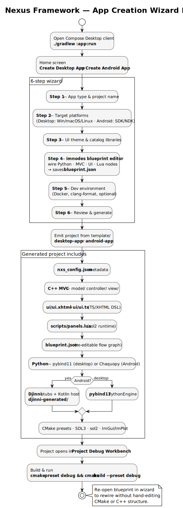

# Nexus Framework — Documentation Hub

Documentation for the **Framework** scaffold client: Compose Desktop UI + Gradle generation pipeline for native C++/Lua/Python apps.

## Navigation

| Doc | What it covers |
|-----|----------------|
| [Architecture overview](architecture/overview.md) | Full-stack layers, themes, wizard roadmap |
| [Agent readiness](architecture/agent-readiness.md) | AI agent onboarding score, gaps, fixes |
| [Risk analysis](architecture/risk-analysis.md) | Architecture risks and mitigations |
| [Desktop App template](templates/desktop-app.md) | `template/desktop-app/` — MVC, pybind11, plotter |
| [Android App template](templates/android-app.md) | `template/android-app/` — Djinni, Chaquopy |
| [Shared DSL](templates/shared-dsl.md) | `template/shared/dsl/` — TypeScript + XHTML |
| [Coding with Nexus](guides/coding-with-nexus.md) | UI, MVC, Python, Lua, blueprint, themes, icons |
| [Generation pipeline](guides/generation-pipeline.md) | `ProjectGenerator`, CLI, Docker, Jenkins |

## Architecture diagrams




## Related READMEs

| Path | Purpose |
|------|---------|
| [../README.md](../README.md) · [../README.pt-BR.md](../README.pt-BR.md) | Project overview (EN / pt-BR) |
| [../client-setup/README.md](../client-setup/README.md) | First-run JDK 26 + Git setup |
| [../builds/README.md](../builds/README.md) | `builds/client/` and `builds/framework/` layout |
| [../template/README.md](../template/README.md) | Output templates index |
| [../misc/README.md](../misc/README.md) | Generation pipeline modules (`:core`, `:cli`) |
| [../jenkins/README.md](../jenkins/README.md) | Optional Jenkins CI |
| [../AGENTS.md](../AGENTS.md) | Build commands for coding assistants |

## Quick commands

```bash
source ../client-setup/env.sh
./gradlew :app:run
./gradlew :cli:run --args="generate --type desktop --name MyApp --dry-run"
```
