# Nexus Framework Scaffold — Architecture Risk Analysis

**Repository:** `Framework` (Nexus Framework scaffold)  
**Analysis date:** 2026-07-10  
**Risk score:** 72 / 100 — **High Risk**  
**Method:** Opsera DevSecOps `architecture-analyze` (3-pass) + manual verification

---

## Executive summary

The Framework repo is a **template-and-docs monorepo** with a minimal Compose Desktop `:app` (counter demo), not the wizard/generator described in marketing diagrams. Architectural risk concentrates on **documentation–implementation drift**, **dual-repo template sync** with Nexus Framework Client, and **brittle native build chains** (FetchContent, Android boot order, synchronous Python on the UI thread).

Auth routes are **N/A** — local desktop scaffold with no network surface.

---

## Architecture at a glance

| Layer | Technology | Status |
|-------|------------|--------|
| Scaffold client | Kotlin 2.4 + Compose Desktop 1.11.1 | Counter MVC demo only |
| Templates | C++20 SDL3 + ImGui + sol2 + pybind11 / Chaquopy + Djinni | Plotter samples present |
| Build (client) | Gradle + Foojay, `jvmToolchain(26)` | JDK docs say 21 |
| Build (desktop template) | CMake 3.24 + 7× FetchContent repos | Network required at configure |
| Build (Android template) | AGP + NDK + Chaquopy 3.11 | **Compile-broken** duplicate Kotlin classes |

**Scale:** ~152 source files, ~8.2k LOC (excluding build artifacts), 3 test files, bus factor 1.

---

## What works well

1. **Consistent MVC layering** — Kotlin client and C++ templates both use `model/` / `controller/` / `view/`; easy mental model for contributors.
2. **Cross-platform SDL3 parity** — Desktop and Android templates share the same ImGui loop and `template/shared/runtime` (themes, fonts).
3. **Explicit Python bridge contracts** — Desktop pybind11 embed and Android Djinni IDL (`plotter.djinni`) document the JVM↔native boundary clearly.
4. **Pinned dependency tags** — FetchContent uses explicit `GIT_TAG` values; Gradle uses a version catalog.
5. **Honest development status (partial)** — README § Development status (lines 141–157) now distinguishes “in this repo today” vs “v1 roadmap”; should be extended to other docs.

---

## Critical risks

### C1 — README / diagrams vs runnable client

| Field | Detail |
|-------|--------|
| **Evidence** | `app/src/main/kotlin/nexus/opensource/App.kt` launches `CounterScreen` only. No `ProjectGenerator`, wizard steps, or imnodes editor. |
| **Docs still claiming wizard** | `docs/architecture/overview.md:13`, wizard SVG, `docs/guides/coding-with-nexus.md` blueprint workflow |
| **Worst case** | Contributors run `./gradlew :app:run` expecting project creation; onboarding fails immediately |
| **README fix** | Lead Quick Start with `cd template/desktop-app && cmake …`; label `:app:run` as “client shell (demo)” until wizard ships |

### C2 — Dual-repo template drift

| Field | Detail |
|-------|--------|
| **Evidence** | This repo: `template/desktop-app/`. Client repo: `templates/basic-app/` per Client `AGENTS.md`. `nxs_config.json` sets `"generatedBy": "nexus-framework-client"`. |
| **Worst case** | Generator emits templates that diverge from canonical samples; breaking changes ship without coordinated release |
| **Decision** | Monorepo merge, git submodule, or CI diff gate between `template/` trees (see § Hard-to-reverse decisions) |

---

## High risks

### H1 — JDK version contradiction (3 targets)

| Source | JDK |
|--------|-----|
| `README.md:108` | 21 |
| `misc/build-logic/.../kotlin-jvm.gradle.kts:14` | **26** (Foojay auto-download) |
| `template/android-app/app/build.gradle.kts:45` | 17 |

**Impact:** Wrong JDK installed by contributors; IDE/toolchain mismatch.

**Recommendation:** Standardize client on **JDK 21 LTS** unless a JDK 26 feature is required; document all three targets explicitly if kept.

### H2 — FetchContent network SPOF (configure-time)

Desktop `CMakeLists.txt` fetches **7** Git repos (SDL3, imgui, implot, imnodes, lua, sol2, pybind11). Android fetches **6**. No content-hash pin beyond `GIT_TAG`; Android has no `NXS_PREFER_SYSTEM_DEPS`.

**Failure modes:**

| Trigger | Symptom |
|---------|---------|
| GitHub outage / proxy | `cmake` configure fails; zero native builds |
| Tag moved / deleted | Non-reproducible or broken builds |
| Air-gapped CI | First build impossible without vendor mirror |

### H3 — Android template compile corruption

`MainActivity.kt` and `NexusApplication.kt` each contain **duplicate package/class blocks** (merge artifact). Kotlin compiler rejects the file before Gradle native build runs.

Additionally, duplicate `onCreate` orderings disagree on `super.onCreate` vs `PlotterCore.installPythonBridge` — SDL lifecycle risk once compile is fixed.

### H4 — Chaquopy → Djinni → SDL3 boot chain

Required order (confirmed via `AndroidManifest.xml:5`):

```
NexusApplication.onCreate → Python.start(AndroidPlatform)
  → MainActivity.onCreate → PlotterCore.installPythonBridge(ChaquopyPythonBridge)
    → SDL_main (native MVC loop)
```

| Failure point | Runtime symptom |
|---------------|-----------------|
| Chaquopy not started | `PythonBridge not installed` → empty charts |
| Bridge after SDL_main | Native core has no Python; silent empty series |
| Djinni stub mismatch | JNI crash at first `evaluate()` |
| SDL3 `.so` load failure | Activity exits; no ImGui |

Errors surface as `EvalResult.ok = false`; UI may show blank plots without prominent error chrome.

### H5 — Synchronous Python on render thread

`main.cpp:77` calls `controller.refresh()` every frame. `PlotController.cpp:36-50` invokes `PythonEngine.evaluate` synchronously (pybind11 GIL desktop; JNI Android). Sample count clamped **64–4096**.

**Stress projection:**

| Load | Expected behavior |
|------|-------------------|
| 1 dirty curve, 512 samples | Acceptable |
| 5 curves × 4096 samples | UI thread blocked; likely &lt;10 FPS |
| Complex numpy in `functions.py` | Frame drops during every resample |

---

## Medium risks

| ID | Area | Detail |
|----|------|--------|
| M1 | pybind11 system dependency | `find_package(Python3 3.10 REQUIRED COMPONENTS Development.Embed)` — fails without `python3-dev` |
| M2 | JDK 26 early-adopter bet | Reverting touches `misc/build-logic`, CI, IDE docs |
| M3 | Remote URL naming | `git remote` → `nexus-framework-client` while directory is `Framework` |
| M4 | FetchContent supply chain | Tags are mutable; no SHA256 verification |

---

## Low risks

| ID | Area | Detail |
|----|------|--------|
| L1 | Minimal tests | Only `NexusBrandingTest.kt`; no CMake/Android/template validation |
| L2 | Unused version-catalog libs | `kotlinx-datetime`, serialization, coroutines declared but not used in `:app` |

---

## Auth routes

**Not applicable.** The scaffold client is a local Compose Desktop app with no HTTP server, session layer, or API routes. Generated native apps likewise have no documented network auth boundary in v1.

Trust boundaries that *do* exist:

| Boundary | Protocol | Data |
|----------|----------|------|
| Desktop Python embed | in-process pybind11 | numpy buffers |
| Android JVM ↔ native | Djinni JNI | `double[]` curve samples |

---

## Failure mode map (components)

```mermaid
flowchart TD
    subgraph Client["Compose :app"]
        A[./gradlew :app:run] --> B{Wizard implemented?}
        B -->|No| C[CounterScreen demo]
        B -->|Future| D[ProjectGenerator]
    end

    subgraph DesktopBuild["Desktop CMake FetchContent"]
        E[cmake configure] --> F{GitHub reachable?}
        F -->|No| G[BUILD FAIL]
        F -->|Yes| H[7 repos download ~50-100MB]
        H --> I{Python3 dev headers?}
        I -->|No| G
        I -->|Yes| J[Link pybind11 embed]
    end

    subgraph AndroidRuntime["Android boot chain"]
        K[NexusApplication] --> L[Chaquopy Python.start]
        L --> M[MainActivity bridge install]
        M --> N[SDL_main native loop]
        M -.->|bridge missing| O[Empty charts]
        N -.->|JNI error| P[Process crash]
    end

    subgraph RenderLoop["Per-frame MVC"]
        Q[SDL_PollEvent] --> R[controller.refresh]
        R --> S[Python evaluate sync]
        S --> T[ImGui draw]
        S -.->|slow numpy| U[UI jank / freeze]
    end
```



---

## Hard-to-reverse decisions

| Decision | Reversibility | Notes |
|----------|---------------|-------|
| **JDK 26 toolchain** | Medium | Foojay + `misc/build-logic` convention; downgrade to 21 is small diff but touches all contributor docs |
| **Dual-repo split** | **High** | Framework templates vs Client `ProjectGenerator`; merge cost grows monthly |
| **FetchContent-over-vendor** | Medium | Switching to `vendor/` subtrees requires CMake refactor + LFS policy |
| **SDL3 + ImGui (not Qt/web)** | **Very high** | Core product identity; affects all templates and docs |
| **Android: Chaquopy on JVM (not embedded CPython)** | High | Djinni IDL, Gradle plugin, APK size model all assume JVM Python |
| **README as product brochure** | Low | Text/diagram fixes; no code migration |

---

## README accuracy — actionable corrections

Use this table when editing `README.md`, `README.pt-BR.md`, and `docs/architecture/overview.md`:

| Claim (current) | Reality | Suggested wording |
|-----------------|---------|-------------------|
| Quick Start `./gradlew :app:run` → wizard | Counter demo | “Run client shell (demo)” + separate “Build template directly” block (already partially at README:132–137) |
| Prerequisites JDK **21** | `jvmToolchain(26)` | JDK **26** (auto via Foojay) **or** change build to 21 |
| `docs/architecture/overview.md` “Wizard, imnodes editor, project generation” | Not in `:app` | Prefix with “**Planned (v1 roadmap):**” |
| “generated projects run on day one” | Android template does not compile | Add caveat: verify `template/android-app` after fixing Kotlin duplicates |
| Repository layout shows full wizard client | Only `app/` counter | Align layout diagram with Development status section |
| Single repo owns generation | `nxs_config.json` → `nexus-framework-client` | Document dual-repo model and which repo to clone for scaffolding |

---

## Remediation roadmap

### Fix today (&lt;1 hour)

1. Remove duplicate classes in `MainActivity.kt` and `NexusApplication.kt`.
2. Align JDK prerequisite in README with `misc/build-logic` (or downgrade toolchain to 21).
3. Add “demo only” label to Quick Start for `:app:run`.

### This sprint

1. Add CI job: `cmake --preset debug` on `template/desktop-app` (dry configure).
2. Add CI job: `./gradlew :app:compileKotlin :app:test`.
3. Update `docs/architecture/overview.md` roadmap qualifiers.
4. Document dual-repo sync checklist in `docs/architecture/overview.md` or `AGENTS.md`.

### Next quarter

1. Resolve dual-repo strategy (monorepo vs submodule vs published template artifact).
2. Vendor or mirror FetchContent dependencies for offline builds.
3. Move Python evaluation off UI thread (worker + buffer swap).
4. Implement wizard/generator or remove wizard diagrams from primary README flow.

---

## Risk score breakdown

```
Score = min(100, round(log10((C×100) + (H×30) + (M×10) + (L×3) + 1) × 25))
      = min(100, round(log10(365) × 25)) ≈ 72
```

| Severity | Count |
|----------|-------|
| Critical | 2 |
| High | 5 |
| Medium | 4 |
| Low | 2 |

---

## Related documents

- [Architecture overview](overview.md)
- [Development status](../../README.md#development-status)
- Nexus Framework Client repo — `ProjectGenerator`, `:core`, `:cli` (generation pipeline)

---

*Generated by Opsera DevSecOps architecture analysis. Focus: architectural risks only — not a project status report.*
