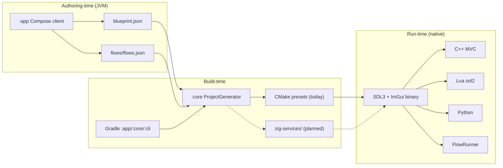
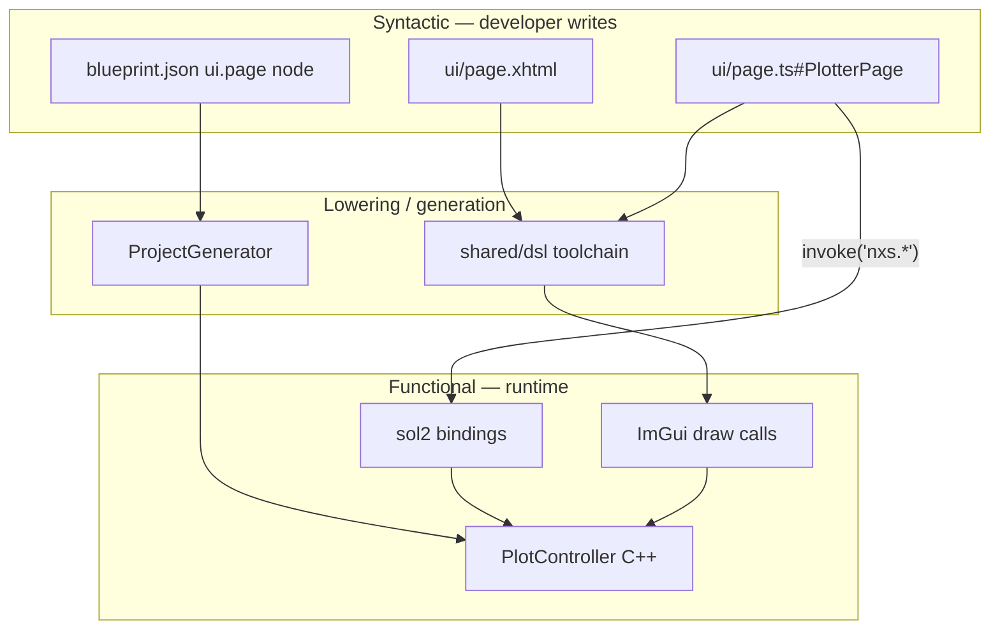
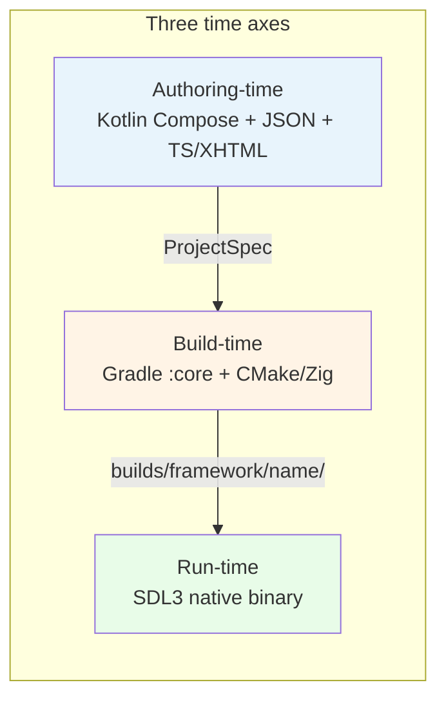
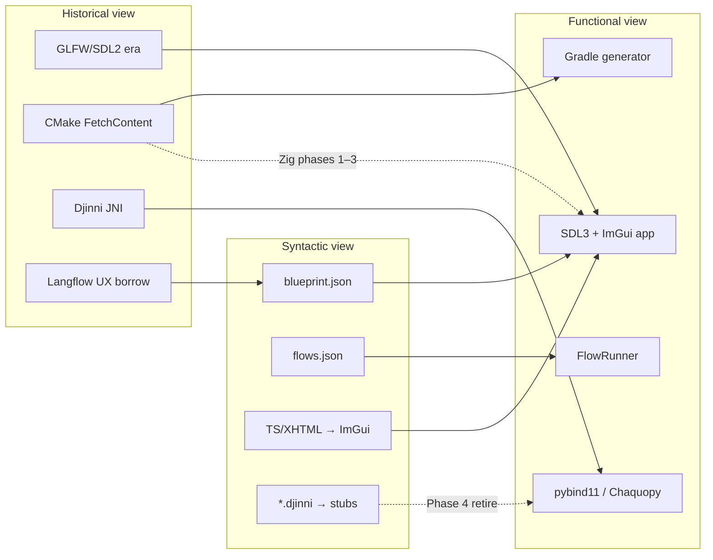

# Runtime stack — historical, functional, and syntactic map

**Repository:** Nexus Framework (monorepo: `:app`, `:core`, `:cli`, `template/`)  
**Last updated:** 2026-07-13  
**Audience:** Contributors, agents, and adopters who need to know *what runs where*, *what you write*, and *why each layer exists*.

This document links three views of the same stack:

| Dimension | Question it answers |
|-----------|---------------------|
| **Historical** | Where did this layer come from? What is it replacing? |
| **Functional** | What does it *do* at runtime (or at generation time)? |
| **Syntactic** | What does the developer *author* vs what gets lowered or generated? |

For layer diagrams and blueprint authoring, start with [overview.md](overview.md). For phased native-build migration, see [zig-patching.md](zig-patching.md). For risk posture and doc–code drift, see [risk-analysis.md](risk-analysis.md) and the Opsera HTML companion [zig-surgical-integration-risk-analysis.html](zig-surgical-integration-risk-analysis.html).

---

## 1. Overview — how a Nexus project runs end-to-end today

A Nexus project moves through three phases before the user sees a native window:

1. **Authoring (Compose client)** — You run `./gradlew :app:run`, name a project, and edit `blueprint.json` (structure) and optional `flows/flows.json` (in-app automations) in the Kotlin Compose UI.
2. **Generation (`:core` / `:cli`)** — `ProjectGenerator` validates graphs, substitutes template placeholders (`{{projectName}}`, `{{windowTitle}}`, …), and writes a tree under `builds/framework/<name>/` from `template/desktop-app/` or `template/android-app/`.
3. **Native runtime (generated binary)** — The shipped app is a single process: **SDL3** window loop, **Dear ImGui** + **ImPlot** view, **C++20 MVC**, **Lua** panels (sol2), optional **Python** (pybind11 desktop / Chaquopy Android), and optional **FlowRunner** services from `flows.json`.

**Honest scope today:** The Compose scaffolder (`:app`) still requires **JDK 26** and runs on the JVM. **Generated desktop apps have no JVM** — they are native binaries. Android generated apps use a **small JVM island** (Kotlin activity + Chaquopy) around the same C++ core. The direction is *less* generated JVM glue (Zig JNI replacing Djinni), not a JVM-free Compose client in v1.

---

## 2. Historical lineage — where each piece comes from

Nexus did not invent every layer from scratch. Most choices are deliberate borrowings from game engines, visual flow tools, and mobile bridge patterns — with a migration path toward simpler native builds.

### Scaffold client & generation pipeline

| Piece | Lineage | Why it exists |
|-------|---------|---------------|
| **Kotlin + Compose Desktop (`:app`)** | JetBrains desktop UI stack; MVC mirrored from generated C++ templates | Cross-platform project wizard, blueprint/flows editors, branding |
| **Gradle + JDK 26** | Standard JVM build orchestration for Kotlin multi-module repos | Builds `:core`, `:cli`, `:app`; Foojay toolchain in `misc/build-logic` |
| **`:core` / `:cli`** | Internal codegen services (not a public SDK) | Headless `generate` + shared validation with the GUI |
| **Blueprint graph UX** | [Langflow](https://github.com/langflow-ai/langflow)-style typed DAG mental model | Familiar node-and-edge authoring for app *structure* — see [README § How Nexus compares](../../README.md#how-nexus-compares) |
| **Flows graph UX** | n8n-style *local* automation pattern, without cloud runtime | Optional in-process triggers; not a replacement for n8n webhooks at the edge |

### Generated native runtime

| Piece | Lineage | Why it exists |
|-------|---------|---------------|
| **SDL3** | Successor to SDL2; community shift away from GLFW-only samples | One window/input/GPU surface API for desktop **and** Android GLES — README positions SDL3 parity vs Electron/Tauri |
| **Dear ImGui + ImPlot** | Game-engine and tooling UIs (immediate mode) | Sub-ms refresh, dense data UIs without a browser renderer |
| **C++20 MVC** | Classic desktop architecture; matches `src/model|controller|view/` | Domain state, commands, and view in one address space |
| **Lua + sol2** | Scripting layers in games and CAD tools | Hotkeys, panels, rapid iteration without recompile |
| **TS/XHTML DSL** | Web-familiar authoring lowered to native widgets | Designers write declarative UI; toolchain targets ImGui — [shared-dsl.md](../templates/shared-dsl.md) |
| **Python** | Scientific / analytics stacks (numpy, etc.) | Desktop: **pybind11** embed in-process. Android: **Chaquopy** on JVM with thin native facade |
| **Djinni (Android, today)** | Dropbox IDL → JNI/Kotlin/C++ glue | Explicit C++ ↔ Kotlin contract for plotter bridge; **transitional** — Phase 4 Zig JNI retires codegen path per [zig-patching.md](zig-patching.md) |

### Native build orchestration (migration)

| Era | Tooling | Status |
|-----|---------|--------|
| **Baseline** | CMake 3.24 + **7× FetchContent** clones, Ninja, platform compilers, Android NDK, Djinni CLI | **Today** — default for generated apps |
| **Zig strangler** | `template/desktop-app/zig-services/` sidecar, `zig c++`, `build.zig.zon` lock | **Planned** Phases 0–6 — Gradle untouched for JVM modules |
| **Arena allocator opt-in** | C-ABI `nxs_alloc` / `nxs_free` at hotspots | **Planned** Phase 5 — no global `operator new` replacement |

CMake cold-configure pain and Djinni file sprawl are documented with measured baselines in [README § Zig patching](../../README.md#zig-patching-native-builds) and quantified risks in [zig-surgical-integration-risk-analysis.html](zig-surgical-integration-risk-analysis.html).

### Mental-model imports (not runtimes)

| External tool | What Nexus imports | What Nexus does *not* ship |
|---------------|-------------------|---------------------------|
| **Langflow** | Export JSON → manual or importer (`LangflowTransformationEngine`) → `blueprint.json` / `flows.json` | Langflow server, LLM runtime, cloud execution |
| **n8n** | Pattern reference for step lists and triggers | Hosted workflow engine — apps may *call* n8n webhooks from Python/Lua |

See [README § Blueprint & flows](../../README.md#blueprint--flows--two-layers) and [blueprint-schema.md § Langflow vs n8n](../templates/blueprint-schema.md).

---

## 3. Functional map — what each language/runtime does

Responsibilities at **generation time** vs **run time** for the Framework monorepo and generated apps.

| Component | When | Responsibility |
|-----------|------|----------------|
| **Kotlin `:app`** | Authoring + build | Compose UI: Generate Project, blueprint editor, flows editor; passes `ProjectSpec` to generator |
| **Kotlin `:core`** | Build | `ProjectGenerator`, `BlueprintValidator`, `FlowsValidator`, template engine, optional Langflow importer |
| **Kotlin `:cli`** | Build | Headless `generate` for CI and scripts |
| **Gradle** | Build | JVM module graph, JDK 26 toolchain, pack `lua.dat` / `python.dat`, deploy client to `builds/client/` |
| **CMake** | Build (generated) | FetchContent deps, compile C++20, link pybind11/sol2/SDL3, Android NDK via AGP |
| **Zig (`zig-services/`)** | Build (planned) | Native orchestration, `zig c++` compile, cross-compile, JNI `.so` — **not** app business logic |
| **C++20** | Run | MVC core: models, controllers, ImGui view, `FlowRunner`, PythonEngine facade |
| **Lua 5.4** | Run | Runtime panels, hotkeys, script hooks via sol2 |
| **Python 3** | Run | Analytics modules (`python.module` nodes), numpy-style sampling |
| **TypeScript / XHTML** | Authoring → run | UI page definitions; lowered/bound into native view layer |
| **JSON graphs** | Authoring → build | `blueprint.json` consumed once; `flows.json` loaded at startup if enabled |
| **SDL3** | Run | OS window, input, GPU backend |
| **ImGui / ImPlot** | Run | Widgets and charts |
| **JVM (Android only)** | Run | Activity shell, Chaquopy classloader, Kotlin UI glue — **not** used on desktop generated apps |
| **Djinni / JNI** | Build + run (Android) | Kotlin ↔ C++ bridge — shrinking under Zig plan |

### Desktop vs Android functional split

| Concern | Desktop generated app | Android generated app |
|---------|----------------------|------------------------|
| Windowing | SDL3 + OpenGL | SDL3 + GLES |
| Python | pybind11 embedded in native process | Chaquopy on JVM + native callbacks |
| Kotlin/Java | None at runtime | Activity + bridge classes |
| Native bridge | Direct C++ / pybind11 | Djinni today → Zig JNI (planned) |
| Packaging | CMake output binary | APK/AAB via Gradle AGP |

---

## 4. Syntactic / authoring map — what you write vs what gets lowered

| You author | Syntax / location | Lowered or consumed by | Runtime artifact |
|------------|-------------------|------------------------|------------------|
| **Blueprint nodes** | `blueprint.json` (`python.module`, `cpp.model`, `ui.page`, …) | `:core` validation + codegen | Paths wired in CMake/sources; edges inform MVC wiring |
| **Flow definitions** | `flows/flows.json` (`steps[]`, `trigger`, `mode`) | `FlowsValidator`; `FlowRunner` at startup | In-process services, timers, event hooks |
| **C++ domain** | `src/model/`, `src/controller/`, `src/view/` | CMake / Zig compile | Native binary |
| **Lua panels** | `scripts/panels.lua`, `lua.script` nodes | LUAC pack → `lua.dat` (host task) | sol2 `require` at runtime |
| **Python modules** | `python/*.py`, `python.module` nodes | PYAC pack → `python.dat` (host task) | pybind11 / Chaquopy import |
| **UI pages** | `ui/*.xhtml`, `ui/*.ts` (`NexusPage` subclasses) | DSL → ImGui widget tree (see [shared-dsl.md](../templates/shared-dsl.md)) | Immediate-mode view each frame |
| **Djinni IDL** | `*.djinni` (Android, transitional) | `regen-djinni.sh` → C++/Java/Kotlin stubs | JNI calls — **planned retirement** |
| **Zig C ABI headers** | `zig-services/cpp/*.h` (planned) | `zig build` exports | Thin alloc / JNI surface — not MVC replacement |
| **Config** | `nxs_config.json` (schema v2) | Placeholder substitution | Feature flags (`flows.enabled`, `build.nativeBackend`) |
| **Langflow export** | External JSON | Manual v1; `LangflowTransformationEngine` v1.1 | Split into blueprint + flows with `enabled: false` default |

### Authoring flow (UI example)

**Key idea:** Blueprint and flows are **data**, not a second programming language. They steer which files exist and how MVC ports connect; most logic still lives in C++, Python, Lua, and TS you edit after generation.

---

## 5. Build-time vs run-time vs authoring-time

| Phase | Where it runs | Languages & tools | Trust boundary |
|-------|---------------|-------------------|----------------|
| **Authoring-time** | Developer machine — Compose window | Kotlin, JSON graphs, TS/XHTML in editors | JVM process; no user app data yet |
| **Build-time (generator)** | Gradle on developer/CI | Kotlin `:core`, template copy, LUAC/PYAC pack | Writes `builds/framework/<name>/` |
| **Build-time (native)** | CMake or Zig (generated tree) | C++ compile, link SDL3/ImGui/sol2/pybind11 | Network at CMake configure (FetchContent) — Zig plan removes clones |
| **Run-time (desktop)** | End-user OS process | C++, Lua, Python, SDL3, ImGui | Single native address space — no JVM |
| **Run-time (Android)** | APK process | C++ + JVM island (Kotlin + Chaquopy) | JNI/Djinni boundary — migrating to Zig JNI |

---

## 6. Trust / process boundaries

| Boundary | Processes | Crosses with | Implication |
|----------|-----------|--------------|-------------|
| **Compose client ↔ filesystem** | JVM `:app` | Reads/writes project dirs, invokes `:core` | Trusted developer tool — not sandboxed like end-user app |
| **Generator ↔ templates** | JVM `:core` | Copies `template/`, validates JSON | Malformed blueprint fails validation; no arbitrary code exec in generator |
| **Desktop native app** | Single OS process | Lua, Python embedded via sol2/pybind11 | Script packs are **your** code; treat `python/` and `scripts/` as trusted |
| **Android JVM ↔ native** | ART + `lib*.so` | JNI (Djinni) / future Zig exports | Keep bridge thin; domain logic stays C++ |
| **Flows ↔ external network** | In-process `FlowRunner` | Optional HTTP from Python/Lua (app code) | Nexus does not bundle n8n/Langflow servers — outbound calls are explicit app choices |
| **Langflow import** | External tool → JSON file | Importer in `:core` | Imported flows default **`enabled: false`** until reviewed |

**Java-reduction direction (honest):**

- **Today:** JDK 26 required for `:app`, `:core`, `:cli`.
- **Generated desktop:** Already JVM-free at runtime.
- **Planned:** Zig JNI reduces Djinni-generated Java/Kotlin surface on Android; does **not** remove Compose client JVM requirement in v1.

---

## 7. Migration chronology — past → present → planned

| When | Milestone | Stack impact |
|------|-----------|--------------|
| **Past** | Hand-rolled C++/CMake templates | GLFW/SDL2-era samples informed move to **SDL3** + shared `template/shared/runtime` |
| **Past** | Dual-repo Client vs Framework | Template drift risk — see [risk-analysis.md § C2](risk-analysis.md) |
| **Present (2026-07)** | Monorepo `:app` + `:core` + full templates | Compose editors, `ProjectGenerator`, blueprint + flows validators |
| **Present** | CMake + FetchContent default | 7 git clones at configure; Android Djinni + Chaquopy |
| **Phase 0** | Zig 0.14.x in `client-setup` | Pin toolchain for contributors |
| **Phase 1** | `zig-services/` sidecar | Compile real C++ TU via `zig c++`; CMake remains default |
| **Phase 2** | Langflow importer (parallel) | Kotlin-only; `enabled: false` on import |
| **Phase 3** | Desktop Zig default | `nxs_config.json` `build.nativeBackend: "zig"` |
| **Phase 4** | Android Zig JNI | Retire Djinni codegen path |
| **Phase 5** | ArenaAllocator opt-in | C-ABI alloc at AppModel hotspots only |
| **Phase 6** | Docs + diagrams | Includes this document and refreshed SVGs |

Full phase acceptance criteria: [zig-patching.md](zig-patching.md).

---

## 8. See also

| Doc | Why |
|-----|-----|
| [Architecture overview](overview.md) | Layer diagrams, blueprint node table, Langflow vs n8n |
| [Zig patching](zig-patching.md) | Phased CMake → Zig migration + Langflow importer |
| [Risk analysis](risk-analysis.md) | Doc–code drift, FetchContent, Android build risks |
| [Zig surgical integration (HTML)](zig-surgical-integration-risk-analysis.html) | Opsera architecture-analyze companion |
| [Blueprint schema](../templates/blueprint-schema.md) | Node types and validation rules |
| [Flows schema](../templates/flows-schema.md) | Triggers, steps, `enabled` flags |
| [Shared DSL](../templates/shared-dsl.md) | TS/XHTML lowering model |
| [Generation pipeline](../guides/generation-pipeline.md) | `ProjectGenerator` and CLI |
| [Coding with Nexus](../guides/coding-with-nexus.md) | Day-to-day editing after scaffold |
| [README § Architecture](../../README.md#architecture) | Product-level diagrams and comparisons |
| [README § Zig patching](../../README.md#zig-patching-native-builds) | Projected gains table |
| [AGENTS.md](../../AGENTS.md) | Build commands for coding assistants |

**Generated-app templates:** [template/desktop-app/AGENTS.md](../../template/desktop-app/AGENTS.md) · [template/android-app/AGENTS.md](../../template/android-app/AGENTS.md)

**Translations:** [Mapa da stack (EN)](../../misc/translations/README.pt-BR.md#mapa-da-stack-en) in pt-BR README.
