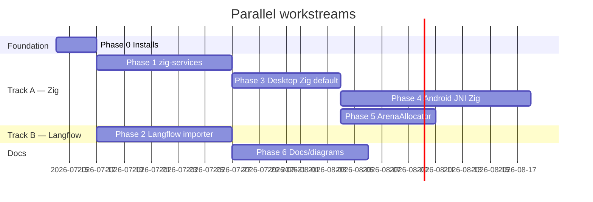

# Zig patching — native build orchestration + Langflow importer

**Repository:** Nexus Framework Client (monorepo: `:app`, `:core`, `:cli`, `template/`)  
**Plan date:** 2026-07-13  
**Status:** Draft for `CreatePlan` / `writing-plans` conversion  
**Scope:** Phased native-build migration (CMake → Zig sidecar) + automatic Langflow → `flows.json` importer

---

## Executive summary

This plan introduces **Zig as the native build orchestrator for generated template apps** without rewriting the C++ MVC stack overnight. Gradle remains the build system for `:app`, `:core`, and `:cli`. Zig owns **generated** desktop/Android native binaries via a new `zig-services/` sidecar that compiles existing C++20 sources with `zig c++`.

In parallel, **`LangflowTransformationEngine`** in `:core` maps Langflow ReactFlow export JSON (nodes/edges) into Nexus `FlowsFile`, with **imported flows defaulting to `enabled: false`** until the user explicitly enables them. Output passes existing `FlowsValidator` before generation.

**Non-goals (surgical constraints):**

- No global C++ `operator new` replacement — ArenaAllocator is opt-in via a `ZigAllocator` struct and C-ABI (`cAlloc`/`cFree`) at AppModel hotspots only.
- No one-shot CMake deletion — phased A→D migration with CMake fallback until Phase 4 completes.
- No Langflow runtime embedded in shipped apps — import is codegen/adoption only (same product boundary as today).

---

## Current baseline (verified in repo)

| Area | Today | Plan impact |
|------|-------|-------------|
| **Compose client** | Generate Project, Blueprint Editor, Flows Editor (list + JSON preview) | Add “Import Langflow JSON” button in Flows Editor |
| **`:core` generation** | `ProjectGenerator`, `BlueprintValidator`, `FlowsValidator` | Add `LangflowTransformationEngine` + fixture tests |
| **Desktop native build** | `template/desktop-app/CMakeLists.txt` — FetchContent ×7, pybind11 embed, `FlowRunner` | Zig sidecar compiles same `NXS_APP_SOURCES` |
| **Android native build** | AGP + CMake + Djinni (`plotter.djinni`, `app.djinni`) + Chaquopy | Phase 4: Zig JNI `.so` replaces Djinni codegen path |
| **Flows schema** | `FlowsSchema.kt`, `docs/templates/flows-schema.md` | Importer flips “manual v1 / importer v1.1” to implemented feature |
| **Client setup** | JDK 26 + Git; CMake “optional for generated apps” | Add Zig 0.14.x pin + optional `ANDROID_NDK` |
| **Risk analysis** | `docs/architecture/risk-analysis.md` score **72** (2026-07-10) | **Stale:** claims counter-only `:app` and missing `ProjectGenerator` — generator + editors exist in this repo |

---

## Recommended phase order & parallel workstreams



| Workstream | Phases | Can start after Phase 0 | Notes |
|------------|--------|-------------------------|-------|
| **A — Native Zig** | 0 → 1 → 3 → 4 → 5 | Yes | Desktop-first; Android JNI last |
| **B — Langflow importer** | 0 → 2 → 6 (partial) | Yes | **Fully parallel with Phase 1** — Kotlin-only until generation wiring |
| **C — Documentation** | 6 (continuous) | After Phase 2 schema freeze | Diagrams can stub in Phase 2, finalize after Phase 3 |

**Critical path:** Phase 0 → Phase 1 → Phase 3 (desktop Zig default). Langflow importer does not block Zig scaffold.

---

## Machine install list (contributor / CI)

| Package | Version | Required when | Installed by |
|---------|---------|---------------|--------------|
| **OpenJDK** | **26** | Always (`:app`, `:core`, `:cli`) | `misc/client-setup/*/setup.*` (existing) |
| **Git** | latest | Always | client-setup (existing) |
| **Zig** | **0.14.x** (pin exact patch in `env.sh`) | Generated native builds (Phase 1+) | **Phase 0** — new client-setup step |
| **CMake** | ≥ 3.24 | Fallback / transition period | Manual or distro package (existing docs) |
| **Ninja** | latest | CMake fallback presets | Manual (existing) |
| **C++20 compiler** | gcc/clang/MSVC | CMake fallback; Zig bundles toolchain for `zig c++` | Zig + optional system compiler |
| **Python 3.10+ dev** | headers | Desktop pybind11 embed (CMake or Zig link stage) | Distro `python3-dev` (existing) |
| **Android NDK** | r26+ recommended; **API ≥ 29** | Phase 4 Android Zig builds only | `ANDROID_NDK` / `sdkmanager` (optional Phase 0) |

**Verify after Phase 0:**

```bash
source misc/client-setup/env.sh
java -version    # 26
zig version      # 0.14.x
# Optional Android:
test -n "$ANDROID_NDK" && ls "$ANDROID_NDK/toolchains/llvm/prebuilt"
```

---

## Phase 0 — Installs

### Deliverables

1. **`misc/client-setup`** — install Zig **0.14.x** on Linux (Arch/Debian/Fedora), macOS (brew/tarball), Windows (zip + PATH).
2. **`misc/client-setup/env.sh`** (and `env.bat`) — export:
   - `ZIG_VERSION=0.14.x` (exact pin)
   - `ZIG_HOME` / prepend `PATH`
   - `ANDROID_NDK` (optional, documented only if NDK detected)
3. **`misc/client-setup/README.md`** — Zig row in “What gets installed”; Android NDK note for Phase 4.
4. **CI stub** — document `zig version` check in `misc/jenkins/Jenkinsfile` or future workflow (no Jenkins change required in Phase 0 if docs-only CI note suffices).

### Platform install strategy

| OS | Approach |
|----|----------|
| Linux | Official tarball to `~/.local/zig-0.14.x/` or distro package if 0.14.x available |
| macOS | `brew install zig@0.14` or pinned tarball |
| Windows | Official zip → `%LOCALAPPDATA%\zig-0.14.x\` + PATH in `env.bat` |

### Android / Zig research constraints (document in client-setup)

- Zig does **not** ship Bionic libc — Android builds need **NDK sysroot** via `zig-android-sdk` pattern or manual `libc.txt` / `libc.conf` pointing at NDK headers/libs.
- Zig **0.14+** has known C++ Android libc file issues — **pin 0.14.x** and require **NDK API level ≥ 29** until upstream fixes are verified.
- Do **not** claim “Zig replaces NDK” — Zig drives compilation; NDK still supplies Bionic.

### Acceptance criteria

- [ ] Fresh machine: run platform `setup.sh` → `zig version` prints pinned 0.14.x
- [ ] `env.sh` documents `ANDROID_NDK` optional export
- [ ] `AGENTS.md` First run section mentions Zig for generated app builds
- [ ] No change to Gradle JDK 26 toolchain

---

## Phase 1 — `zig-services` scaffold

### Goal

Add `template/desktop-app/zig-services/` (and mirrored path in generated output) as a **sidecar** that builds the desktop app with `zig build`, compiling at least one existing C++ translation unit via `zig c++`, while **CMake remains the default** until Phase 3.

### Directory layout (template + generated)

```
template/desktop-app/
├── CMakeLists.txt              # unchanged default (Phase 1)
├── zig-services/
│   ├── build.zig               # main build graph
│   ├── build.zig.zon           # dependency manifest (SDL3, etc. — staged)
│   ├── build.zig.zon.json      # lock (committed when deps stabilize)
│   ├── src/
│   │   └── main.zig            # thin entry / version probe (optional)
│   ├── cpp/
│   │   └── bridge_stub.cpp     # hello + links one real TU (e.g. NexusTheme.cpp)
│   ├── scripts/
│   │   ├── fetch-deps.sh       # vendor or git deps for Zig (mirror FetchContent tags)
│   │   └── zig-build.sh        # wrapper: debug/release, target triple
│   └── README.md               # build commands, CMake fallback flag
├── nxs_config.json             # add build.nativeBackend: "cmake" | "zig"
└── ...
```

### `build.zig` responsibilities (MVP)

1. **Targets:** `x86_64-linux`, `x86_64-macos`, `x86_64-windows`, `aarch64-linux`, `aarch64-macos` (desktop Phase 1); Android triples stubbed with `disabled` comment until Phase 4.
2. **Compile** `../src/main.cpp` + one shared runtime TU using `zig c++ -std=c++20`.
3. **Link** against vendored SDL3/imgui path (Phase 1 may link only stub; full dep graph Phase 3).
4. **Emit** binary to `builds/framework/<projectName>/zig-out/` (align with `nxs_config.json` `build.outputDir` convention).
5. **Dual path flag:** `nxs_config.json`:

```json
"build": {
  "nativeBackend": "cmake",
  "useCmakeFallback": true
}
```

CLI override: `./zig-services/scripts/zig-build.sh --backend zig|cmake`.

### CMake coexistence

- Keep `cmake --preset debug` as documented default in Phase 1.
- Add `NXS_USE_ZIG_SIDECAR=ON` CMake option (optional) that prints message “use zig-services/ for native build” — **does not invoke Zig from CMake** in Phase 1 (avoids CMake↔Zig coupling).
- `ProjectGenerator` copies `zig-services/` tree when `nativeBackend` is `zig` or `dual`.

### Acceptance criteria

- [ ] `cd template/desktop-app/zig-services && zig build` succeeds on maintainer Linux x86_64
- [ ] At least one desktop C++ TU from `../src/` or `../shared/runtime/` links successfully
- [ ] `zig build -Dtarget=x86_64-windows` cross-compile documented (may require CI verification)
- [ ] CMake path still builds unchanged app (regression gate)
- [ ] `misc/scripts/test-gen/` smoke note added for optional Zig build step

---

## Phase 2 — `LangflowTransformationEngine` (parallel with Phase 1)

### Goal

Automatic import of Langflow export JSON into `FlowsFile`, with **all imported flows `enabled: false`**, validation via existing `FlowsValidator`, and UI entry point in Flows Editor.

### Kotlin module layout (`misc/core`)

```
misc/core/src/main/kotlin/nexus/opensource/core/
├── model/
│   ├── FlowsSchema.kt                    # existing
│   └── langflow/
│       ├── LangflowExport.kt             # ReactFlow nodes/edges + data bags
│       └── LangflowNodeTypes.kt          # known Langflow component type strings
├── service/
│   ├── FlowsValidator.kt                 # existing — no breaking changes
│   └── LangflowTransformationEngine.kt   # map export → FlowsFile
└── ...

misc/core/src/test/kotlin/.../
├── LangflowTransformationEngineTest.kt
└── resources/langflow/
    ├── minimal-chatflow.json
    ├── agent-with-tools.json
    └── schedule-trigger.json
```

### Langflow export shape (input contract)

Langflow exports ReactFlow-compatible JSON. Importer accepts **either**:

- Top-level `{ "nodes": [...], "edges": [...] }`, or
- Wrapped `{ "data": { "nodes", "edges" } }` (API export variant)

Use `ignoreUnknownKeys = true` on DTOs; never require full Langflow schema compliance.

### Mapping matrix (Langflow → `flows.json`)

| Langflow signal | Detection heuristic | Nexus `FlowDefinition` field |
|-----------------|---------------------|------------------------------|
| Chat Input / Webhook / Schedule | node `type` or `data.type` contains `ChatInput`, `Webhook`, `Schedule` | `trigger.type` → `event` / `interval` / `manual` |
| Timer / Cron | `Schedule` node or `interval` in template | `trigger.type: interval`, `trigger.ms` from config or default 60000 |
| Agent / LLM / Tool / Prompt | automation-class nodes | `steps[]` → `{ "type": "invoke", "target": "python.module", "args": ["<nodeId>", "<template>"] }` |
| Sequential edges | topological sort of automation subgraph | ordered `steps` |
| Branching | multiple outgoing edges from one node | `condition` step stub + warning (v1) |
| App structure nodes (UI, API router) | **Out of scope for flows importer** | Document: user maps to `blueprint.json` separately (future `LangflowBlueprintEngine`) |

**Safety defaults (required):**

```kotlin
FlowDefinition(
    id = sanitizedId,
    name = langflowNodeLabel,
    enabled = false,  // ALWAYS false on import
    ...
)
```

Post-import UI copy: *“Imported flows are disabled until you enable them — review steps before enabling.”*

### Trigger inference rules

| Langflow trigger class | Nexus trigger | Mode |
|------------------------|---------------|------|
| ChatInput, manual run | `manual` | `triggered` |
| Webhook | `event` (`name: langflow.webhook.<id>`) | `triggered` |
| Schedule / interval | `interval` + `ms` | `background` |
| No trigger detected | `manual` + warning | `triggered` |

### `LangflowTransformationEngine` API

```kotlin
class LangflowTransformationEngine(
    private val flowsValidator: FlowsValidator = FlowsValidator(),
) {
    data class TransformResult(
        val flows: FlowsFile,
        val warnings: List<String>,
        val skippedNodes: List<String>,
    )

    fun transform(exportJson: String): TransformResult
    fun transform(export: LangflowExport): TransformResult
}
```

Pipeline:

1. Parse JSON → `LangflowExport`
2. Filter automation-relevant nodes (exclude pure UI/layout)
3. Build one `FlowDefinition` per detected “runnable” subgraph (or single flow for MVP)
4. Topological sort edges → `steps`
5. Map node types → `invoke` targets (`python.module`, `nxs.log` fallback)
6. Set **`enabled = false`** on every flow
7. Run `FlowsValidator.validate()` — throw or return errors to UI

### Compose UI (`:app`)

**`FlowsEditorView.kt`** additions:

- Button: **Import Langflow JSON** → file picker (`.json`)
- Controller method: `importLangflowJson(text: String)` → merges/replaces flows with confirmation dialog
- Show `TransformResult.warnings` in status area
- Toggle remains user-controlled after import (all start disabled)

**`FlowsEditorController.kt`**:

```kotlin
fun importLangflow(path: Path) {
    val engine = LangflowTransformationEngine()
    val result = engine.transform(Files.readString(path))
    flows = result.flows
    flowsEnabled = false  // global switch off after import
    validationErrors = validator.validate(flows).errors
    statusMessage = "Imported ${flows.flows.size} flow(s) (disabled by default)"
}
```

Wire `effectiveFlows()` in `ProjectGenerator` path unchanged — disabled flows still serialize if user saves project with flows file present but `enabled: false` per flow.

### Unit tests (fixtures)

| Fixture | Assert |
|---------|--------|
| `minimal-chatflow.json` | 1 flow, `enabled: false`, `trigger.type == manual`, ≥1 invoke step |
| `agent-with-tools.json` | multiple invoke steps, edge order preserved |
| `schedule-trigger.json` | `background` + `interval` ms > 0 |
| invalid edge (cycle) | error or warning + partial import policy (document: fail closed) |

### Docs updates (Phase 2 minimum)

- `docs/templates/flows-schema.md` — replace “manual v1; importer v1.1” with importer behavior + `enabled: false` default
- `README.md` § Importing Langflow — Step 3 “Translate” becomes “Import in client or paste JSON”
- `docs/templates/flows-schema.md` — full mapping table (appendix)

### Acceptance criteria

- [ ] `LangflowTransformationEngineTest` green with 3+ fixtures
- [ ] Imported flows always have `enabled: false`
- [ ] `FlowsValidator` passes on all fixture outputs
- [ ] Flows Editor import button loads file and updates JSON preview
- [ ] Generation with imported flows writes `flows/flows.json` with disabled flags
- [ ] README + flows-schema.md no longer list importer as post-MVP only

---

## Phase 3 — Desktop Zig as primary build

### Goal

Make `zig-services/` the **default** native backend for new desktop generations; CMake becomes opt-in fallback.

### Deliverables

1. **`nxs_config.json` default** → `"nativeBackend": "zig"` for desktop template
2. **Full `build.zig` graph** — replicate desktop `CMakeLists.txt` targets:
   - `imgui_bundle` equivalent (static lib step)
   - `pack_archive` → `lua.dat` / `python.dat` custom steps
   - post-build asset staging (`scripts/`, `ui/`, `flows/`, `blueprint.json`)
3. **`build.zig.zon`** — pinned deps matching CMake `GIT_TAG`s (SDL3 3.2.4, imgui 1.91.8, etc.)
4. **CMake presets** — rename to `legacy-cmake-debug` / `legacy-cmake-release`; README “escape hatch”
5. **`ProjectGenerator`** — emit `zig-services/` always for desktop; honor `useCmakeFallback`
6. **`docs/guides/adding-dependencies.md`** — Zig-first C++ dep section (git submodule / `build.zig.zon` git deps)

### Migration strategy

| Step | Action |
|------|--------|
| 3a | Parity build: Zig binary runs hello + ImGui window (same as CMake target) |
| 3b | CI: `zig build` on `template/desktop-app` + generated smoke in `builds/framework/` |
| 3c | Flip generator default to Zig |
| 3d | Deprecate CMake in template README (not delete) |

### Acceptance criteria

- [ ] `zig build` produces runnable desktop binary equivalent to CMake debug build
- [ ] `lua.dat` / `python.dat` packed and staged beside binary
- [ ] `-Duse_cmake=true` or `nativeBackend: cmake` still works
- [ ] `misc/scripts/test-gen/desktop-smoke.sh` passes against Zig-built artifact

---

## Phase 4 — Zig JNI Android bridges + retire Djinni path

### Goal

Replace Djinni-generated JNI with **hand-authored Zig JNI exports** (`python_bridge.zig`, `lua_bridge.zig`) producing `lib{{projectName}}.so` for AGP `externalNativeBuild` consumption.

### Prerequisites

- Phase 3 desktop Zig stable
- `ANDROID_NDK` installed; API **≥ 29**
- Research spike: `zig-android-sdk` or project-local `libc.conf` for Bionic

### Directory layout

```
template/android-app/
├── zig-services/
│   ├── build.zig
│   ├── build.zig.zon
│   ├── jni/
│   │   ├── python_bridge.zig   # Java_com_nexus_*_ChaquopyPythonBridge_* 
│   │   └── lua_bridge.zig      # future Lua JVM hooks
│   └── README.md
├── djinni/                     # deprecated Phase 4 — README redirect
└── app/build.gradle.kts        # switch externalNativeBuild to Zig artifact path
```

### JNI design (replace `plotter.djinni`)

| Djinni today | Zig JNI Phase 4 |
|--------------|-----------------|
| `python_bridge +j` Kotlin implements | Kotlin **still** implements Chaquopy calls; Zig exports **native** `PlotterCore.install_python_bridge` |
| `plotter_core +c` C++ implements | C++ unchanged; JNI glue generated by Zig `export fn Java_*` |
| `eval_result` record | Same field layout — manual JNI marshalling `jdoubleArray` |

**MVP:** parity with `plotter.djinni` only (`evaluate`, `install_python_bridge`). `app.djinni` follows in Phase 4b.

### Gradle integration

- `app/build.gradle.kts` — add `zigBuildRelease` Exec task → copies `.so` to `jniLibs`
- Keep Chaquopy + `Python.start` boot order documented (risk H4 in risk-analysis)
- Remove `regen-djinni.sh` from default path; archive under `docs/guides/legacy-djinni.md`

### Acceptance criteria

- [ ] Android APK builds with Zig-produced `.so` on API 29+ emulator/device
- [ ] `PlotterCore.install_python_bridge` + `evaluate` round-trip matches Djinni behavior
- [ ] No Djinni codegen in default generate path
- [ ] CMake Android preset documented as fallback only
- [ ] Targets: `aarch64-linux-android`, `arm-linux-androideabi` (optional x86_64 android for emulator)

---

## Phase 5 — Opt-in ArenaAllocator C-ABI (AppModel hotspots)

### Goal

Introduce Zig `ArenaAllocator` behind a **narrow C ABI** for selected allocations in C++ template code — **not** a global allocator replacement.

### Design

**`zig-services/src/allocator.zig`:**

```zig
export fn nxs_alloc(size: usize) ?*anyopaque { ... }
export fn nxs_free(ptr: ?*anyopaque) void { ... }
export fn nxs_reset_arena() void { ... }
```

**`template/shared/runtime/ZigAllocator.hpp`:**

```cpp
struct ZigAllocator {
    static void* alloc(std::size_t n);
    static void free(void* p);
};
// Opt-in: AppModel or FunctionRegistry uses ZigAllocator for transient buffers only
```

### Surgical rules (must document)

| Do | Don't |
|----|-------|
| Use for per-frame scratch, curve sample buffers, JSON parse temp | Route every `new`/`delete` through Zig |
| Guard with `nxs_config.json` `"allocator": { "zigArena": false }` default off | Install global `operator new` |
| Reset arena at frame boundary in `PlotController::refresh` | Mix arena pointers with `std::unique_ptr` ownership |

### Hotspots (ordered)

1. `examples/plotter/src/model/FunctionRegistry.cpp` — sample cache vectors
2. `PlotController.cpp` — dirty-flag resample buffers
3. `AppModel` — only if measurable win; starter template may skip

### Acceptance criteria

- [ ] `zigArena: false` (default) — byte-identical behavior vs baseline
- [ ] `zigArena: true` — plotter smoke test passes; no leak across `nxs_reset_arena` frames
- [ ] ASan/valgrind note in docs for contributors enabling arena
- [ ] risk-analysis updated with allocator misuse risk

---

## Phase 6 — Docs, README, translations, diagrams

### New SVG diagrams (`docs/assets/diagrams/`)

| File | Content |
|------|---------|
| `zig-orchestration-layer.svg` | Gradle client → generated app → zig-services → C++/Lua/Python artifacts |
| `cmake-to-zig-migration.svg` | Phased A→D timeline, dual-path flag |
| `langflow-import-pipeline.svg` | Export JSON → LangflowTransformationEngine → FlowsValidator → flows.json |

### Update existing SVGs

| File | Change |
|------|--------|
| `full-stack-architecture.svg` | Add zig-services box under native template layer |
| `desktop-vs-android-runtime.svg` | Desktop: Zig+pybind11; Android: Zig JNI + Chaquopy |
| `langflow-adoption-workflow.svg` | Replace manual translate step with Import button |

Regenerate via `misc/scripts/generate-diagrams/generate-styled-diagrams.py` (add 3 new generator functions).

### Document touch list

| File | Updates |
|------|---------|
| `README.md` | Zig vs CMake section; MVP checklist: Langflow importer ✅; Zig desktop beta |
| `AGENTS.md` | Zig in build commands; `nativeBackend` config |
| `template/desktop-app/AGENTS.md` | `zig build` primary; CMake fallback |
| `template/android-app/AGENTS.md` | Zig JNI bridge; Djinni deprecated |
| `misc/client-setup/README.md` | Zig + NDK rows |
| `docs/guides/adding-dependencies.md` | Zig `build.zig.zon` deps |
| `docs/architecture/risk-analysis.md` | See § Stale findings below |
| `misc/translations/README.*.md` | Sync Zig + importer sections (6 locales) |

### Acceptance criteria

- [ ] All 3 new diagrams committed and linked from README
- [ ] 3 existing diagrams updated
- [ ] Translation files mention Zig install + Langflow import (may lag English by one sprint — track in checklist)
- [ ] `docs/README.md` hub links to this plan

---

## Stale findings in `risk-analysis.md` (score 72)

Update in Phase 6 (or hotfix earlier):

| Stale claim (2026-07-10) | Current repo truth |
|--------------------------|-------------------|
| “`:app` launches CounterScreen only” — no wizard | **Generate Project**, Blueprint Editor, Flows Editor ship in `:app` |
| “No `ProjectGenerator`” | `misc/core/.../ProjectGenerator.kt` + `:cli` `generate` command |
| C1 worst case: “onboarding fails — no generation” | Partially mitigated; remaining gap is **imnodes native panel** (still v1.1) |
| Dual-repo C2 | This monorepo includes `template/` + generator — clarify Framework vs Client naming in docs |

### New risks Zig introduces (add to risk-analysis)

| ID | Severity | Risk |
|----|----------|------|
| Z1 | High | Android Bionic + Zig libc.conf drift breaks JNI `.so` |
| Z2 | High | `build.zig.zon` dep pins diverge from CMake `GIT_TAG`s → reproducibility split |
| Z3 | Medium | Contributor confusion dual CMake/Zig backends |
| Z4 | Medium | Cross-compile matrix (5 desktop + 2 Android ABIs) CI cost |
| Z5 | Low | ArenaAllocator misuse → UAF if pointers escape frame scope |

**Revised score direction:** Z risks add medium weight; mitigated by phased rollout + CMake fallback → estimate **68–74** until Phase 3 completes.

---

## `ProjectGenerator` integration summary

| Config key | Phase | Behavior |
|------------|-------|----------|
| `build.nativeBackend` | 1 | `cmake` \| `zig` \| `dual` — copy `zig-services/` when zig/dual |
| `build.useCmakeFallback` | 1 | Document escape hatch |
| `allocator.zigArena` | 5 | Emit `ZigAllocator.hpp` usage only when true |
| `flows` (existing) | 2 | Unchanged — `ProjectSpec.flows` + `FlowsValidator` |

No Gradle module for Zig — invocation via documented scripts and optional CI `exec`.

---

## Testing strategy

| Layer | Tests |
|-------|-------|
| `:core` | `LangflowTransformationEngineTest`, existing `FlowsValidatorTest` |
| `:app` | Manual / screenshot test Import button (automate in v1.1) |
| Native | `misc/scripts/test-gen/desktop-smoke.sh` × CMake and Zig |
| Android | Emulator JNI smoke after Phase 4 |
| Docs | `docs-reliability-review` agent on updated README paths |

---

## MVP checklist alignment (README)

| Item | After plan |
|------|------------|
| Langflow JSON importer | Phase 2 — **move to MVP** with `enabled: false` default |
| Desktop Zig primary | Phase 3 — beta flag in README |
| Android Zig JNI | Phase 4 — post-MVP / v1.1 |
| imnodes native panel | Unchanged — separate track |
| CMake removal | Phase 4+ — deprecation only |

---

## Open decisions (resolve before Phase 3)

1. **Exact Zig patch pin** — 0.14.0 vs latest 0.14.x at kickoff; record in `env.sh`.
2. **Langflow multi-flow policy** — one subgraph per flow vs single merged flow (MVP: one export → one `FlowDefinition` with multiple steps).
3. **Blueprint Langflow import** — out of scope Phase 2; document manual blueprint mapping remains.
4. **Vendor location for Zig deps** — `zig-services/vendor/` git subtrees vs pure `build.zig.zon` git URLs.

---

## Related documents

- [Architecture overview](overview.md)
- [Risk analysis](risk-analysis.md) — requires refresh after Phase 6
- [flows.json schema](../templates/flows-schema.md)
- [Adding dependencies](../guides/adding-dependencies.md)
- [Client setup](../../misc/client-setup/README.md)
- [Generation pipeline](../guides/generation-pipeline.md)

---

*Plan authored for parent agent conversion via CreatePlan. No production Zig/Kotlin implementation in this document.*
