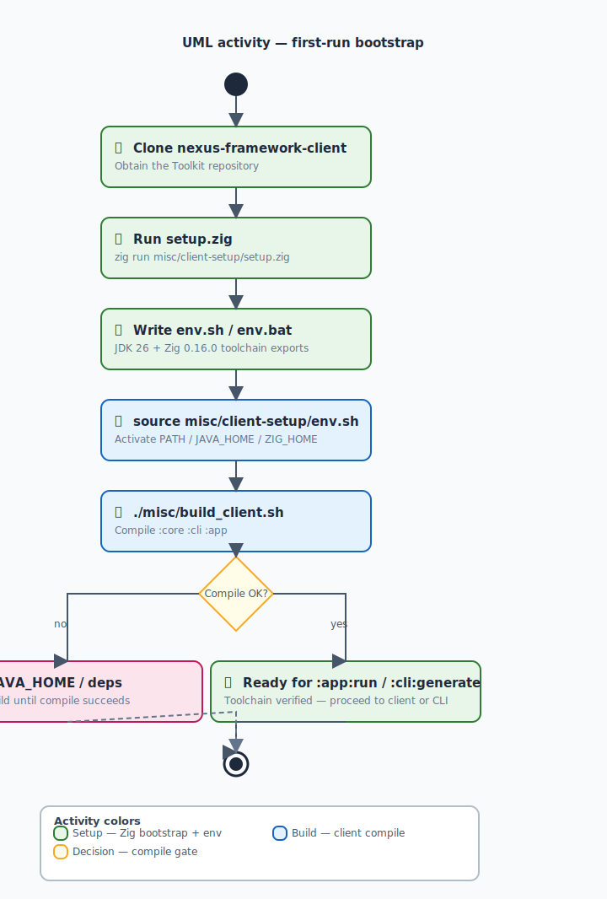
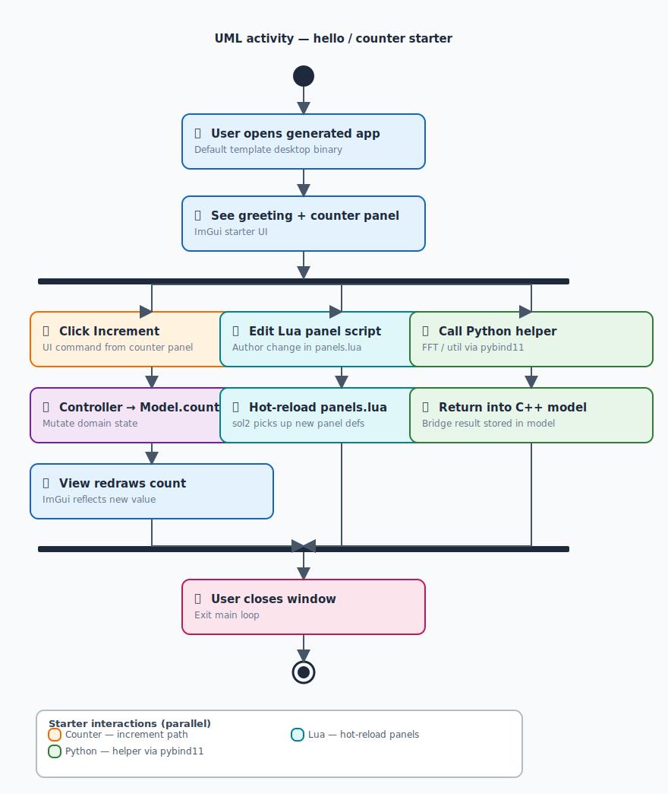

# UML activity diagrams

UML **activity** diagrams for The Nexus Framework (authoring client + generator) and **sample** flows for apps derived from the templates.

SVGs are generated by [`misc/scripts/generate-diagrams.py`](../../../misc/scripts/generate-diagrams.py) (same tooling as the structural architecture diagrams). Regenerate with:

```bash
python3 misc/scripts/generate-diagrams.py
```

| # | Flow | SVG |
|:-:|:-----|:----|
| 1 | Framework — first-run bootstrap | [activity-first-run-bootstrap.svg](activity-first-run-bootstrap.svg) |
| 2 | Framework — Compose client navigation | [activity-client-navigation.svg](activity-client-navigation.svg) |
| 3 | Framework — project generation pipeline | [activity-generate-pipeline.svg](activity-generate-pipeline.svg) |
| 4 | Framework — build generated desktop app | [activity-build-desktop-app.svg](activity-build-desktop-app.svg) |
| 5 | Derived — desktop frame loop | [activity-desktop-frame-loop.svg](activity-desktop-frame-loop.svg) |
| 6 | Derived — hello / counter starter | [activity-hello-counter.svg](activity-hello-counter.svg) |
| 7 | Derived — flows automation | [activity-flows-automation.svg](activity-flows-automation.svg) |
| 8 | Derived — Langflow → Nexus import | [activity-langflow-import.svg](activity-langflow-import.svg) |
| 9 | Derived — Android field tablet | [activity-android-field-tablet.svg](activity-android-field-tablet.svg) |

---

## 1. Framework — first-run bootstrap

How a developer prepares the machine before using the Compose client or CLI.



---

## 2. Framework — Compose Desktop client session

User-facing navigation inside `:app` (Loading → Home → tools).


---

## 3. Framework — project generation pipeline (`:core`)

CLI or client invokes `ProjectGenerator.generate`.


---

## 4. Framework — build a generated desktop app

After generation, native compile via `build_app.sh`.


---

## 5. Derived app — typical desktop frame loop

Generic activity inside a generated SDL3 + ImGui app (MVC).


---

## 6. Derived app — sample: hello / counter starter

User interaction with the default template UI.



---

## 7. Derived app — sample: blueprint + flows automation

Background/triggered services driven by `flows/flows.json`.


---

## 8. Derived app — sample: Langflow → Nexus import

Authoring externally, then generating a native app.


---

## 9. Derived app — sample: Android field tablet

High-level activity for `template/android-app` style targets.


---

## Related docs

| Doc | Role |
|:----|:-----|
| [../../architecture/overview.md](../../architecture/overview.md) | Architecture narrative |
| [../../hub.md](../../hub.md) | Documentation hub |
| [.](.) | Sibling SVG structure diagrams in this folder |
| [../../../LICENSE](../../../LICENSE) | Nexus License (`Nexus-1.0`) — non-commercial OK with attribution; through 2041-07-21 authorization for Toolkit commercial use, revenue apps, commercial-institution use |
| [../../../misc/scripts/README.md](../../../misc/scripts/README.md) | How to regenerate SVGs |
