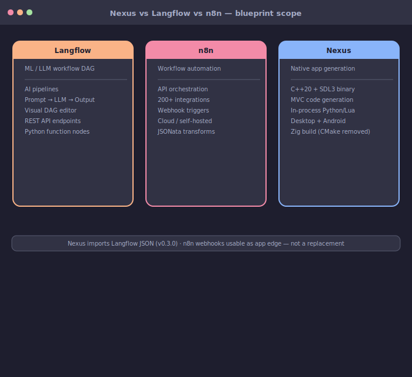

# El Framework de Nexus Company para el Desarrollo de Aplicaciones Nativas

<p align="center">
  
</p>

<p align="center"><strong>🧩 Apps nativas, no pestañas del navegador</strong> — entrega binarios SDL3 desde un grafo blueprint.</p>

<p align="center">
  🌐 <strong>Traducciones:</strong>
  <a href="../../README.md">English</a> ·
  <a href="README.pt-BR.md">Português</a> ·
  <a href="README.es.md">Español</a> ·
  <a href="README.de.md">Deutsch</a> ·
  <a href="README.ru.md">Русский</a> ·
  <a href="README.zh-CN.md">简体中文</a>
</p>

<p align="center">
  <a href="../../README.md"></a>
  <a href="README.pt-BR.md"></a>
  <a href="README.es.md"></a>
  <a href="README.de.md"></a>
  <a href="README.ru.md"></a>
  <a href="README.zh-CN.md"></a>
</p>

<p align="center">
  <a href="https://www.apache.org/licenses/LICENSE-2.0"></a>
  <a href="https://kotlinlang.org/"></a>
  <a href="https://www.libsdl.org/"></a>
  <a href="https://github.com/ocornut/imgui"></a>
</p>

> [!TIP]
> **Bienvenido/a.** Ejecuta la [configuración inicial](#inicio-rápido) y luego `./gradlew :app:run` — en minutos tendrás el cliente Compose, el editor de blueprint y la ruta hacia `builds/framework/<nombre>/`. Sin descargar Chromium.

## Índice

- [¿Qué es Nexus?](#qué-es-nexus)
- [Cómo se compara Nexus](#cómo-se-compara-nexus)
- [Qué hay en este repositorio](#qué-hay-en-este-repositorio)
- [Inicio rápido](#inicio-rápido)
- [Arquitectura](#arquitectura)
- [Blueprint y flujos — dos capas](#blueprint-y-flujos--dos-capas)
- [Construir tu app](#construir-tu-app)
- [La carpeta `misc/`](#la-carpeta-misc)
- [Añadir dependencias](#añadir-dependencias)
- [C++ moderno y crecer sin reescribir](#c-moderno-y-crecer-sin-reescribir)
- [Zig patching (builds nativos)](#zig-patching-builds-nativos)
- [Más allá de la automatización rápida](#más-allá-de-la-automatización-rápida)
- [Estado del desarrollo](#estado-del-desarrollo)
- [Copyright y licencia](#copyright-y-licencia)
- [Ver también](#ver-también)
- [Camino al MVP](#camino-al-mvp)

---

## ¿Qué es Nexus?

**The Nexus Framework** es un **constructor de apps nativas open source**. Describes tu app como un grafo visual — [`blueprint.json`](../../docs/templates/blueprint-schema.md) para la estructura, [`flows.json`](../../docs/templates/blueprint-schema.md) opcional para automatizaciones in-app — y Nexus genera una aplicación real en **C++**, **Lua** y **Python** para **escritorio** (Windows, macOS, Linux) y **Android**. El cliente Kotlin Compose (`:app`) crea esos grafos; [`misc/core`](#la-carpeta-misc) los valida y escribe proyectos en [`template/`](#construir-tu-app) con ventanas SDL3, widgets Dear ImGui, scripting sol2, autoría de UI TypeScript + XHTML y Python integrado (pybind11 en escritorio, Chaquopy + Djinni en Android).

Esto **no** es un web-shell ni un runtime de flujos alojado. Nexus entrega binarios compilados — SDL3 + ImGui + ImPlot — con Lua y Python in-process. Iteras en las capas de código habituales (`cpp.model`, `python.module`, `ui.page`, paneles Lua) tras la generación. Para diferencias con Electron, n8n, Langflow o empezar desde cero, consulta [Cómo se compara Nexus](#cómo-se-compara-nexus).

---

## Cómo se compara Nexus

Nexus toma prestado el **modelo mental de nodos y aristas** de herramientas visuales de flujo, pero la salida es un **programa nativo** — no una pestaña Chromium, no un host de workflows en la nube y no un servidor Langflow embebido en tu app.

### vs Electron y Tauri

| Herramienta | Punto fuerte | Diferencia con Nexus |
|-------------|--------------|----------------------|
| [Electron](https://www.electronjs.org/) | Apps de escritorio web-first; DOM/CSS/React como superficie del producto | Runtime C++ nativo, binarios ~3–20 MB, sin subproceso renderer |
| [Tauri](https://tauri.app/) | UI web ligera en el WebView del SO + backend Rust | UI immediate-mode ImGui, superficies GPU SDL3, stack compartido escritorio + Android |
| **Nexus** | Herramientas con datos intensivos, despliegue en campo, sensibles al throughput | Codegen guiado por blueprint; Python/numpy in-process; UX estilo game engine |

**Cuándo ganan los web shells:** tu equipo es HTML/CSS-first, o necesitas iOS desde una toolchain web hoy. **Cuándo gana Nexus:** refresco de UI sub-ms, binarios pequeños, paridad SDL3 desde la mesa de trading hasta la tablet Android de campo — consulta [Construir tu app](#construir-tu-app).

### vs n8n y Power Automate

| Herramienta | Punto fuerte | Diferencia con Nexus |
|-------------|--------------|----------------------|
| [n8n](https://n8n.io/) | Pegamento de ops — webhooks, cron, integraciones SaaS | Genera una **app entregada** con UI nativa, comportamiento offline y estado in-process |
| [Power Automate](https://www.microsoft.com/power-automate) | Automatización de procesos en la nube Microsoft | Misma UX de grafo para **cableado MVC interno**, no motores de pasos externos |
| **Nexus** | Cuando el flujo rápido *es* el producto | `blueprint.json` = estructura en tiempo de build; `flows.json` opcional = servicios locales in-process |

> [!WARNING]
> **Nexus no es n8n ni Power Automate.** Usa esas herramientas para integración SaaS en la nube. Una app generada aún puede llamar webhooks n8n desde Python/Lua en el borde.

### vs Langflow

| Herramienta | Punto fuerte | Diferencia con Nexus |
|-------------|--------------|----------------------|
| [Langflow](https://github.com/langflow-ai/langflow) | Autoría visual de flujos LLM/AI en runtime | **Importar/adoptar** JSON exportado en `blueprint.json` y `flows.json` — sin runtime Langflow embebido en v1 |
| **Nexus `blueprint.json`** | — | Grafo MVC en tiempo de build (`python.module`, `cpp.model`, `ui.page`, …) consumido una vez por `ProjectGenerator` |
| **Nexus `flows.json`** | — | Automatizaciones opcionales in-app (timers, eventos, bucles en background) cargadas por FlowRunner al inicio |

Los grafos de estructura van a [`blueprint.json`](#estructura-de-la-app-blueprintjson); los de automatización a [`flows.json`](#automatizaciones-in-app-flowsjson). Flujo completo de importación: [Importar procedimientos Langflow](#importar-procedimientos-langflow).

<!-- Diagrama: comparación Langflow vs n8n vs blueprint Nexus -->


*Flujos runtime estilo Langflow vs automatización ops n8n vs codegen Nexus en tiempo de build — mismo patrón visual, modelo de ejecución distinto.*

### vs C++ puro / desde cero

| Enfoque | Punto fuerte | Diferencia con Nexus |
|---------|--------------|----------------------|
| C++/CMake manual | Control total; SDKs de proveedor y cores legacy | Generadores + grafo blueprint; capas TS/XHTML y Lua sin reescribir desde cero |
| Rewrite greenfield (Rust, Go, …) | Seguridad en compile-time o ecosistema nuevo | **Crecer incrementalmente** — mantener C++ crítico de rendimiento, añadir nodos y flows junto al código antiguo |
| **Nexus** | Equipos atrapados entre overhead de web-shell y rewrite completo | Tercer camino: modernizar la autoría paso a paso, perfilar antes de migrar lenguajes |

---

## Qué hay en este repositorio

| Ruta | Rol |
|------|-----|
| [`app/`](../../app/) | Cliente Compose Desktop (`:app`) — Generate Project, editores de blueprint/flujos |
| [`misc/`](../../misc/) | Generador `:core`, `:cli`, client-setup, scripts, Docker — ver [La carpeta `misc/`](#la-carpeta-misc) |
| [`template/`](../../template/) | desktop-app · android-app · shared — copiados a `builds/framework/<nombre>/` |
| [`builds/`](../../builds/) | Artefactos del cliente → `builds/client/` · apps generadas → `builds/framework/` |
| [`docs/`](../../docs/) | Hub de documentación → [docs/hub.md](../../docs/hub.md) |

Este es el monorepo **Framework** (`:app`, `:core`, `:cli`). No es el repositorio separado [Nexus Framework Client](https://github.com/tuliofh01/nexus-framework-client) (wizard `:client-desktop` allí).

---

## Inicio rápido

**1. Configuración en la primera ejecución** — instala JDK 26 + Git (una vez por máquina):

| Plataforma | Setup | Entorno |
|------------|-------|---------|
| Linux | `./misc/client-setup/linux/setup.sh` | `source misc/client-setup/env.sh` |
| macOS | `./misc/client-setup/macos/setup.sh` | `source misc/client-setup/env.sh` |
| Windows | `misc\client-setup\windows\setup.bat` | `call misc\client-setup\env.bat` |

Detalles: [misc/client-setup/README.md](../client-setup/README.md).

**2. Ejecutar el cliente**

```bash
source misc/client-setup/env.sh
./gradlew :app:run
```

**3. Generar un proyecto**

```bash
./gradlew :cli:run --args="generate --type desktop --name MyApp --dry-run"
./gradlew :cli:run --args="generate --type desktop --name MyApp"
```

O usa **Generate Project** en la UI Compose → **Edit blueprint** / **Edit flows**.

**4. Compilar la app generada**

```bash
cd template/desktop-app && cmake --preset debug && cmake --build --preset debug
# la salida también va a builds/framework/<nombre>/ tras la generación
```

**5. Leer la documentación** — [docs/hub.md](../../docs/hub.md) · [coding-with-nexus](../../docs/guides/coding-with-nexus.md) · [generation-pipeline](../../docs/guides/generation-pipeline.md)

Compilar y probar el generador: `./gradlew :core:compileKotlin :cli:compileKotlin :app:compileKotlin :app:test`

Deploy del cliente: `./gradlew :app:deployToBuildsClient` → [builds/client/app/](../../builds/client/app/)

---

## Arquitectura

### Arquitectura full-stack
*Cliente Compose → flujo de generación `:core` → runtimes SDL3 (tu app, no una pestaña del navegador)*


El cliente `:app` crea JSON de blueprint y flujos; `:core` valida y materializa templates en `builds/framework/<nombre>/`. Las apps generadas corren como binarios SDL3 nativos con ImGui, Lua y Python opcional.

### Flujo de generación y builds
*Desde client-setup y módulos Gradle hasta `builds/framework/<nombre>/`*


Setup JDK 26 → Gradle `:core` / `:cli` / `:app` → `ProjectGenerator` escribe árboles CMake/Gradle en `builds/`.

### Runtime escritorio vs Android
*MVC compartido en SDL3/ImGui; pybind11 vs Chaquopy + Djinni*


Un `blueprint.json` cablea MVC en ambos templates; solo cambian el puente Python y el empaquetado por plataforma.

Referencia de capas: [docs/architecture/overview.md](../../docs/architecture/overview.md) · Blueprint/flujos: [Blueprint y flujos](#blueprint-y-flujos--dos-capas) · Python: [Python en escritorio vs Android](#python-en-escritorio-vs-android)

---

## Blueprint y flujos — dos capas

Nexus separa **la estructura de la app en tiempo de build** de **las automatizaciones que corren dentro de la app**. Un único canvas Langflow puede dividirse en ambos archivos tras la traducción.

### Blueprint vs flujos — dos capas
*Estructura en tiempo de build vs automatizaciones opcionales in-app*


`blueprint.json` cablea la estructura MVC consumida una vez por `:core`; `flows.json` registra triggers in-process cargados por FlowRunner al inicio.

### Estructura de la app (`blueprint.json`)

Grafo en tiempo de build en la raíz del proyecto. Los nodos declaran módulos; las aristas conectan flujo de datos y comandos en la app MVC generada.

| Tipo de nodo | Rol |
|--------------|-----|
| `python.module` | Muestreo / analytics Python (`python/functions.py`) |
| `cpp.model` | Estado de dominio C++ (`FunctionRegistry`, caches) |
| `cpp.controller` | Comandos + cableado (`PlotController`) |
| `ui.page` | Página TS/XHTML (`ui/ui.ts`, `ui/ui.xhtml`) |
| `lua.script` | Paneles Lua en runtime (`scripts/panels.lua`) |

**Editar en el cliente:** `./gradlew :app:run` → **Generate Project** → **Edit blueprint** (canvas Compose + inspector JSON en v1; panel nativo **imnodes** previsto v1.1 — mismo schema).

Muestras: [template/desktop-app/blueprint.json](../../template/desktop-app/blueprint.json) · [template/android-app/blueprint.json](../../template/android-app/blueprint.json) · Schema: [docs/templates/blueprint-schema.md](../../docs/templates/blueprint-schema.md)

#### Ejemplos estilo Langflow

Diagramas de referencia para el patrón visual que Nexus refleja en tiempo de build (no en runtime):

- [Flujo RAG chatbot](../../docs/assets/examples/langflow-rag-chatbot.svg) — runtime Langflow; mapear módulos a tipos de nodo blueprint
- [Agente con herramientas](../../docs/assets/examples/langflow-agent-tools.svg) — bucle de agente → `python.module`, `cpp.controller`, …
- [Estructura blueprint Nexus](../../docs/assets/examples/nexus-blueprint-app-structure.svg) — codegen MVC en tiempo de build

### Automatizaciones in-app (`flows.json`)

Servicios opcionales en runtime — bucles en background, triggers por evento, programaciones.

| Modo | Cuándo ejecuta | Ejemplo de trigger |
|------|----------------|-------------------|
| `background` | Mientras la app está viva | `interval` cada 5000 ms |
| `triggered` | Solo bajo condición | `event` `curve.added`, `startup`, `manual` |

**Editar en el cliente:** `./gradlew :app:run` → **Generate Project** → **Edit flows** — listar flujos, habilitar/deshabilitar, vista previa JSON (editor visual v1.1). Schema: [docs/templates/blueprint-schema.md](../../docs/templates/blueprint-schema.md).

Añade varios flujos al array `flows` (cada uno con `id` único). Deshabilita globalmente con `nxs_config.json` → `"flows": { "enabled": false }` o por flujo con `"enabled": false`.

Muestra: [template/desktop-app/flows/flows.json](../../template/desktop-app/flows/flows.json)

### Importar procedimientos Langflow

[Langflow](https://github.com/langflow-ai/langflow) es una herramienta **externa opcional** de autoría. Exporta JSON del flujo y adóptalo como servicios nativos Nexus — **no** ejecutando Langflow dentro de la app entregada.

**Paso 1 — Exportar desde Langflow**

1. Construye un flujo visual en Langflow (LLM, Prompt, Tool, Retriever, Agent, …).
2. Exporta como JSON vía **Export flow** o la API Langflow (`/api/v1/flows/{id}`). Los nombres de campo y anidamiento **difieren** de los schemas Nexus; trata la exportación como artefacto de diseño, no como archivo plug-and-play.

**Paso 2 — Mapear a Nexus**

| Concepto Langflow | Destino Nexus |
|-------------------|---------------|
| Componentes de estructura de la app | Nodos y puertos MVC en [`blueprint.json`](#estructura-de-la-app-blueprintjson) |
| Componentes de automatización (LLM, Tool, Agent, …) | `flows.json` → `steps[]` con `type: invoke` → `nxs.*`, `python.*`, `lua.*` |
| Aristas / orden de ejecución | Array `steps` ordenado; ramas vía `condition` (v1.1) |
| Trigger (chat, webhook, programación) | `trigger.type`: `event`, `interval`, `startup`, `manual`, `hotkey` |
| Bucle continuo | `mode: background` |
| Ejecución bajo demanda | `mode: triggered` |

**Paso 3 — Entregar en tu proyecto**


1. **Traducir** la exportación al [schema flows](../../docs/templates/blueprint-schema.md) (manual v1; importador v1.1).
2. **Colocar** en `flows/flows.json` o pegar en **Edit flows** en el cliente.
3. **Habilitar** en `nxs_config.json` → `"flows": { "enabled": true }`. FlowRunner registra triggers al inicio.

> [!NOTE]
> **Límites honestos v1:** sin importador Langflow automático; sin runtime Langflow embebido; los nodos LLM se convierten en stubs `invoke` (la llamada al modelo vive en `python.module`). Los flujos son **locales, in-process** — no cableado de webhooks en la nube. Tipos de paso HTTP/webhook previstos v1.1.

### Caminos de adopción para flujos

Tres formas de adoptar flujos de runtime — elige el peso que encaje con tu app:

1. 🚫 **Sin flujos** — Omitir o deshabilitar; el starter funciona sin FlowRunner
2. 🔧 **Flujos como helpers** — Pequeños servicios de automatización (timers, hooks de evento) dentro de una app mayor
3. 🔀 **Híbrido** — MVC via blueprint + flujos background/triggered en el mismo binario

---

## Construir tu app

Nexus apunta a **herramientas nativas, con uso intensivo de datos o desplegadas en campo** — mesas de trading, visores CAD, visualización científica, utilidades de game dev, bancos de audio/DSP, paneles de robótica y tablets Android de campo. Template por defecto: starter de propósito general (hello + counter). **Plotter estilo Desmos** opcional en `examples/plotter/`.

### Templates (escritorio y Android)

| Template | Stack | Guía |
|----------|-------|------|
| `desktop-app` | SDL3 + ImGui + pybind11 + sol2 | [docs/templates/desktop-app.md](../../docs/templates/desktop-app.md) |
| `android-app` | SDL3/GLES + Chaquopy + Djinni | [docs/templates/android-app.md](../../docs/templates/android-app.md) |

Salida: `builds/framework/<nombre>/` · Layout: [builds/LAYOUT.md](../../builds/LAYOUT.md) · [template/README.md](../../template/README.md)

### Python en escritorio vs Android

El mismo nodo `python.module` en `blueprint.json` cablea el muestreo de curvas en **ambos** templates — solo cambian la configuración Python, el empaquetado y la frontera C++↔Python.

| | **Escritorio** | **Android** |
|---|----------------|-------------|
| **Python integrado** | pybind11 — CPython dentro del proceso nativo | Chaquopy en la JVM; Djinni `ChaquopyPythonBridge` |
| **Árbol de fuentes** | `python/` (p. ej. `functions.py`) | `app/src/main/python/` |
| **Archivo** | `misc/python.dat` (PYAC) vía CMake `pack_python_dat` | **Ninguno** — Gradle/Chaquopy empaqueta `.py` en el APK |
| **`nxs_config.json`** | `features.python.embedding = "pybind11"` | `features.python.embedding = "chaquopy"` |
| **Rebuild típico** | `cmake --build` (refresca `python.dat`) | `./gradlew :app:assembleDebug` |


*Mismo puerto evaluate de `python.module` — empaquetado y puente distintos por plataforma.*

Guías: [template/desktop-app/AGENTS.md](../../template/desktop-app/AGENTS.md) · [template/android-app/AGENTS.md](../../template/android-app/AGENTS.md)

### UI TypeScript + XHTML

Dos capas de autoría de UI bajan a la misma API ImGui/Lua — ninguna usa motor de navegador.

**Lua imperativo** (`panels.lua`) — capa más baja; `nxs.register_panel(...)` con `ui.button`, hotkeys; hot-reload opcional vía `lua.dat`.

**TS/XHTML declarativo** (`ui/ui.xhtml` + `ui/ui.ts`) — markup y TypeScript bajan a definiciones de panel Lua. [`template/shared/dsl/`](../../template/shared/dsl/) mapea tags (`window`, `panel`, `plot`, `node-editor`, …) a llamadas Dear ImGui, ImPlot e imnodes.

| Mecanismo | TS/XHTML | Baja a |
|-----------|----------|--------|
| `state()` en `ui.ts` | `bind="sampleCount"` en `<slider>` | Estado two-way del widget ImGui |
| `native()` en `ui.ts` | `items-source="activeCurves"` | Proyección read-only del model C++ |
| `invoke("nxs.add_function", …)` | `on-click="addPending"` | Mismos comandos `nxs.*` que Lua llama directamente |

Empieza aquí: [template/desktop-app/ui/ui.xhtml](../../template/desktop-app/ui/ui.xhtml) · [docs/guides/coding-with-nexus.md](../../docs/guides/coding-with-nexus.md)

### Scripts Lua y flujos opcionales

- **Lua** — paneles y hotkeys en runtime vía sol2; edita `scripts/panels.lua`, rebuild empaqueta `lua.dat`
- **Flujos** — servicios opcionales `flows.json`; ver [Automatizaciones in-app](#automatizaciones-in-app-flowsjson) e [Importar procedimientos Langflow](#importar-procedimientos-langflow)

### Quién aprende más rápido

| Persona | Empieza por |
|---------|-------------|
| Game devs (overlays ImGui) | `scripts/panels.lua` → hotkeys y botones rápidos |
| Ingenieros C++ | `src/model/` + `src/controller/` → extender `FunctionRegistry` |
| Devs web | `ui/ui.xhtml` + `ui/ui.ts` → añadir panel y handler |
| Analistas Python | `python/functions.py` → nuevo muestreo de curva |
| Devs Android | Generar `android-app` → rastrear puente Djinni |

Guía completa: [docs/guides/coding-with-nexus.md](../../docs/guides/coding-with-nexus.md)

<details>
<summary><strong>Cuándo otro stack puede encajar mejor</strong></summary>

| Situación | Considera |
|-----------|-----------|
| Equipo solo web, sin apetito por C++/CMake | Electron o Tauri |
| UI de marketing pixel-perfect | Web o toolkit nativo con motor de layout |
| iOS desde este repo hoy | Aún no entregado — espera template iOS v1 |
| Proyecto nuevo safety-critical | Rust — ver [C++ moderno](#c-moderno-y-crecer-sin-reescribir) |

</details>

---

## La carpeta `misc/`

La carpeta `misc/` consolida **herramientas del repositorio Framework** — módulos Gradle, plugins de convención, setup en la primera ejecución, imágenes de contenedor, notas de CI y scripts auxiliares. Nada de esto se incluye en apps nativas generadas; solo construye y ejecuta el generador de proyectos.

| Ruta | Rol |
|------|-----|
| [misc/core/](../core/) | `:core` — `ProjectGenerator`, `TemplateEngine`, schema `nxs_config.json` (v2) |
| [misc/cli/](../cli/) | `:cli` — comando headless `generate` |
| [misc/build-logic/](../build-logic/) | Included build — toolchain JVM 26, plugins de convención |
| [misc/client-setup/](../client-setup/) | Instaladores en la primera ejecución (JDK 26 + Git) |
| [misc/scripts/](../scripts/) | [dev/](../scripts/dev/) · [test-gen/](../scripts/test-gen/) · [generate-diagrams/](../scripts/generate-diagrams/) |
| [misc/docker/](../docker/) | Generación containerizada |
| [misc/jenkins/](../jenkins/) | CI Jenkins opcional |
| [misc/translations/](README.md) | READMEs localizados — [pt-BR](README.pt-BR.md) · [es](README.es.md) · [de](README.de.md) · [ru](README.ru.md) · [zh-CN](README.zh-CN.md) |

Gradle mapea `:core` y `:cli` desde `misc/` vía [settings.gradle.kts](../../settings.gradle.kts). Hub: [misc/README.md](../README.md) · Pipeline: [docs/guides/generation-pipeline.md](../../docs/guides/generation-pipeline.md)

**test-gen** escribe stubs smoke/instrumentados para apps en `builds/framework/<proyecto>/` (no el generador en sí). Entrada: `./misc/scripts/test-gen/linux/generic.sh --dry-run --project MyApp` — ver [misc/scripts/test-gen/README.md](../scripts/test-gen/README.md).

---

## Añadir dependencias

Tras [client-setup](../client-setup/README.md) y **Generate Project**, añade dependencias nativas en la **app generada** bajo `builds/framework/<ProjectName>/` — no en los módulos del generador Compose.

- **C++** — extiende `CMakeLists.txt` con `FetchContent` o vcpkg; recompila con `cmake --build --preset debug`
- **Python** — escritorio: `pip install`, edita `python/`, recompila; Android: Chaquopy `pip { install(...) }` en `app/build.gradle.kts`
- **Lua** — coloca `.lua` en `scripts/`, `require` desde `panels.lua`; rebuild empaqueta `lua.dat`

Guía completa: **[docs/guides/coding-with-nexus.md](../../docs/guides/coding-with-nexus.md)**

---

## C++ moderno y crecer sin reescribir

Los proyectos generados usan **C++20** con patrones RAII, presets CMake y clang-format. Rust aún gana en garantías estáticas de seguridad — un trade-off honesto para equipos con bibliotecas C++ existentes (kernels CAD, codecs, APIs de exchange) y dependencias ImGui/SDL3.

**Crece paso a paso, no reescribas desde cero.** Nuevos nodos de blueprint, flows en runtime y pantallas autoría en XHTML pueden convivir con scripts Lua antiguos y módulos C++ a medida en el mismo proceso. Equipos atrapados en Electron o Tauri suelen enfrentar una bifurcación: aceptar overhead de web-shell o apostar por un rewrite completo. Nexus ofrece un tercer camino — mantener el C++ crítico de rendimiento que ya pagaste, modernizar la autoría incrementalmente y perfilar antes de reescribir en otro lenguaje.

> *"Haz que funcione, hazlo bien, hazlo rápido — en ese orden."* — a menudo atribuido a Kent Beck

---

## Zig patching (builds nativos)

**Zig** es una capa opcional de **orquestación** para apps nativas generadas — no reescribe el generador Kotlin `:app` / `:core`. Gradle sigue siendo el sistema de build del cliente Compose y del pipeline de generación.

### Por qué adoptar Zig (ganancias)

Zig no reemplaza tu stack C++20 MVC — reemplaza **fricción de build**: menos toolchains, cross-compile unificado, glue JNI más delgado y un lock de dependencias en lugar de siete clones FetchContent. **No medido en producción hoy** — plan quirúrgico en curso ([plan completo](../../docs/architecture/zig-patching.md)). Filas **†** = baseline medido en el repo (2026-07-13).

| Métrica | Anterior (CMake / Djinni) | Con Zig (meta) | Ganancia |
|---------|---------------------------|----------------|----------|
| Configure nativo frío † | ~174 s | ~20–30 s | **~83–88% más rápido** |
| Toolchains host (desktop + Android) | 5–7 | **1** (`zig c++`) | **~83% menos** |
| Huella en disco (herramientas) | ~10–12 GB | ~80 MB | **~99% menor** |
| Cross-compile Linux → Windows | No | Sí | **Nueva capacidad** |
| Pasos build ABI Android † | 2 presets CMake | 1 `zig build` | **~50% menos** |
| LOC Djinni generado † | 228 / 8 archivos | ~120 / 2 `.zig` | **~47% menos** |
| Archivos glue Python † | 10 | 3 | **~70% menos** |
| Archivos glue Lua † | 8 | 2 | **~75% menos** |
| Herramientas de build | CMake+Ninja+NDK+Djinni | **Zig** | **4 → 1** |
| Hash reproducible | FetchContent variable | `build.zig.zon.json` | **Determinístico** |
| Rebuild incremental (1 TU) | ~6–10 s | ~4–6 s | **~30–40% más rápido** |
| Hotspots ArenaAllocator | 0 | 3 planeados | **Cobertura opt-in** |
| Jobs CI smoke nativo | 5–7 runners | 2 runners | **~65–70% menos** |
| Langflow: flows habilitados | Riesgo manual | **`enabled: false`** | **Default seguro** |
| Deps de red en configure † | **7** FetchContent | **0** post-vendor | **100% offline** |
| Docs onboarding toolchain † | ~10 páginas | ~3 páginas | **~70% menos** |
| Allocator C-ABI unificado | Ninguno | `nxs_alloc` opt-in | **C-ABI único** |
| Tamaño binario release | Baseline CMake | LTO Zig | **~3–8% menor** |
| Tiempo de link release | ~40–60 s | ~25–40 s | **~30–35% más rápido** |
| Rutas de artefactos | Preset-dependent | `zig-out/bin/` fijo | **Layout predecible** |

[Plan completo (inglés)](../../docs/architecture/zig-patching.md)

---

## Más allá de la automatización rápida

**Power Automate**, **n8n** y herramientas similares brillan en pegamento de ops. Eso se rompe cuando el arreglo rápido *es* el producto: sin UI nativa, empaquetado offline débil, dependencia de la nube.

Nexus mantiene el modelo mental de nodos y aristas pero genera una **aplicación nativa real** — C++/SDL3, Lua/Python, ImGui + TS/XHTML, packs de script, apps de escritorio/Android. Consulta [Cómo se compara Nexus](#cómo-se-compara-nexus) para contexto herramienta a herramienta.

**Camino de migración:** conecta módulos en el editor de blueprint → genera con `:cli` o **Generate Project** → itera en capas de código en lugar de apilar parches en el flujo. Un webhook n8n puede permanecer en el borde para pegamento de ops mientras la app posee estado, UI y comportamiento offline in-process.

| Área | Herramientas de flujo (típico) | Salida Nexus |
|------|----------------------------------|--------------|
| **Runtime** | Motor de pasos en el servidor | App de escritorio/móvil o APK Android |
| **Offline / campo** | Requiere conectividad con el host del workflow | App SDL3 offline-first |
| **Rendimiento** | Round-trips HTTP entre pasos | C++ in-process; Python/numpy |
| **Superficie de UI** | Dashboard del vendor o ninguna | ImGui + páginas DSL |
| **Cross-platform** | Integraciones separadas por destino | Un `blueprint.json` cablea escritorio + Android |

---

## Estado del desarrollo

**Entregado hoy:**

- `:app` — Counter + Generate Project + Blueprint Editor + Flows Editor
- `:core` / `:cli` — generación de templates + `BlueprintValidator` + `FlowsValidator`
- `template/*` — escritorio + Android con `blueprint.json` + `flows.json` opcional
- Packs de script — `lua.dat` / `python.dat` (escritorio), `lua.dat` en el APK Android
- `builds/`, `misc/client-setup/`, `docs/`

**Limitaciones (v1):** solo generador Compose Desktop; estética ImGui utilitaria; Chaquopy aumenta el APK; sin iOS desde esta toolchain hoy.

**Branch:** desarrollo activo en **`main`** (`origin/main`).

Trabajo restante antes del MVP: [Camino al MVP](#camino-al-mvp).

---

## Copyright y licencia

> [!IMPORTANT]
> **Licencia Apache 2.0** — uso comercial, modificación y distribución permitidos. Mantén avisos de copyright y el archivo [LICENSE](../../LICENSE) al redistribuir. El código de la app generada es tuyo; los fragmentos copiados de templates deben conservar los avisos Apache.

- © 2026 Nexus Framework contributors — Nexus Framework Client y templates/docs incluidos
- **Proyectos generados:** eres dueño del código de aplicación que escribe el generador; las porciones copiadas de templates Nexus deben mantener el aviso Apache 2.0 donde aparezcan

Texto completo: [Apache License 2.0](../../LICENSE) · [https://www.apache.org/licenses/LICENSE-2.0](https://www.apache.org/licenses/LICENSE-2.0)

---

## Ver también

*Diseña el blueprint, genera el árbol, entrega el binario — luego itera en capas de código reales.*

### Documentación

| Doc | Descripción |
|-----|-------------|
| [docs/hub.md](../../docs/hub.md) | Hub de documentación |
| [docs/guides/coding-with-nexus.md](../../docs/guides/coding-with-nexus.md) | UI, MVC, Python, Lua, temas |
| [docs/guides/generation-pipeline.md](../../docs/guides/generation-pipeline.md) | ProjectGenerator, CLI, Docker |
| [docs/templates/blueprint-schema.md](../../docs/templates/blueprint-schema.md) | Schema `blueprint.json` |
| [docs/templates/blueprint-schema.md](../../docs/templates/blueprint-schema.md) | Schema `flows.json` |
| [AGENTS.md](../../AGENTS.md) | Comandos de build para asistentes de código |

### Ecosistema

| Tecnología | Rol |
|------------|-----|
| [SDL3](https://www.libsdl.org/) | Ventanas, input, superficies GPU |
| [Dear ImGui](https://github.com/ocornut/imgui) / [ImPlot](https://github.com/epezent/implot) | UI immediate-mode y gráficos |
| [sol2](https://github.com/ThePhD/sol2) / [pybind11](https://pybind11.readthedocs.io/) | Lua y Python en C++ |
| [Chaquopy](https://chaquo.com/chaquopy/) / [Djinni](https://github.com/dropbox/djinni) | Python y puente Kotlin en Android |
| [Langflow](https://github.com/langflow-ai/langflow) / [n8n](https://n8n.io/) | Autoría externa opcional (importar en Nexus) |

| Repositorio | Rol |
|-------------|-----|
| [Nexus Framework Client](https://github.com/tuliofh01/nexus-framework-client) | Distribución separada del wizard `:client-desktop` |

---

## Camino al MVP

Cuando cada fila esté ✅, Nexus Framework estará **listo para MVP**: generar apps nativas, editar blueprints/flujos, escribir proyectos y entregar un build de escritorio/Android documentado.

### Cliente y generador de proyectos

| Item | Estado |
|------|--------|
| Generar escritorio + Android desde templates | ✅ |
| Editor de blueprint (Compose) | ✅ |
| Editor de flujos (lista, habilitar/deshabilitar, vista previa JSON) | ✅ |
| ProjectGenerator + validadores | ✅ |
| Asistente Compose de 6 pasos *(v1 entrega Generate en 2 pantallas + editores)* | ⬜ |

### Templates

| Item | Estado |
|------|--------|
| Templates de escritorio + Android de propósito general | ✅ |
| Estructura `blueprint.json` + `flows.json` opcional | ✅ |
| Stubs TS/XHTML DSL, rutas Lua y Python | ✅ |
| Build de app de escritorio end-to-end verificado en CI | ⬜ |
| Build APK Android end-to-end verificado en CI | ⬜ |

### Runtime / apps generadas

| Item | Estado |
|------|--------|
| Paridad de packs `python.dat` / `lua.dat` | ✅ |
| pybind11 de escritorio totalmente cableado en app generada (Fase 2) | ⬜ |
| Puente Chaquopy Android probado E2E en dispositivo | ⬜ |
| Compilador TS/XHTML → Lua *(camino manual vía `panels.lua` documentado)* | ⬜ |

### Docs y experiencia del desarrollador

| Item | Estado |
|------|--------|
| Secciones de arquitectura y comparación en README | ✅ |
| Guías `AGENTS.md` de templates | ✅ |
| Scripts `client-setup` (JDK 26) | ✅ |
| CLI `debug validate --all` o equivalente en CI | ⬜ |

### Release

| Item | Estado |
|------|--------|
| CI verde en `main` | ⬜ |
| Binario del cliente publicado (`builds/client/`) | ⬜ |
| Tag de versión `v1.0.0` | ⬜ |

<details>
<summary><strong>Roadmap post-MVP (v1.1+) — clic para expandir</strong></summary>

| Item | Notas |
|------|-------|
| Panel imnodes nativo de blueprint | Mismo schema `blueprint.json` |
| Canvas visual del editor de flujos | — |
| Importador JSON Langflow | Traducción manual en v1 |
| Catálogo remoto de templates · template iOS | — |
| Tipos de paso HTTP/webhook en `flows.json` | — |

</details>
